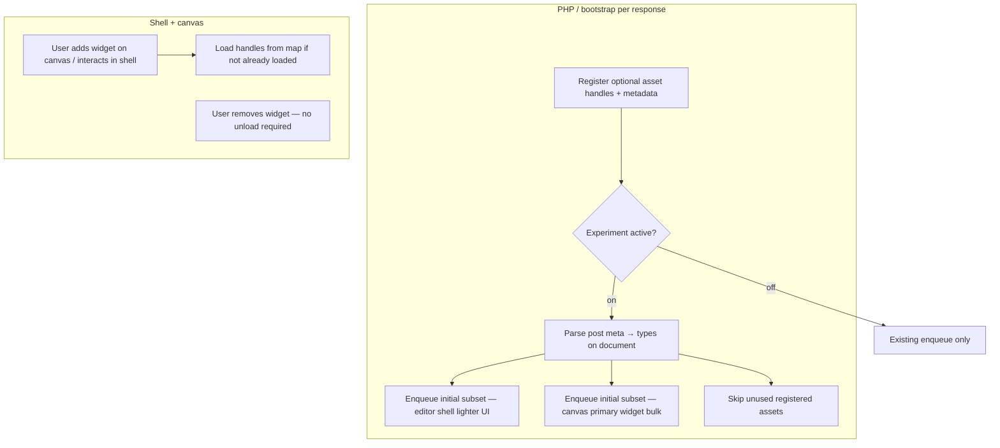

# Editor on-demand assets (optional enqueue) — specification draft

> **Status:** Draft for refinement. **§2.3** locks handle/DOM prefix; other *TBD*s may be resolved **later in the implementation cycle** unless a spike shows a **blocker**. Broader “implementation-ready” sign-off still needs agreed acceptance criteria for GA.

## 0. Definitions — what “preview” means here

In this document, **preview** means **(b)** only: the **in-editor** visual surface—the **iframe** embedded in the editor where the page under edit is rendered. Elementor may refer to this internally as the **canvas**.

**Not implied by default:** **(a)** A separate browser tab or standalone “preview page” opened outside the embedded iframe (e.g. front-end preview in a new window). If a future revision must treat that surface differently, it should be named explicitly (e.g. *separate-tab preview*) and scoped separately. Reusing the **same** on-demand asset **plumbing** for **(a)**, **front-end / live pages**, or other surfaces is **architecturally intended** (**§2.2**); default **preview** wording in this doc still means **(b)** unless a subsection names another consumer.

All mentions of **preview** / **preview iframe** in **§1**, **§6**, **§10**, and **§12** refer to **(b)** unless a subsection states otherwise.

---

## 1. Goal

Introduce a **new** mechanism (behind an experiment / feature flag) so that assets (JS and CSS) that are **today always loaded** in the Editor can instead be:

- **Registered** as dependencies of widgets/components.
- **Enqueued only when needed**: initial page load (server-side usage scan) and/or when the user adds a widget in the Editor (client-side lazy load).

**Problem (today):** Most **JS/CSS volume** tied to editing is there to support **widgets on the canvas**, not the **editor UI** itself—the UI is **relatively light**. In the legacy model, **broad widget-related dependencies** are loaded **up front** on the editing session **“just in case”** the user might add **any** widget. That includes **empty documents** (no widgets yet), documents with **only a subset** of types, and sessions where the user **never** opens certain widgets—**unused assets still download and initialize**. That is the **waste** this work targets: fewer bytes and less work during **page editing** when those assets are not needed yet.

**Scope emphasis (decided):** The mechanism still applies to **both** the **editor shell** and the **canvas** (**§0**) so **first paint** and **live interaction** can load only what each surface needs (**§6**, **§7**). **Prioritization:** expect the **largest wins** from trimming **canvas-bound** widget and preview-rendering bundles; shell/UI gains are **secondary** unless specific always-on shell enqueues are also over-broad. **Widget stacks:** Core/Pro **legacy and atomic** use the same Registry-based mechanism when they opt in (**§5**).

**Forward compatibility (decided):** **`e_dynamic_assets_manager`** is introduced **editor-first** (in-editor shell + canvas, **§0**), but **core plumbing**—**Registry**, scan → enqueue → client map (**§5–§7**), and extension **hooks** (**§8**)—must be shaped so **other consumers** can **opt in later** with minimal friction: e.g. **front-end / live pages**, **standalone or separate-tab preview** (**§0 (a)**), or future product areas. Avoid **hard-coding** “editor only” into types and hook contracts where a **named execution context** (or equivalent **consumer id**, *TBD* API detail) can carry **editor** vs **frontend** vs **preview_tab** (illustrative). **v1** may **gate activation** (experiment, bootstrap triggers) on editor routes only; the **implementation** should not require a rewrite to attach the same Registry pipeline elsewhere (**§2.2**). For **FE preview / FE live**, emphasize **scan + selective enqueue** over lazy client paths (**§2.2** last bullet).

Existing behavior must remain the default when the experiment is **off**: no changes to current enqueue paths or widget implementations.

---

## 2. Constraints (non-negotiable)

| Constraint | Detail |
|------------|--------|
| Feature flag | All new behavior lives under a new experiment-backed module. |
| No modification of existing implementations | Do not alter current enqueue/register code paths for production behavior when the flag is off. New code is additive (new module, new hooks, new APIs consumed only when active). See **§2.1** for allowed touches outside the module and extension rules. |
| WordPress integration | Prefer `add_action` / `do_action`, `add_filter` / `apply_filter` for extension and to avoid tight coupling. |
| Backward compatibility | With experiment **inactive**, behavior matches today (assets load as they do now). |

### 2.1 Allowed integration outside the module (decided)

- **Hook trigger in shared bootstrap:** It is allowed to add a `do_action` / similar call **outside** the experiment module (e.g. editor loader) so the on-demand pipeline can attach. When the experiment is **inactive**, on-demand behavior must not run—either **(a)** gate the call so it does not fire when inactive, or **(b)** fire unconditionally but register listeners only when active (so nothing runs). Default enqueue paths stay unchanged in both cases.
- **Extension vs. breaking change:** Existing public interfaces and their consumers must keep today’s behavior and signatures. Prefer **additional** APIs (new classes, hooks, dedicated registrars) over changing existing function signatures. **Do not** add optional parameters to existing functions unless there is no reasonable alternative; document any exception.

### 2.2 Multi-consumer plumbing (decided)

From the **first implementation**, treat the dynamic asset system as a **reusable subsystem**, not a one-off editor hack:

- **Context-aware entry:** Registry construction, document **scan** input, **initial** enqueue decisions, and **client map** generation must accept or be bound to a **consumer context** (editor shell, editor canvas document, future **frontend**, future **preview** surface, etc.—exact taxonomy *TBD*). Call sites pass context; shared logic branches only where behavior truly differs.
- **Hooks / filters:** Prefer signatures that include **context** (or a request object carrying it) so **non-editor** code can register and filter assets **without** editor-only global state. Illustrative hook paths in **§8** that start with `elementor/editor/…` should be **revisited** during implementation to avoid misleading **frontend** consumers—**namespace or parameter** must make reuse obvious (*TBD* final names).
- **Activation vs. capability:** The **experiment** (**§4**) may initially **enable** the pipeline only for editor flows; **disabled** contexts keep legacy behavior. **Capability** to run the pipeline elsewhere should exist **without** forking the module.
- **Front-end preview vs. front-end live (future consumers):** For those surfaces, **client-side lazy injection** (**§7**) is typically **less important** than in the **editor** (fewer in-session “add widget” SPA dynamics in the same sense). The **bigger win** is still **content / page scan → only enqueue handles that are actually needed** for that response. The same Registry and server pipeline apply; **prioritize scan + selective `wp_enqueue_*`** over lazy map complexity when tuning **non-editor** contexts.

### 2.3 Handle prefix and implementation-cycle deferrals (decided)

- **WordPress handle prefix (decided):** Script/style **handles** (and matching logical keys in the **handle → uri** client map) that this subsystem **newly introduces** and **owns** **must** begin with **`e_lazy_`** (e.g. `e_lazy_button-editor`). Aids collisions, grep, and support. Handles **only referenced** from legacy `get_*_depends()` or third parties keep their **existing** names unless a deliberate migration renames them.
- **DOM dedupe markers (**§7.6**):** `data-*` attributes used to mark injected assets **should** carry the handle in a form that preserves the **`e_lazy_`** prefix in the **attribute value** (or use an attribute name that references this convention—exact attribute names *TBD* in implementation, but values for owned handles use **`e_lazy_`**).
- **Deferrals:** Other *TBD*s in this document (consumer context taxonomy, final hook namespaces, canvas map transport, shell vs canvas initial split, always-core handle list, WP version floor for script strategy, explicit+adapter filter merge, etc.) **do not** need resolution before early spikes; they may be closed **later in the same initiative** when implementation demands.

---

## 3. High-level architecture

---

## 4. Experiment module

- **New module** (e.g. under `modules/…`) registered like other experiments (`get_experimental_data()` + `Modules_Manager` pattern, or equivalent already used in this repo).
- **Experiment slug (stable id):** `e_dynamic_assets_manager` — use consistently in code, config keys, and docs.
- **Default state:** **Inactive** (disabled) for all installs at this stage.
- **Visibility:** **Hidden** — not listed in the public Elementor Features / Labs UI while the mechanism is still being refined. Enablement is for internal or advanced paths only (exact mechanism: filter, constant, or env — *TBD* when implementing). Expect to **graduate** visibility (e.g. Labs) as the implementation stabilizes.
- **User-facing copy:** title, description, and release tag for Labs can stay *TBD* until the experiment is unhidden.
- Module **constructor** only wires hooks when the experiment is active; otherwise **no-op**.
- **Forward compatibility:** Module internals follow **§2.2**; **v1** may limit **which contexts** the experiment activates for, but must not **paint** the whole subsystem into an editor-only corner.

---

## 5. Dependency registration model

Each **widget**, **control**, or other opted-in participant **declares** the handles (or logical asset IDs) it needs to operate in the Editor.

- **Register:** assets are known to the system (handle, URL/build key, type CSS/JS, **dependencies between handles**, and optional **WordPress loading hints** per **§6.1**). **New** handles owned by this pipeline use the **`e_lazy_`** prefix (**§2.3**). Dependencies are required so the **client** and server can resolve **load order** (**§7.5**).
- **Do not enqueue** at registration time when the on-demand path is active.
- **Registry** is queryable: “which handles belong to widget type X?”
- **Registry contract (decided):** Core ships a **Registry** interface and default implementation. **Elementor Core, Elementor Pro, and third-party** code all opt in by hooking the same bootstrap **action** / **filters** and calling the shared Registry API (no Core-only hardcoded allowlist as the sole source of truth). The Registry is **multi-consumer ready** (**§2.2**): factory or bootstrap receives **context** so editor, future **frontend**, and future **preview** opt-ins share one design. Exact hook names *TBD*; align naming with experiment slug **`e_dynamic_assets_manager`** where practical and **§2.2** (avoid editor-only URL namespaces if they block reuse).
- **Widget kinds (decided):** The mechanism is **available to all** of the following, via the **same** Registry and client map (**§7**), with **opt-in** registration (**§9**): Core **legacy (PHP)** widgets, Core **atomic** widgets, Pro **legacy** widgets, Pro **atomic** widgets, and **third-party** widget authors who choose to adopt it. Internal wiring may use **adapters** per stack (e.g. PHP class vs atomic manifest) as long as everything **converges** on the shared Registry API—**no** separate first-class “parallel path” that bypasses the Registry for the same user-facing outcome.

*Refinement:*

- Mapping: one widget → many handles; shared handles across widgets (dedupe on enqueue).

### 5.1 Legacy PHP widgets: hybrid registration (decided)

**Policy:** Use the **new Registry API** as the **preferred** source of truth when present. If an opted-in widget type has **no** explicit Registry registration (or the product defines “empty” as fallback-eligible), **fall back** to an **adapter** that reads **`get_script_depends()`** / **`get_style_depends()`** and maps handles to URIs/deps via `wp_scripts` / `wp_styles` (or equivalent)—**without** editing widget class files (**§2.1**).

**Precedence (per widget type / participant key):**

1. **Explicit** registration on the Registry for that key → **use only that** graph for the new pipeline (no automatic union with `get_*_depends()` output—avoids duplicate handles and ambiguous lazy split).
2. **Else** → adapter builds the graph from **`get_script_depends()`** / **`get_style_depends()`**.

**Filters** may still adjust the final graph after the above resolution (**§8**). *Refinement:* whether advanced filters may **merge** explicit + adapter fragments for a single key—*TBD*; default is **no merge**.

**Explicit registration completeness (decided):** If explicit registration exists for a key but is **incomplete** (e.g. omits handles that are truly needed on first paint, or only declares lazy entries), **do not** backfill from the **`get_*_depends()`** adapter. The **explicit graph is authoritative**; gaps are **registration bugs** to fix, not silent fallback (**option B**).

**Rationale:** New API gives a precise **initial vs lazy** and editor-only story where you invest; fallback keeps **migration and third parties** workable without touching every legacy class on day one.

*Design review archive:* Adapter-only (**A**), new-API-only (**B**), and adapter-default + override (**C**) were compared; **decided** variant is **new-first + adapter fallback** when explicit registration is absent.

---

## 6. Server: before sending the page to the client

**Surfaces (decided):** The scan, **initial** enqueue subset, and **client asset map** (**§7**) apply to **both** participating HTTP responses: the **editor shell** page and the **canvas** iframe document (**§0**). **Where the waste is:** most optional **widget** scripts/styles are required for **canvas** behavior; the shell is **lighter**—implementation should **not** assume equal byte savings on both, but **must** still avoid loading **canvas-heavy** widget bundles through the shell “just in case” when the scan shows they are unnecessary (**§1**). They share the same **saved document** in post meta for **which widget types exist on the page**; each response may still differ in which **handles** are **initial** for that context (shell chrome vs canvas rendering—*TBD* minimal split if one union suffices for v1).

When preparing **either** the **editor shell** or **canvas iframe** response (experiment **on**):

1. **Source of truth (decided):** Read the **saved document** from the post’s **post meta** record. **Parse** the payload to discover which **elements / widget types** are present (widgets **on the canvas** at save time are included here).
2. From the **Registry**, union **initial** handles for this **response context** for those types (and shell-only / canvas-only tagging if the Registry exposes it—*TBD*). **Lazy-only** handles are **not** server-enqueued here; they load via the client map when needed (**§7**, **§7.1**).
3. **Enqueue** for this response: that **initial** union (+ always-required core handles for this surface, *TBD list*). Widget types **not** present in the saved document need **no** **initial** enqueue for those types; when the user **adds** one during the session, assets load **client-side** without a full reload (**§7**).
4. Optional behavior (configurable via experiment setting or filter):
   - **Zero-reference optimization:** if a handle is registered for on-demand but **no** instance of any widget that needs it exists in the **parsed saved document**, **do not enqueue** it on the server for that load.

**Empty saved document:** Parsing yields **no** on-demand-registered widget types → **initial** server enqueue is only always-required handles for that surface (plus legacy behavior for unregistered types). Same expectation for acceptance tests.

**Unsaved editor state:** Same as before: not in post meta until saved → relies on **§7** until persisted. *Refinement:* autosave / live merge into scan — *TBD.*

**Per-request scope (decided, v1):** Post meta read, parse, handle union, and client map are built **each time** WordPress serves a participating load—the **editor shell** and **each** **canvas iframe** document load for editing. **No** feature-owned object-cache of scan/map in v1. Host-level caching caveat unchanged.

### 6.1 WordPress registration and loading attributes (decided scope)

The pipeline should **integrate with WordPress’ asset APIs**, not fight them:

- **Registration:** Prefer **`wp_register_script`** / **`wp_register_style`** (or equivalents) for handles the system owns, so **dependencies**, **versions**, and **attributes** can be defined once, then **`wp_enqueue_script`** / **`wp_enqueue_style`** only for handles selected after the scan.
- **Footer vs header:** Use WordPress’ **`$in_footer`** (and related conventions) so non-critical scripts can load **in the footer** when safe—Registry metadata or enqueue wrappers should allow **per-handle** (or per-group) placement where the dependency graph allows.
- **Async / defer / strategy:** Where **compatible** with script dependencies and execution order (**§7.5** for any client-injected analog), use WordPress-supported mechanisms (e.g. **`wp_script_add_data`** with loading **strategy** where available, or documented attributes for registered handles) so scripts can be **`defer`**, **`async`**, or default blocking as appropriate. **CSS** follows `wp_enqueue_style` / media attributes as applicable.
- **Correctness first:** `defer` / `async` / footer placement must **not** break inline dependents or widgets that assume execution order; **conservative defaults** when metadata is absent. *Refinement:* minimum WP version for **strategy** API—*TBD*.

*Refinement:* Ordering with `wp_script_is` / `wp_style_is`, dependency trees, and **§6.1** together—*TBD* implementation checklist.

---

## 7. Client: Editor lazy loading

### 7.1 Initial vs lazy responsibility (decided)

**Per surface:** Anything that **must** run on **first paint** for a given **response** (**editor shell** or **canvas** iframe, **§6**) belongs to **server enqueue** for **that** response, not to the **lazy** injector as its **sole** delivery path. The lazy path loads what the Registry marks as **lazy-only** or what becomes needed **after** that surface’s first paint (e.g. user **injects** a widget on the canvas that was not in saved post meta). **If a widget type is already on the canvas** (saved document), **initial** handles for it are satisfied via **§6** for the **canvas** load; **lazy** handles for that type still follow Registry rules and **§7.6** when activated in-session.

**Classification:** Each handle is **initial** or **lazy-only** for a lifecycle; **initial** is not delivered **only** via lazy inject for that first paint. **§7.5** order applies whenever multiple client injects run.

### 7.2 Handle → URI lookup (decided)

For every **opted-in** participant (widgets, **controls**, and any other asset keyed through the Registry), the server exposes a **lookup**: **`handle` → `uri`** (and metadata: asset kind, **dependencies**, and **initial vs lazy-only** — see **§7.5** for injection order, **§7.1** for partition rules). The map drives **lazy** injection; **initial** handles are satisfied via **§6** and must not be classified as **lazy-only** for the same lifecycle (**§7.1**). Exact carrier: `wp_localize_script`, config object, or equivalent — *TBD*.

The **client** loads resources **on demand** by **injecting** `<script>` / `<link>` tags whose `src` / `href` come from that lookup when the editor decides a handle is needed—whether in **shell** UI or **on the canvas** (e.g. user added a widget, opened a control). *Refinement:* how the **canvas iframe** receives the map (parent localization, iframe bootstrap, `postMessage`, etc.) — *TBD*.

### 7.3 Extensible mapping (decided)

The lookup is not a private constant: **PHP** code must be able to **hook** into the mapping (filter and/or action) so Elementor Core, Pro, and third parties can **register, override, or append** `handle → uri` entries before the payload is sent. **Client-side** extensibility (editor hooks / registry so bundles can participate in resolution or post-load behavior) should follow the same spirit; shape *TBD* to match existing editor extension patterns.

### 7.4 Session behavior

- When the user **removes** a widget, **no unload** is required; accumulated overhead in the session is acceptable.
- **Idempotency:** loading the same handle twice must be safe—see **§7.6** (in-memory state + DOM markers); **do not** re-run the load pipeline for a handle that is **already loaded**.

**REST-only lazy fetch:** not required for v1 if the lookup is complete; a small **REST** or **admin-ajax** adjunct remains *TBD* only if some URIs cannot be known at bootstrap time.

### 7.5 Load order: JS and CSS (decided)

- **JavaScript:** The client must inject scripts so that **dependencies run before dependents**. The payload must include enough information (explicit `deps` per handle and/or a **pre-sorted linear list** for a given load batch) that the loader can respect **execution order**. Parallel injection without ordering is **not** acceptable when handles depend on each other.
- **CSS:** Use the **same ordering discipline**: inject `<link>` tags in an order consistent with **registered dependency order** (and WordPress-style expectations where practical) so **cascade and priority** behave like today’s enqueue order. Separate handles per stylesheet remain the norm; order of injection defines stacking when rules compete.

### 7.6 Loaded state and deduplication (decided)

The loader maintains an authoritative view of **which handles are already satisfied** (in-memory map / registry keyed by handle, scoped **per browsing context** or shared where technically possible—*TBD* for iframe vs parent).

**HTML markers:** Injected `<script>` / `<link>` (or a small wrapper node) SHOULD carry **stable `data-*` attributes** so **inspectability** and **guards** align with **§2.3** (marker value or naming convention includes the **`e_lazy_`-prefixed** handle string where the asset is owned by this subsystem). Before injecting, if the handle is already in the loaded set **or** the DOM already shows that marker, **skip** injection and **do not** re-trigger network load.

**Cross-surface:** Shell and canvas may need the same handle; avoid duplicate network **where possible**; iframe isolation may require duplicate script execution in each context even when URLs repeat—*TBD* product rules vs true dedupe.

---

## 8. Hooks / filters (draft list)

Names are illustrative; finalize during implementation.

| Hook / filter | Purpose |
|---------------|---------|
| `elementor/experiments/features` or existing `add_feature` only | Register experiment (if not solely via `get_experimental_data`). |
| *TBD* bootstrap action (name aligns with **`e_dynamic_assets_manager`**) | Receives the **Registry** instance; Core, Pro, and third parties register widget types and asset bindings here. |
| *TBD* `elementor/editor/on_demand_assets/widget_dependencies` | Filter map widget type → handles. |
| *TBD* `…/scan_document` (name *TBD*) | Filter types (or handles) derived from **parsed post meta** before enqueue. |
| *TBD* `…/client_asset_map` (name *TBD*) | Filter the **handle → uri** payload sent to the client, including **kind** and **deps** (or equivalent) so order rules in **§7.5** can be applied (**§7.2**). |
| *TBD* `elementor/editor/on_demand_assets/enqueue_before_send` | Last chance to add/remove handles before enqueue runs. |
| *TBD* `elementor/editor/on_demand_assets/skip_zero_usage` | Bool or filter to enable dequeue / skip behavior. |

*Refinement:* Minimize hook surface; document parameters and return types. **§2.2:** prefer **context** in filter args and **neutral** hook prefixes (or `elementor/assets/dynamic/…` style) over `elementor/editor/…` if the same filters are meant for **frontend** / **preview** reuse—finalize in implementation.

---

## 9. Opt-in registration (no separate hardcoded “list” only in Core)

Who participates is **who registers** on the shared **Registry** during the bootstrap **action** (and optional **filters** described in **§8**). Elementor Core, Elementor Pro, and third-party packages use the **same** `Registry` interface and hook surface if they choose to opt in.

- **Registered types** (with experiment **on**): use register-without-enqueue + scan + lazy paths per this spec.
- **Never registered** types (including widgets that do not hook the Registry): **unchanged** — legacy enqueue as today, even when the experiment is **on**.

Core may ship **default** registrations for pilot widgets by attaching to the same bootstrap action; Pro extends the same Registry for Pro widgets. Nothing relies on a private PHP-only allowlist that other distributions cannot hook.

---

## 10. Risks and open questions

- **FOUC / layout (initial implementation):** **No** dedicated mitigation (no placeholders, no critical-CSS path). Lazy **CSS** may briefly **flash** or reflow after add; that is **acceptable** for the hidden experiment phase. Revisit (skeleton, critical subset, etc.) when the feature moves toward public Labs.
- **Script / style order:** mitigated by **§7.5** (dependency-aware injection). Interaction with **already-booted** editor core remains *TBD* for edge cases.
- **Third-party widgets:** **opt-in** only (aligns with **§9**); no automatic migration of types that never register on the Registry.
- **Shell + canvas:** Two browsing contexts (**§6**); risk of **duplicate** loads if not coordinated (**§7.6**). Iframe **security / origin** boundaries may force limits on sharing one loaded script across parent and iframe—*TBD*.
- **`defer` / `async` / footer:** Aggressive **§6.1** hints can break widgets that rely on blocking order or `wp_footer` timing—test matrix per consumer context.
- **Caching:** v1 follows **§6** per-request rule (no feature-owned cache). Stale maps from **host-level** editor HTML caching are out of v1 scope; document for support if needed.

---

## 11. Phased execution plan (for later)

1. **Spec lock:** finalize sections 5–7, hook names, and “no modification” boundary.
2. **Spike:** one widget end-to-end (register → scan → enqueue on load → lazy on add).
3. **Generalize:** registry, filters, zero-usage option.
4. **Expand registrations:** migrate additional widgets by registering them on the shared Registry behind the same flag.
5. **QA:** matrix experiment on/off; Core + Pro × legacy + **atomic** where registered; third-party opt-in smoke; **shell + canvas** add/remove and dedupe (**§7.6**).
6. **Later:** enable **additional consumers** (frontend, standalone preview, **§2.2**) by context + activation rules without redesigning Registry/scan/map core.

---

## 12. Acceptance criteria (draft)

- [ ] With experiment **off**, asset loading and Editor behavior are unchanged (regression baseline).
- [ ] With experiment **on**, a pilot widget’s assets are not loaded until the widget is **on the canvas** (saved) or **added** during the session (per **§6** / **§7**), except where **initial** handles apply at first paint.
- [ ] Saved document (**post meta**) with **zero** instances of on-demand-registered widget types does not load those widgets’ optional bundles on initial server response (when zero-usage option is enabled); **§6** empty-doc rule.
- [ ] Adding a pilot widget in the Editor loads its assets without a full reload (via **§7** lookup + injected tags); removing does not break the session.
- [ ] With experiment **on**, the client receives a **handle → uri** map (plus **deps** or equivalent) for opted-in registrants; filters can alter it (**§7.3**, **§8**). Lazy injection respects **§7.5** order for JS and CSS.
- [ ] New code lives under the module + documented hooks (**§2.1** allows a central hook trigger). No breaking changes to existing interfaces; extensions use **new** APIs where possible (**§2.1**).
- [ ] **FOUC:** v1 does **not** require flash-free lazy CSS (**§10**); document known limitation for QA.
- [ ] **Caching:** v1 builds scan + client map **per participating request** (editor shell **and** canvas iframe, **§6**); no feature-level object-cache of map/scan in initial implementation.
- [ ] **Shell + canvas (§0, §1, §6):** With experiment **on**, **both** surfaces participate; **largest** expected reduction is **canvas** widget/preview bundles, not shell chrome (**§1** waste model). **Client** lazy load for types **added** during editing or **lazy-only** handles; widgets **present at save** get required assets without relying solely on post-add inject.
- [ ] **Deduplication (§7.6):** no redundant load for an already-satisfied handle—in-memory state plus `data-*` (or equivalent) on injected tags; no re-trigger of the load pipeline when already loaded.
- [ ] **Naming (§2.3):** new handles owned by the pipeline use the **`e_lazy_`** prefix; DOM markers align with that prefix for owned handles.
- [ ] **Registry** supports the same opt-in flow for **legacy and atomic** widgets (Core/Pro) and documented extension for **third-party** registrants (**§5**).
- [ ] **Legacy PHP:** for each opted-in type, resolution follows **§5.1** (explicit Registry first, else `get_*_depends()` adapter); filters may refine (**§8**). Incomplete explicit registration **does not** trigger adapter backfill (**§5.1**).
- [ ] **Initial vs lazy:** **§6** covers all **initial** handles; **§7.1** — nothing required on first paint is **lazy-module-only**; lazy map is for **lazy-only** / post–first-paint needs.
- [ ] **§2.2:** Registry / bootstrap / hooks are **context-capable** from v1 so **frontend**, **preview**, and other surfaces can opt in later without a subsystem fork (editor may remain the only **activated** consumer in v1).
- [ ] **§6.1:** Where handles are registered/enqueued through WP, support **footer placement** and **`defer` / `async` / strategy** when metadata and dependency safety allow; document conservative defaults.

---

## 13. Document changelog

| Date | Author | Change |
|------|--------|--------|
| *TBD* | *TBD* | Initial draft |
| 2026-04-30 | Review | §2.1: allowed external hook trigger (no-op when experiment off); extension policy (new APIs, avoid new optional params on existing functions). §5/§12 cross-updates. |
| 2026-04-30 | Review | §2.1: clarified hook trigger—gated `do_action` vs unconditional call with listeners only when experiment active. |
| 2026-04-30 | Review | §4 decided: slug `e_dynamic_assets_manager`, hidden, default off; graduation to Labs *TBD*; enablement path *TBD*. |
| 2026-04-30 | Review | §9: opt-in list; unlisted types keep legacy enqueue when experiment on. §10 third-party aligned. |
| 2026-04-30 | Review | §5/§8/§9: Registry interface + bootstrap action/filters; Core/Pro/third-party share surface; participation = registration, not Core-only array. |
| 2026-04-30 | Review | §10/§11: wording aligned with Registry (“never register” / expand registrations). |
| 2026-04-30 | Review | §6: post meta → parse → types for initial enqueue vs hot-plug; empty doc; unsaved state → §7 caveat *TBD*. §8 scan hook note. §12 empty-doc acceptance. |
| 2026-04-30 | Review | §7: handle→uri lookup to client; inject script/link; PHP hookable map; client extensibility *TBD*. §5 scope includes controls. §8 `client_asset_map` filter. §12 acceptance. |
| 2026-04-30 | Review | §7.5 (formerly 7.4): dependency-ordered JS; CSS `<link>` order for cascade. §5 deps for load order. §10 risk note. §12 acceptance. |
| 2026-04-30 | Review | §10/§12: v1 FOUC — no special mitigation; acceptable flash for hidden experiment. |
| 2026-04-30 | Review | §6/§10/§12: per-request scan + map, no feature cache v1; read/write acceptable; host FPC caveat. |
| 2026-04-30 | Review | §1/§6/§10/§12: editor-first scope; preview as today, no v1 preview optimization mandate. |
| 2026-04-30 | Review | **§0** Definitions: “preview” = in-editor iframe (canvas); not separate-tab preview by default. §1/§6/§10/§12 wording aligned. |
| 2026-04-30 | Review | §5/§1/§11: same Registry for Core/Pro legacy+atomic + third-party opt-in; adapters OK, single converged API. §12 Registry acceptance. |
| 2026-04-30 | Review | §5.1: legacy PHP registration strategies A/B/C (adapter vs new API vs hybrid) with pros/cons/impact; choice *open*. |
| 2026-04-30 | Review | §5.1 **decided:** hybrid — new Registry API first per key; fallback to `get_*_depends()` adapter; no auto-merge explicit+adapter (filter merge *TBD*). §12 acceptance. |
| 2026-04-30 | Review | §5.1: explicit authoritative, no adapter backfill if incomplete. §6 step 2 initial vs lazy. §7.1 partition; §7 renumbered (7.1–7.5). §12. |
| 2026-04-30 | Review | **Pivot:** lazy/on-demand covers **editor shell + canvas**; §6 dual responses; §1 scope; §3 diagram; **§7.6** dedupe (`data-*` + in-memory); §7.1/§7.2/§7.4; §10; §11 QA; §12 (supersedes “canvas unchanged only” from 2026-04-30 §1/§6/§10/§12 row). |
| 2026-04-30 | Review | §1/§6/§3/§12: problem statement—just-in-case widget bulk, **canvas-heavy** vs **light UI**; optimization goal = cut waste during editing; shell secondary savings. |
| 2026-04-30 | Review | **§2.2** multi-consumer plumbing; §1 forward compat; §0 (a)+FE reuse; §4/§5/§8 notes; §11 step 6; §12 acceptance. |
| 2026-04-30 | Review | §2.2: FE preview/live — scan+enqueue > lazy; **§6.1** WP register/enqueue, footer, defer/async/strategy; §5/§10/§12. |
| 2026-04-30 | Review | **§2.3** `e_lazy_` handle prefix + DOM marker alignment; implementation-cycle deferrals; §7.5/§7.6 order fix; status, §5, §12. |
