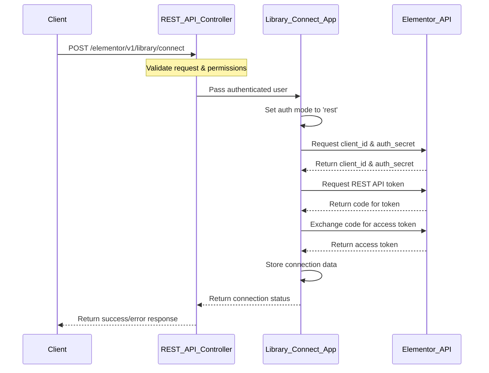

# Elementor Library Connect REST API - Product Requirements Document

## 1. Overview

### 1.1 Purpose
The purpose of this document is to outline the requirements for implementing a REST API endpoint that provides similar functionality to the existing CLI "connect" command for Elementor Library, but with simplified API usage. This will allow developers to connect a user to the Elementor Library programmatically via REST API calls.

### 1.2 Background
Currently, Elementor offers a CLI command to connect users to the Elementor Library:
```
wp elementor library connect --user=<id|login|email> --token=<connect-cli-token>
```
However, there is no REST API equivalent to achieve similar functionality, which limits programmatic access options. Implementing this REST endpoint will expand the ways developers can integrate with Elementor.

### 1.3 Goals
- Create a secure REST API endpoint for connecting to the Elementor Library
- Simplify the connection process by using authenticated user credentials
- Automatically handle token generation without requiring external tokens
- Process the entire connection in a single API call with no user interaction
- Provide clear documentation and error responses for developers
- Ensure backward compatibility with existing Elementor connect flows

## 2. Technical Specification

### 2.1 REST API Endpoints

#### 2.1.1 Connect Endpoint
- **Endpoint:** `/elementor/v1/library/connect`
- **Method:** POST
- **Authentication:** WordPress user authentication required
- **Permissions:** User must have `manage_options` capability
- **Request Parameters:**
  - None required - uses the authenticated WordPress user
- **Response:**
  - Success: `200 OK` with connection details
  - Error: Appropriate HTTP error code with error message

### 2.2 Data Model
The endpoint will use the existing data model for connection management, including:
- User connection data storage
- Token generation and validation
- Access level management

### 2.3 Security Considerations
- All requests must be authenticated via WordPress authentication
- Only users with appropriate permissions can connect accounts
- Implementation of state parameters to prevent CSRF attacks
- Rate limiting to prevent abuse

## 3. Implementation Details

### a.) API Architecture



### b.) Implementation Steps

1. Create a new REST API controller class for library connect operations
2. Extend the WP REST API with the new endpoint definition
3. Implement permission callback to validate user capabilities 
4. Create endpoint callback to handle the connection process
5. Add support for 'rest' auth mode in the Library app class
6. Add support for direct token generation without user action
7. Implement proper error handling and responses
8. Add documentation for the new endpoint

### 3.1 Code Location
The implementation will be located in the following files:
- `/core/common/modules/connect/rest-api.php` (new file)
- `/core/common/modules/connect/apps/base-app.php` (modifications)
- `/core/common/modules/connect/apps/library.php` (modifications)

### 3.2 Integration with Existing Code
The implementation will leverage the existing Library app class and connect module, adding a new REST mode to the auth_mode functionality. Unlike the UI flow, it will complete the entire authentication process in a single API call without requiring any user interaction.

## 4. User Experience

While this is primarily an API feature for developers, it should maintain the security and user experience principles of Elementor:

1. Clear error messages that help developers understand what went wrong
2. Appropriate permissions checks to prevent unauthorized access
3. Successful connections should trigger the same post-connection processes as the CLI flow

## 5. Testing Requirements

### 5.1 Unit Tests
- Test authentication and authorization flows
- Test successful connection process
- Test error handling for various failure scenarios

### 5.2 Integration Tests
- Test integration with the existing Library connect system
- Verify that connected users have proper access to the library
- Test error handling and recovery

### 5.3 Security Tests
- Test for proper permission handling
- Test state parameter validation
- Test rate limiting and abuse prevention

## 6. Success Metrics

- REST API endpoint successfully connects users to the Elementor Library
- No regressions in existing connect functionality
- API responses are consistent and informative
- Security is maintained throughout the process

## 7. Documentation

### 7.1 Developer Documentation
Documentation will be needed to explain:
- REST API endpoint usage
- Authentication requirements
- Error codes and troubleshooting
- Example code for making requests

### 7.2 Internal Documentation
- Changes to the connect architecture to support REST mode
- Security considerations for the implementation

## 8. Limitations and Future Considerations

### 8.1 Limitations
- REST endpoint will require proper WordPress REST API authentication
- Only users with appropriate capabilities can use the endpoint
- Server-side implementation may require specific API endpoints for REST support

### 8.2 Future Enhancements
- Consider adding additional endpoints for other connect operations (disconnect, reconnect)
- Add endpoint for checking connection status
- Support for status checking and diagnostics

## 9. Release Plan

### 9.1 Development Phases
1. Implementation of core functionality
2. Testing and security review
3. Documentation
4. QA and bug fixes
5. Release as part of a minor Elementor update

### 9.2 Release Notes
The release notes should highlight:
- New REST API endpoint for connecting to Elementor Library
- Developer documentation links
- Any relevant security information

## 10. Dependencies

- WordPress REST API framework
- Existing Elementor Connect module
- User permissions and capabilities system
- Server-side support for REST API token generation 