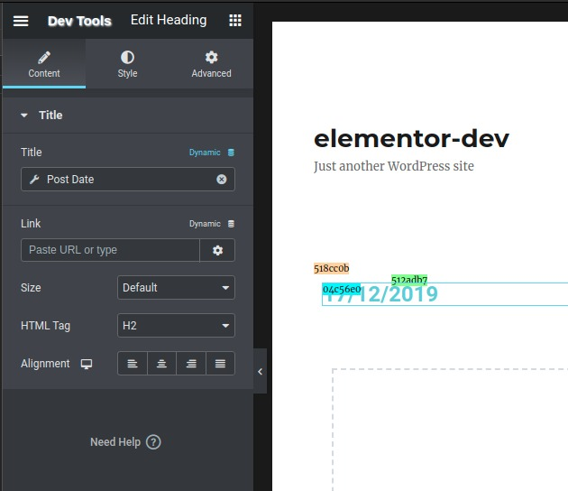
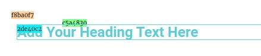

## Component -- `$e.components.get('document/dynamic')`

*  **Name**: Dynamic.
*  **Description**: Dynamic enable, disable and change.

## All **Document/Dynamic** Commands
| Command               | Access                                  | Description         
|-----------------------|-----------------------------------------|-----------------------------------
| [Disable](#disable-command----erungetdocumentdynamicdisable)    | `$e.run('document/dynamic/disable')`    | Disable dynamic. 
| [Enable](#enable)     | `$e.run('document/dynamic/enable')`     | Enable dynamic.
| [Settings](#settings) | `$e.run('document/dynamic/settings')`   | Change dynamic.


### Disable _Command_ -- `$e.run.get('document/dynamic/disable')`
*  **Name**: Disable.
*  **Description**: Disable dynamic settings.
*  **Returns**: `{void}`
*  **Arguments**: 

    | Type          | Property                  | Requirement       | Description |
    |---            |---                        |---                |---|
    | `{Container}` | _container OR containers_ | **required**      | 
    | `{object}`    | _settings_                | **required**      | Dynamic settings to disable

* **Examples**:
    Assuming we have a widget with dynamic tag for *title*, and want to disable it.
    

    ```javascript
      // Get the view by id, then get the container.
      const eWidget = $e.utils.document.findViewById( '04c56e0' ).getContainer();
  
      // Disable dynamic tag 'date'.
      $e.run( 'document/dynamic/disable', {
          container: eWidget,
          settings: {
              title: true,
          },
      } );
    ```
    Will disable dynamic tag for title.

### Enable _Command_ -- `$e.run.get('document/dynamic/enable')`
*  **Name**: Enable.
*  **Description**: Enable dynamic settings.
*  **Returns**: `{void}`
*  **Arguments**: 

    | Type          | Property                  | Requirement       | Description |
    |---            |---                        |---                |---|
    | `{Container}` | _container OR containers_ | **required**      | 
    | `{object}`    | _settings_                | **required**      | Dynamic settings to enable

* **Examples**:
    Enable dynamic title for heading, assuming you have simple widget like this:
    
    ```javascript
    // Get heading container.
    eWidget = $e.utils.document.findViewById( '2de40c2' ).getContainer();
    
    // Enable dynamic tag `post-date` for title.
    $e.run( 'document/dynamic/enable', {
          container: eWidget,
          settings: {
              title: '[elementor-tag id="47a0ad1" name="post-date" settings="%7B%7D"]',
          },
    } );
    ```
    Will enable dynamic tag: 'post-date' for heading title:
    
    


### Settings _Command_ -- `$e.run.get('document/dynamic/settings')`
*  **Name**: Settings.
*  **Description**: Change dynamic settings.
*  **Returns**: `{void}`
*  **Arguments**: 

    | Type          | Property                           | Requirement       | Description |
    |---            |---                                 |---                |---|
    | `{Container}` | _container OR containers_          | **required**      | 
    | `{object}`    | _settings_                         | **required**      | Dynamic settings to enable
    | `{object}`    | _options_ { debounce: `{boolean}`} | **optional**      | Use debounce? default: `true`

* **Examples**:
    Example change dynamic settings for title with dynamic tag *post-date*.
    Assuming you have a heading with 'post-date' dynamic tag for title.
    
    
    
    And you want to change the format to human readable format. use next example:
    
    ```javascript
    // Get heading container.
    eWidget = $e.utils.document.findViewById( '2de40c2' ).getContainer();
    
    // Change dynamic settings.
    $e.run( 'document/dynamic/settings', {
          container: eWidget,
          settings: {
              title: '[elementor-tag id="47a0ad1" name="post-date" settings="%7B%22format%22%3A%22human%22%7D"]',
          },
    } );
    ```
    The result will be:
    
    

