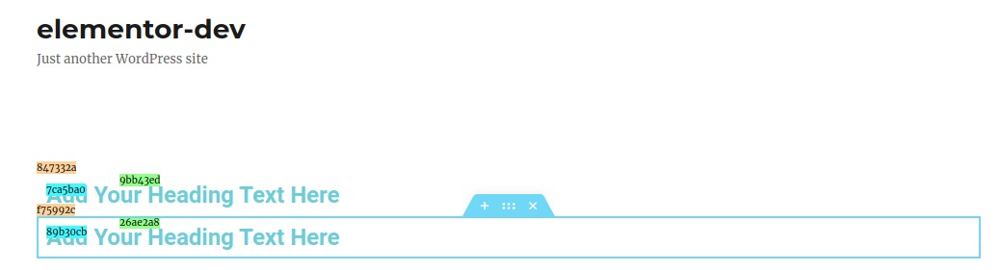

## Component -- `$e.components.get('document/elements')`

*  **Name**: Elements.
*  **Description**: Provide a way to manage elements, create, edit, delete. copy, paste, etc...

## `document/elements/` -- Commands
| Command                                   | Access                                             | Description         
|-------------------------------------------|----------------------------------------------------|-----------------------------------------
| [Copy](#)                                 | `$e.run('document/elements/copy')`                 | Copy container. 
| [Copy-All](#)                             | `$e.run('document/elements/copy-all')`             | Copy all containers. 
| [Create](#)                               | `$e.run('document/elements/create')`               | Create element. 
| [Delete](#)                               | `$e.run('document/elements/delete')`               | Delete container. 
| [Duplicate](#)                            | `$e.run('document/elements/duplicate')`            | Duplicate container. 
| [Empty](#)                                | `$e.run('document/elements/empty')`                | Empty document. 
| [Import](#)                               | `$e.run('document/elements/import')`               | Import. 
| [Paste](#)                                | `$e.run('document/elements/paste')`                | Paste. 
| [Paste-Style](#)                          | `$e.run('document/elements/paste-style')`          | Disable dynamic. 
| [Reset-Style](#)                          | `$e.run('document/elements/reset-style')`          | Disable dynamic. 
| [Settings](#)                             | `$e.run('document/elements/settings')`             | Disable dynamic. 

## Copy _Command_ -- `$e.run('document/elements/copy')`
*  **Name**: Copy.
*  **Description**: Copy container.
*  **Returns**: `{void}`
*  **Arguments**: 

    | Type          | Property                           | Requirement       | Description |
    |---            |---                                 |---                |---|
    | `{Container}` | _container OR containers_          | **required**      | 
    | `{string}`    | storageKey                         | **optional**      | default: `{'clipboard'}`

## Copy _Command_ -- `$e.run('document/elements/copy-all')`
*  **Name**: Copy-All.
*  **Description**: Copy all containers.
*  **Returns**: `{void}`
*  **Arguments**: None.

## Create _Command_ -- `$e.run('document/elements/create')`
*  **Name**: Create.
*  **Description**: Create element from model.
*  **Returns**: `{Container | Array.<Container>}` *Created container(s)*.

    | Type          | Property                           | Requirement       | Description |
    |---            |---                                 |---                |---|
    | `{Container}` | _container OR containers_          | **required**      | 
    | `{object}`    | model                              | **required**      | 
    | `{object}`    | options                            | **optional**      | 

    *options:*
    ```javascript
    {
        at: {integer},                               // Position.
        clone: {boolean},                            // Generate unique id for the model.
        trigger: {boolean},                          // TODO: Mati help.
        edit: {boolean},                             // Is turn edit panel for the new element.
        onBeforeAdd: {function()},                   // Run callback before add.
        onAfterAdd: {function( newModel, newView )}, // Run callback after add.
    }
    ```
   
* **Examples**:
    Create Heading widget 
    ```javascript
    // Create section.
    const eSection = $e.run( 'document/elements/create', {
      container: elementor.getPreviewContainer(),
      columns: 1,
      model: { elType: 'section' },
    } );  
    ```
    Result: 
    Now to create widget, we need column, here is two examples how to reach column:
    ```javascript
    const eColumn = eSection.view.children.findByIndex( 0 ).getContainer();
    ```
    OR
    ```javascript
    const eColumn = $e.utils.document.findViewById('9bb43ed').getContainer();
    ```
    Then let create heading widget at the column we reach above:
    ```javascript
    $e.run( 'document/elements/create', {
        container: eColumn,
        model: { 
          elType: 'widget',
          widgetType: 'heading',
        },
    } );
    ```
    Result: 

## Create _Delete_ -- `$e.run('document/elements/delete')`
*  **Name**: Delete.
*  **Description**: Delete container.
*  **Returns**: `{Container | Array.<Container>}` *Deleted container(s)*.

    | Type          | Property                           | Requirement       | Description |
    |---            |---                                 |---                |---|
    | `{Container}` | _container OR containers_          | **required**      | 

* **Examples**:
    Delete a section, Assuming we have this section, and want to delete it.
    
    ```javascript
    // Get section container.
    const eSection = $e.utils.document.findViewById('847332a').getContainer();
    
    $e.run( 'document/elements/delete', { 
        container: eSection,
    } );
    ```
    result: section deleted and all children elements.

## Duplicate _Command_ -- `$e.run('document/elements/duplicate')`
*  **Name**: Duplicate.
*  **Description**: Duplicate container.
*  **Returns**: `{Container | Array.<Container>}` *Created container(s)*.

    | Type          | Property                           | Requirement       | Description |
    |---            |---                                 |---                |---|
    | `{Container}` | _container OR containers_          | **required**      | 

* **Examples**:
    Duplicate a section, Assuming we have this section, and want to duplicate it.
    
    ```javascript
    // Get section container.
    const eSection = $e.utils.document.findViewById('847332a').getContainer();
    
    $e.run( 'document/elements/duplicate', { 
        container: eSection,
    } );
    ```
    Result: 
    

## Empty _Command_ -- `$e.run('document/elements/empty')`
*  **Name**: Empty.
*  **Description**: Delete all elements from the document.
*  **Returns**: `{void}`
*  **Arguments**: None.

    | Type          | Property                           | Requirement       | Description |
    |---            |---                                 |---                |---|
    | `{boolean}`   | force                              | **optional**      | default: `{false}`, if true will delete all elements without confirmation.


## Import _Command_ -- `$e.run('document/elements/import')` TODO
*  **Name**: Import.
*  **Description**: Import elements to the document.
*  **Returns**: `{void}`
*  **Arguments**: TODO.

    | Type          | Property                           | Requirement       | Description |
    |---            |---                                 |---                |---|
    | `{boolean}`   | model                              | **f**      | default: `{false}`, if true will delete all elements without confirmation.
    | `{boolean}`   | data                              | **f**      | default: `{false}`, if true will delete all elements without confirmation.
    | `{object}`    | options                            | **optional**      | 

    *options:*
    ```javascript
    {
        clone: {boolean},                            // Generate unique id for the model.
        trigger: {boolean},                          // TODO: Mati help.
        edit: {boolean},                             // Is turn edit panel for the new element.
        onBeforeAdd: {function()},                   // Run callback before add.
        onAfterAdd: {function( newModel, newView )}, // Run callback after add.
        withPageSettings
    }
    ```
