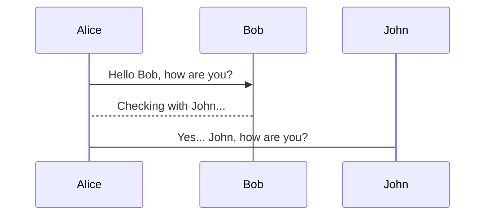
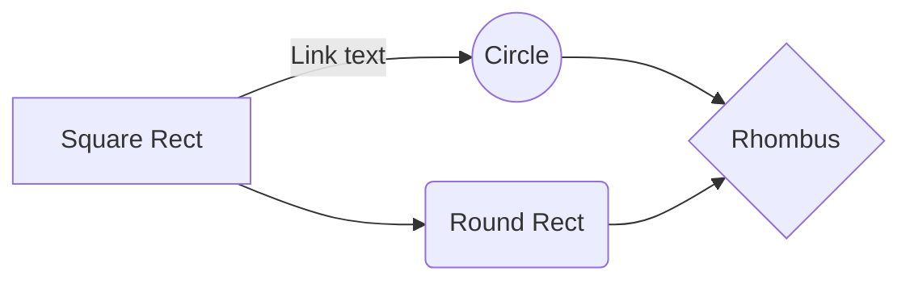
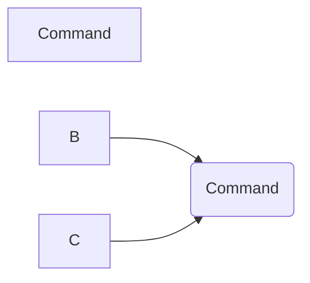

# Elementor JS `$e`  API
## Introduction

**Elementor JS API** - is set of *API(s)*, *modules*, and *utils*, used to communicating with *elementor*.
 represented as `$e` - Global Variable.

# Overview
| API Name                                       | Access          | Description           |
|------------------------------------------------|-----------------|-----------------------|
| [Components](#api---ecomponents)              | `$e.components` | Components management |
| [Hooks](#api---ehooks)          | `$e.hooks`      | Data oriented hooks   |
| [Events](#api---eevents)       | `$e.events`     | UI oriented events    |
| [Commands](#api---ecommands) | `$e.commands`   | Commands management   |
| Routes   | `$e.routes`    | Routes management |
| Shortcuts| `$e.shortcuts` | Shortcuts component |
| DevTools | `$e.devTools`  | External plugin for developers. |


# Aliases
| Function Name | Alias        | API           | Original            | Description			     |
|---------------|--------------|---------------|---------------------|---------------------------|
| run           | `$e.run()`   | `$e.commands` | `$e.commands.run()` | Run command.              |
| route         | `$e.route()` | `$e.routes`   | `$e.routes.run()`   | Run route ( open route ). |


# API - `$e.components`
The new Components API (since 2.7.0), provides a simple and convenient way to bind all route and commands, and keyboard shortcuts that belong to a UI component – into one controller.
The full list of components, including custom & 3rd routes, is available via: `$e.components.getAll();`
Each component has it’s unique namespace, that all it’s command and routes are nested under it.

On route to a component route, the component becomes “active” that mean that allows make sure that keyboard shortcuts of this component will work only if the component is active.

The components are extensible so a 3rd party plugin can add some routes, command and shortcuts to an existing component.

*  **Description**: `$e.components` API is a manager of `$e` _components_.
*  **Location**: *core/common/assets/js/api/apis/components.js*
*  **Parent**: `elementorModules.Module`
*  **Methods**:

	|  Name | Access | Parameters | Returns | Description
	|---------|----------|--------------|-----------|-------------|
	| **getAll** | `$e.components.getAll()` |   | `{Array.<String>}` | Receive all components.
	| **register** | `$e.components.register()` |  `{BaseComponent}` *component* | `{BaseComponent}` *component* | Register a component.
	| **get** | `$e.components.get()` | `{String}` *id* | `{BaseComponent}` *component* | Get component instance by id.
	| **getActive** | `$e.components.getActive()` | | `{Object.<BaseComponent>}` *activeComponents* | Get active components.
	| **active** | `$e.components.activate()` | `{String}` *namespace* | | Activate component.
	| **inactive** | `$e.components.inactivate()` | `{String}` *namespace* | | Deactivate component.
	| **isActive** | `$e.components.isActive()` | `{String}` *namespace* | `{Boolean}` *isActive* | Is component active.

* **Examples**:
    ```javascript
     // Example create and register new component.
     class ExampleCommand extends $e.modules.CommandBase {
        apply( args ) {
            // Output command args to console.
            console.log( 'ExampleCommand: ', args );
     
            // Return object as example.
            return {
                example: 'result from ExampleCommand',
            };
        }
     }
     
     class CustomComponent extends elementorModules.common.Component {
        getNamespace() {
            return 'custom-component';
        }
     
        defaultCommands() {
            // Object of all the component commands.
            return {
                example: ( args ) => ( new ExampleCommand( args ) ).run(),
            };
        }
     }
     
     // Register the new component.
     $e.components.register( new CustomComponent() );
     
     // Run's 'example' command from 'custom-component'.
     result = $e.run( 'custom-component/example', {
        property: 'value',
     } );
     
     // Output command run result.
     console.log( 'e-components-eg-1-result: ', result );

    ```

## API - `$e.hooks`
*  **Description**: `$e.hooks` api is a manager of `$e.hooks`, allow you to create custom **data manipulation** of *elementor* data model, and create a dependencies, the _hooks_ attached 
to  `$e.commands`  and each  **hook** being fired after/before running a command, that runs by  `$e.run()`
*  **Location**: *core/common/assets/js/api/apis/hooks.js*
*  **Parent**: [`{Callbacks}`](#Callbacks)
*  **Register Methods**:

	| Name                   | Access                          | Params                      |  Returns              | Description                                               | Breakable |
	|------------------------|---------------------------------|-----------------------------|-----------------------|-----------------------------------------------------------|-----------|
	| **registerAfter**      | `$e.hooks.registerAfter()`      | `{CallableBase}` *instance* | `{Object}` *callback* | Register a hook that being fired after the command runs.  | false
	| **registerDependency** | `$e.hooks.registerDependency()` | `{CallableBase}` *instance* | `{Object}` *callback* | Register a hook that being fired before the command runs. | true

	> **Note:** Please look at class parent: `{Callbacks}` for all the methods.
  * ***Important***: All hooks should be created by extending [`{( HookAfter | HookDependency )}`](#HookAfter-HookDependency) located at:
    * `core/common/assets/js/api/modules/hook-base/after.js`
    * `core/common/assets/js/api/modules/hook-base/dependency.js`

*  **Examples**:
   * Built in hooks: *`assets/dev/js/editor/document/callback/hooks`*

   * **registerAfter**:
		```javascript
		// Example of hook after.
		import HookAfter from '../base/after';

		class SectionColumns extends HookAfter {
		   getCommand() {
		      return 'document/elements/create';  // Which command to listen.
		   }

		   getId() {
		      return 'create-section-columns';  // Unique id for the hook.
		   }

		   /*
		    * Optional function, used for optimization, if the container type is known in advance,
		    * you can pass it here.
		    */
		   bindContainerType() {
		      // Note: The container type is always document, since section can be create only on document.
		      return 'document';
		   }

		   /* Optional function, the conditions for hook to be run. */
		   getConditions( args ) {
		      return ! args.model.elements;
		   }

		   /*
		    * The actual hook logic.
		    */
		   apply( args, containers ) {
		      const { structure = false, options = {} } = args;

		      if ( ! Array.isArray( containers ) ) {
		         containers = [ containers ];
		      }

		      let { columns = 1 } = args;

		      if ( args.model.isInner && 1 === columns ) {
		         columns = DEFAULT_INNER_SECTION_COLUMNS;
		      }

		      Helper.createSectionColumns( containers, columns, options, structure );
		   }
		}
		```

   * **registerDependency**:

		```javascript
		// Example of hook that blooks column creation, if it reach maximum columns count.
		import HookDependency from '../base/dependency';

		class SectionColumnsLimit extends HookDependency {
		   getCommand() {
		      return 'document/elements/create';
		   }

		   getId() {
		      return 'section-columns-limit';
		   }

		   bindContainerType() {
		      return 'section';
		   }

		   /* NOTE: This is a dependncy hook and its breakable, when apply returns false */
		   apply( args ) {
		      const { containers = [ args.container ] } = args;

		      // If one of the targets have maximum columns reached break the command.
		      return ! containers.some( ( /**Container*/ container ) => {
		         return container.view.isCollectionFilled();
		      } );
		   }
		}
		```
        > **Note:** further information about [`{CallableBase}`](#CallableBase)**class**.

## API -  `$e.events`
*  **Description**: `$e.events` component is a manager of `$e` _events_, allow you to create custom **logic** that runs *after/before* the command without effect the data *elementor* data model,  history, etc...
the events attached to  `$e.commands`  and each  _event_ being fired after/before  running a command, that runs by  `$e.run()`, Mainly used for UI manipulation.
*  **Location**: *core/common/assets/js/components/events.js*
* **Parent**: [`{Callbacks}`](#Callbacks)
*  **Get Methods**:
*  **Register Methods**:

	| Name               | Access                       | Params                      | Returns                | Description
	|--------------------|------------------------------|-----------------------------|------------------------|----------------------------------------------------------------|
	| **registerAfter**  | `$e.events.registerAfter()`  | `{CallableBase}` *instance* | `{Object}` *callback*  | Register a event that being fired after the command runs.
	| **registerBefore** | `$e.events.registerBefore()` | `{CallableBase}` *instance* | `{Object}` *callback*  | Register a event that being fired before the command runs.

	> **Note:** Please look at class parent: `{Callbacks}` for all the methods.

* ***Important***: All hooks should be created by extending [`{CallableBase}`](#CallableBase) located at:
  * `assets/dev/js/editor/document/callback/base/base.js`
  * `assets/dev/js/editor/document/callback/events/base/after.js`
  * `assets/dev/js/editor/document/callback/events/base/dependency.js`

*  **Examples**:
   * Built in events ( Please take a look at this folder ):  *`assets/dev/js/editor/document/callback/events`*
   * **registerAfter**:

		```javascript
		// Example of event that change UI ( CSS Class ) when section is full.
		import HookAfter from '../base/after';

		class CreateSectionIsFull extends HookAfter {
		   getCommand() {
		      return 'document/elements/create';  // Which command to listen.
		   }

		   getId() {
		      return 'create-section-is-full';  // Unique id for the event.
		   }

		  /* Optional function, the conditions for hook to be run. */
		   getConditions( args ) {
		      const { containers = [ args.container ] } = args;

		      return containers.some( ( /* Container */ container ) =>
		         'section' === container.model.get( 'elType' )
		      );
		   }

		  /* The actual event logic. */
		   apply( args ) {
		      const { containers = [ args.container ] } = args;

		      containers.forEach( ( /* Container */ container ) => {
		         if ( 'section' === container.model.get( 'elType' ) ) {
		            container.view._checkIsFull();
		         }
		      } );
		   }
		}
		```

   * **registerBefore**:
		```javascript
		// Example of event that change the column size in UI only.
		import EventAfter from '../base/after';

		class ColumnChangeSize extends EventAfter {
		   getCommand() {
		      return 'document/elements/settings';
		   }

		   getId() {
		      return 'column-change-size';
		   }

		   getConditions( args ) {
		      return undefined !== args.settings._inline_size || undefined !== args.settings._column_size;
		   }

		   apply( args ) {
		      const { containers = [ args.container ] } = args;

		      containers.forEach( ( /* Container */ container ) => {
		         container.view.changeSizeUI();
		      } );
		   }
		}
		```
> **Note:** further information about [`{CallableBase}`](#CallableBase)**class**.

## API --  `$e.commands`
The new Commands API (since 2.7.0), provides a simple and convenient way to run something the the editor, create a widget, as well as show a notice or undo changes, using JS commands.

The full list of commands, including custom & 3rd commands, is available via: `$e.commands.getAll();`

*  **Description**: `$e.commands` component is a manager of `$e.commands`, allow you to create custom **commands** that runs by  `$e.run()`.

*  **Location**: */core/common/assets/js/components/commands.js*

* **Parent**: `elementorModules.Module`

*  **Methods**:

    | Method                          | Access                               | Params                                  | Returns | Description                                                                         |
    |---------------------------------|--------------------------------------|-----------------------------------------|---------|-------------------------------------------------------------------------------------|
    | **getAll**                      | `$e.commands.getAll()`               | `{String}` *command*                    |         | Receive all loaded commands.
    | **register**                    | `$e.commands.register()`             |                                         |         |
    | **getCurrent**                  | `$e.commands.getCurrent()`           |                                         |         | Receive currently running command.
    | **getCurrentArgs**              | `$e.commands.getCurrentArgs()`       |                                         |         | Receive currently running command args.
    | **getCurrentFirstTrace**        | `$e.commands.getCurrentFirstTrace()` |                                         |         | Receive first command in trace that currently running.
    | **isCurrentFirstTrace**         | `$e.commands.isCurrentFirstTrace()`  |                                         |         | Checks if *passed parameter* is the first command in trace that currently running.
    | **run**						  | `$e.commands.run()`                  | `{string}` *command*, `{Object}` *args* |         | Runs a command


# Quickstart

## Rename a file

You can rename the current file by clicking the file name in the navigation bar or by clicking the **Rename** button in the file explorer.

## Delete a file

You can delete the current file by clicking the **Remove** button in the file explorer. The file will be moved into the **Trash** folder and automatically deleted after 7 days of inactivity.

## Export a file

You can export the current file by clicking **Export to disk** in the menu. You can choose to export the file as plain Markdown, as HTML using a Handlebars template or as a PDF.


# Synchronization

Synchronization is one of the biggest features of StackEdit. It enables you to synchronize any file in your workspace with other files stored in your **Google Drive**, your **Dropbox** and your **GitHub** accounts. This allows you to keep writing on other devices, collaborate with people you share the file with, integrate easily into your workflow... The synchronization mechanism takes place every minute in the background, downloading, merging, and uploading file modifications.

There are two types of synchronization and they can complement each other:

- The workspace synchronization will sync all your files, folders and settings automatically. This will allow you to fetch your workspace on any other device.
	> To start syncing your workspace, just sign in with Google in the menu.

- The file synchronization will keep one file of the workspace synced with one or multiple files in **Google Drive**, **Dropbox** or **GitHub**.
	> Before starting to sync files, you must link an account in the **Synchronize** sub-menu.

## Open a file

You can open a file from **Google Drive**, **Dropbox** or **GitHub** by opening the **Synchronize** sub-menu and clicking **Open from**. Once opened in the workspace, any modification in the file will be automatically synced.

## Save a file

You can save any file of the workspace to **Google Drive**, **Dropbox** or **GitHub** by opening the **Synchronize** sub-menu and clicking **Save on**. Even if a file in the workspace is already synced, you can save it to another location. StackEdit can sync one file with multiple locations and accounts.

## Synchronize a file

Once your file is linked to a synchronized location, StackEdit will periodically synchronize it by downloading/uploading any modification. A merge will be performed if necessary and conflicts will be resolved.

If you just have modified your file and you want to force syncing, click the **Synchronize now** button in the navigation bar.

> **Note:** The **Synchronize now** button is disabled if you have no file to synchronize.

## Manage file synchronization

Since one file can be synced with multiple locations, you can list and manage synchronized locations by clicking **File synchronization** in the **Synchronize** sub-menu. This allows you to list and remove synchronized locations that are linked to your file.


# Publication

Publishing in StackEdit makes it simple for you to publish online your files. Once you're happy with a file, you can publish it to different hosting platforms like **Blogger**, **Dropbox**, **Gist**, **GitHub**, **Google Drive**, **WordPress** and **Zendesk**. With [Handlebars templates](http://handlebarsjs.com/), you have full control over what you export.

> Before starting to publish, you must link an account in the **Publish** sub-menu.

## Publish a File

You can publish your file by opening the **Publish** sub-menu and by clicking **Publish to**. For some locations, you can choose between the following formats:

- Markdown: publish the Markdown text on a website that can interpret it (**GitHub** for instance),
- HTML: publish the file converted to HTML via a Handlebars template (on a blog for example).

## Update a publication

After publishing, StackEdit keeps your file linked to that publication which makes it easy for you to re-publish it. Once you have modified your file and you want to update your publication, click on the **Publish now** button in the navigation bar.

> **Note:** The **Publish now** button is disabled if your file has not been published yet.

## Manage file publication

Since one file can be published to multiple locations, you can list and manage publish locations by clicking **File publication** in the **Publish** sub-menu. This allows you to list and remove publication locations that are linked to your file.


# Markdown extensions

StackEdit extends the standard Markdown syntax by adding extra **Markdown extensions**, providing you with some nice features.

> **ProTip:** You can disable any **Markdown extension** in the **File properties** dialog.


## SmartyPants

SmartyPants converts ASCII punctuation characters into "smart" typographic punctuation HTML entities. For example:

|                |ASCII                          |HTML                         |
|----------------|-------------------------------|-----------------------------|
|Single backticks|`'Isn't this fun?'`            |'Isn't this fun?'            |
|Quotes          |`"Isn't this fun?"`            |"Isn't this fun?"            |
|Dashes          |`-- is en-dash, --- is em-dash`|-- is en-dash, --- is em-dash|


## KaTeX

You can render LaTeX mathematical expressions using [KaTeX](https://khan.github.io/KaTeX/):

The *Gamma function* satisfying $\Gamma(n) = (n-1)!\quad\forall n\in\mathbb N$ is via the Euler integral

$$
\Gamma(z) = \int_0^\infty t^{z-1}e^{-t}dt\,.
$$

> You can find more information about **LaTeX** mathematical expressions [here](http://meta.math.stackexchange.com/questions/5020/mathjax-basic-tutorial-and-quick-reference).


## UML diagrams

You can render UML diagrams using [Mermaid](https://mermaidjs.github.io/). For example, this will produce a sequence diagram:



And this will produce a flow chart:





