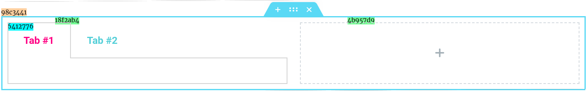

# Elementor JS `$e`  API
## Introduction

**Elementor JS API** - is set of *API(s)*, *modules*, and *utils*, used to communicating with *elementor*.
 represented as `$e` - Global Variable.

# Overview
| API Name                           | Access          | Description                    |
|------------------------------------|-----------------|--------------------------------|
| [Components](api/ecomponents.md)   | `$e.components` | Components management 
| [Hooks](api/ehooks.md)             | `$e.hooks`      | Data oriented hooks   
| [Events](api/eevents.md)           | `$e.events`     | UI oriented events    
| [Commands](api/ecommands.md)       | `$e.commands`   | Commands management   
| Routes                             | `$e.routes`     | Routes management      
| Shortcuts                          | `$e.shortcuts`  | Shortcuts component      
| DevTools                           | `$e.devTools`   | External plugin for developers. 

# Aliases
| Alias        | Original            | Description			     |
|--------------|---------------------|---------------------------|
| `$e.run()`   | `$e.commands.run()` | Run command.              |
| `$e.route()` | `$e.routes.run()`   | Run route ( open route ). |

# Legend
* Example:

-   `Section ID` - `98c3441`
-  `Column ID` &nbsp;&nbsp;- `18f2ab4`, `4b957d9`
-   `Widget ID` &nbsp;&nbsp;- `5412776`

# Quickstart
    TODO

