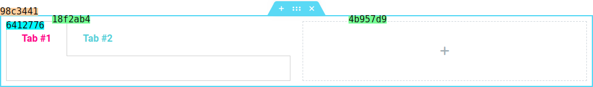

# Legend
* For all the examples in the __Document__ component and its subcomponents, the following legend is used, to determine which type of element is being used:
-   `Section ID` - `98c3441`
-  `Column ID` &nbsp;&nbsp;- `18f2ab4`, `4b957d9`
-   `Widget ID` &nbsp;&nbsp;- `5412776`

  

Every element in the document has a unique ID which is used to identify it in the editor, and is resolved to a unique [Container](#) object that can be accessed using the following method:
```javascript
elementor.getContainer( ID );
```
Every command under document uses `container` or `containers` as parameters to define the target.

The commands can accept `container` or `containers` but not both.

| Property     | Type                  | Description |
|---           |---                    |---|
| _container_  | `{Container}`         | Target.
| _containers_ | `{Container[]}`       | Targets.


## Component -- `$e.components.get('document')`

* **Name**: Document.
* **Description**: `Document` is used as namespace of describing changes in the document made by the command.

## All **Document** subcomponents
| Component Name                 | Access Component                         | Description
|--------------------------------|------------------------------------------|-----------------------
| [Dynamic](dynamic/readme.md)   | `$e.components.get('document/dynamic')`  | Dynamic enable, disable and change.
| [Elements](elements/readme.md) | `$e.components.get('document/elements')` | Elements manipulation (create, edit, remove, etc.).
| [History](history/readme.md)   | `$e.components.get('document/history')`  | Provides a way to record/manipulate the commands history.
| [Repeater](repeater/readme.md) | `$e.components.get('document/repeater')` | Provides a way to communicate with repeaters.
| [Save](save/readme.md)         | `$e.components.get('document/save')`     | Responsible for saving the document (either publish/draft).
| [UI](ui/readme.md)             | `$e.components.get('document/ui')`       | Irregular component for handling UI shortcuts.

## Component `document` -- Utils
| Util Name                                                                 | Access Util                                               
|---------------------------------------------------------------------------|-----------------------------------------------------------|
| [findViewRecursive](#util----ecomponentsgetdocumentutilsfindviewrecursive)| `$e.components.get('document').utils.findViewRecursive()` |
| [findViewById](#util----ecomponentsgetdocumentutilsfindviewbyid)          | `$e.components.get('document').utils.findViewById()`      |
| [findContainerById](#util----ecomponentsgetdocumentutilsfindcontainerbyid)| `$e.components.get('document').utils.findContainerById()` |

## _Util_ -- `$e.components.get('document').utils.findViewRecursive()`
* **Name**: findViewRecursive.
* **Description**: Find view recursively, the method will run recursively until it finds the view with given key & value.
* **Returns**: `{Array}`

   | Property     | Type                  | Requirement   | Description |
   |---           |---                    |---            |---          |
   | _parent_     | {Marionette.View}     | _required_    | Parent view.
   | _key_        | {String}              | _required_    | Key of the view used to  find the view. e.g: id.
   | _value_      | {String}              | _required_    | Value of the view used to find the view. e.g: `98c3441`.
   | _multiple_   | `{Boolean}`           | **optional**  | default: `{false}`. allow multiple results.

## _Util_ -- `$e.components.get('document').utils.findViewById()`
* **Description**: Find view by id, the method will run recursively until it finds the view with the given id.
* **Returns**: `{ View | View[] }`

  | Property     | Type                  | Requirement   | Description |
   |---           |---                    |---            |---         |
   | _id_         | {String}              | **required**  | Id of the element.

## _Util_ -- `$e.components.get('document').utils.findContainerById()`
*  **Name**: findContainerById.
*  **Description**: Find container by id, the method will run recursively until it finds the `{elementorModules.editor.Container}` with given id.
*  **Returns**: `{ Container | Container[] }`

   | Property     | Type                  | Requirement   | Description |
   |---           |---                    |---            |---         |
   | _id_         | {String}              | **required**  | Id of the element.


### [Back](../readme.md) 
