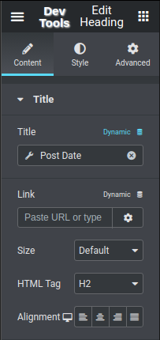
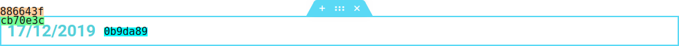
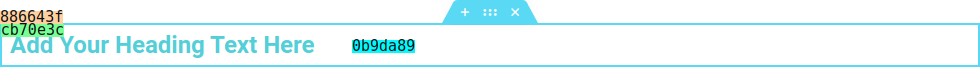
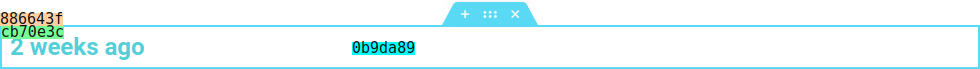

## Component -- `$e.components.get('document/dynamic')`

*  **Name**: Dynamic.
*  **Description**: Provide a way to _enable_, _change_ or _disable_ dynamic settings, associated with [Dynamic Tags](https://developers.elementor.com/dynamic-tags/),

## Component `document/dynamic/` -- Commands
| Command                                                         | Access                                  | Description
|-----------------------------------------------------------------|-----------------------------------------|-----------------------------------------
| [Disable](#disable-command----erundocumentdynamicdisable)       | `$e.run('document/dynamic/disable')`    | Disable dynamic tag.
| [Enable](#enable-command----erundocumentdynamicenable)          | `$e.run('document/dynamic/enable')`     | Enable dynamic tag.
| [Settings](#settings-command----erundocumentdynamicsettings)    | `$e.run('document/dynamic/settings')`   | Edit dynamic settings.


## Disable _Command_ -- `$e.run('document/dynamic/disable')`
* **Name**: Disable.
* **Description**: Disable dynamic settings.
* **Returns**: `{void}`
* **Arguments**:

   | Property     | Type                  | Description |
   |---           |---                    |---|
   | _container_  | `{Container}`         | Target.
   | _containers_ | `{Container[]}`       | Targets.
   | _settings_   | `{Object}`            | Dynamic settings to disable.

* **Example**:
  Assuming we have a widget with dynamic tag for *title*, and want to disable it.

  |    |    |
  |---:|:---|
  |  | 

    ```javascript
      // Get the view by id, then get the container.
      const eWidget = elementor.getContainer( '0b9da89' );
  
      // Disable dynamic tag 'date'.
      $e.run( 'document/dynamic/disable', {
          container: eWidget,
          settings: {
              title: true,
          },
      } );
    ```
  Will disable dynamic tag for title.

## Enable _Command_ -- `$e.run('document/dynamic/enable')`
* **Name**: Enable.
* **Description**: Enable dynamic settings.
* **Returns**: `{void}`
* **Arguments**:

   | Property     | Type             | Description |
   |---           |---               |---|
   | _container_  | `{Container}`    | Target.
   | _containers_ | `{Container[]}`  | Targets.
   | _settings_   | `{Object}`       | Dynamic settings to enable.

* **Example**:
  Enable dynamic title for heading, assuming you have simple widget like this:

  
    ```javascript
    // Get heading container.
    const eWidget = elementor.getContainer( '0b9da89' ),
      postDateTag = elementor.dynamicTags.tagDataToTagText( elementorCommon.helpers.getUniqueId(), 'post-date', new Backbone.Model( {} ));
  
    // Enable dynamic tag `post-date` for title.
    $e.run( 'document/dynamic/enable', {
          container: eWidget,
          settings: {
              title: postDateTag,
          },
    } );
    ```
  Will enable dynamic tag: 'post-date' for heading title:

  


## Settings _Command_ -- `$e.run('document/dynamic/settings')`
* **Name**: Settings.
* **Description**: Edit dynamic settings.
* **Returns**: `{void}`
* **Arguments**:

   | Property     | Type             | Description | 
   |---           |---               |---|
   | _container_  | `{Container}`    | Target.
   | _containers_ | `{Container[]}`  | Targets.
   | _settings_   | `{Object}`       | Dynamic settings to change.

* **Example**:
  Change dynamic settings for title with dynamic tag *post-date*.
  Assuming you have a heading with 'post-date' dynamic tag for title.

  

  And you want to change the format to human-readable format. use next example:

    ```javascript
    // Get heading container.
    const eWidget = elementor.getContainer( '0b9da89' ),
      postDateTag = elementor.dynamicTags.tagDataToTagText( elementorCommon.helpers.getUniqueId(), 'post-date', new Backbone.Model( { format: 'human'} ));
    
    // Change dynamic settings.
    $e.run( 'document/dynamic/settings', {
          container: eWidget,
          settings: {
              title: postDateTag,
          },
    } );
    ```
  The result will be:

  


### [Back](../component.md) 
