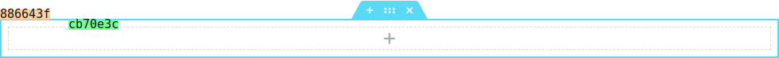

## Component -- `$e.components.get('document/elements')`

*  **Name**: Elements.
*  **Description**: Provide a way to manage elements, create, edit, delete. copy, paste, etc...

## Component `document/elements/` -- Commands
| Command                                                                | Access                                             | Description         
|------------------------------------------------------------------------|----------------------------------------------------|-----------------------------------------
| [Copy](#copy-command----erundocumentelementscopy)                      | `$e.run('document/elements/copy')`                 | Copy container. 
| [Copy-All](#copyall-command----erundocumentelementscopy-all)           | `$e.run('document/elements/copy-all')`             | Copy all containers. 
| [Create](#create-command----erundocumentelementscreate)                | `$e.run('document/elements/create')`               | Create element. 
| [Delete](#delete-command----erundocumentelementsdelete)                | `$e.run('document/elements/delete')`               | Delete container. 
| [Duplicate](#duplicate-command----erundocumentelementsduplicate)       | `$e.run('document/elements/duplicate')`            | Duplicate container. 
| [Empty](#empty-command----erundocumentelementsempty)                   | `$e.run('document/elements/empty')`                | Empty document. 
| [Import](#import-command----erundocumentelementsimport)                | `$e.run('document/elements/import')`               | Import to document. 
| [Paste](#paste-command----erundocumentelementspaste)                   | `$e.run('document/elements/paste')`                | Paste to container. 
| [Paste-Style](#paste-style-command----erundocumentelementspaste-style) | `$e.run('document/elements/paste-style')`          | Paste style to container. 
| [Reset-Style](#reset-style-command----erundocumentelementsreset-style) | `$e.run('document/elements/reset-style')`          | Reset style to container. 
| [Settings](#settings-command----erundocumentelementssettings)          | `$e.run('document/elements/settings')`             | Change settings of container. 

## Copy _Command_ -- `$e.run('document/elements/copy')`
*  **Name**: Copy.
*  **Description**: Copy container.
*  **Returns**: `{void}`
*  **Arguments**: 

    | Property     | Type                  | Requirement   | Description |
    |---           |---                    |---            |---|
    | _container_  | `{Container}`         | **required**  | Container to copy.
    | _containers_ | `{Array.<Container>}` | **required**  | Containers to copy.
    | _storageKey_ | `{String}`            | **optional**  | default: `{'clipboard'}`.

## CopyAll _Command_ -- `$e.run('document/elements/copy-all')`
*  **Name**: Copy-All.
*  **Description**: Copy all containers.
*  **Returns**: `{void}`
*  **Arguments**: None.

## Create _Command_ -- `$e.run('document/elements/create')`
*  **Name**: Create.
*  **Description**: Create element from model.
*  **Returns**: `{Container | Array.<Container>}` *Created container(s)*.
*  **Arguments**: 

    | Property     | Type                  | Requirement   | Description |
    |---           |---                    |---            |---|
    | _container_  | `{Container}`         | **required**  | Container target.
    | _containers_ | `{Array.<Container>}` | **required**  | Containers target.
    | _model_      | `{Object}`            | **required**  | Model to create.
    | _options_    | `{Object}`            | **optional**  | 

    **_options:_**
   
    | Property    | Type                              | Default   | Description                            |
    |-------------|-----------------------------------|-----------|----------------------------------------|
    | at          | `{Number}`                        | `{null}`  | Position (null means last). 
    | clone       | `{Boolean}`                       | `{false}` | Generate unique id for the model.
    | edit        | `{Boolean}`                       | `{false}` | Is turn edit panel for the new element.
    | onBeforeAdd | `{function()}`                    |           | Run callback before add.
    | onAfterAdd  | `{function( newModel, newView )}` |           | Run callback after add.
    | trigger     | `{Boolean}`                       | `{false}` | *Deprecated*.

* **Examples**:
    Create Heading widget 
    ```javascript
    // Create section.
    const eSection = $e.run( 'document/elements/create', {
      container: elementor.getPreviewContainer(),
      columns: 1,
      model: { elType: 'section' },
    } );  
    ```
    Result: 
    Now to create widget, we need column, here is two examples how to reach column:
    ```javascript
    const eColumn = eSection.view.children.findByIndex( 0 ).getContainer();
    ```
    OR
    ```javascript
    const eColumn = $e.components.get( 'document' ).utils.findContainerById('cb70e3c');
    ```
    Then let create heading widget at the column we reach above:
    ```javascript
    $e.run( 'document/elements/create', {
        container: eColumn,
        model: { 
          elType: 'widget',
          widgetType: 'heading',
        },
    } );
    ```
    Result: 

## Delete _Command_ -- `$e.run('document/elements/delete')`
*  **Name**: Delete.
*  **Description**: Delete container.
*  **Returns**: `{Container | Array.<Container>}` *Deleted container(s)*.
*  **Arguments**: 

    | Property     | Type                  | Requirement   | Description |
    |---           |---                    |---            |---|
    | _container_  | `{Container}`         | **required**  | Container to delete.
    | _containers_ | `{Array.<Container>}` | **required**  | Containers to delete.
    
* **Examples**:
    Delete a section, Assuming we have this section, and want to delete it.
    
    ```javascript
    // Get section container.
    const eSection = $e.components.get( 'document' ).utils.findContainerById('886643f');
    
    $e.run( 'document/elements/delete', { 
        container: eSection,
    } );
    ```
    result: section deleted and all children elements.

## Duplicate _Command_ -- `$e.run('document/elements/duplicate')`
*  **Name**: Duplicate.
*  **Description**: Duplicate container.
*  **Returns**: `{Container | Array.<Container>}` *Created container(s)*.
*  **Arguments**: 

    | Property     | Type                  | Requirement   | Description |
    |---           |---                    |---            |---|
    | _container_  | `{Container}`         | **required**  | Container to duplicate.
    | _containers_ | `{Array.<Container>}` | **required**  | Containers to duplicate.
    
* **Examples**:
    Duplicate a section, Assuming we have this section, and want to duplicate it.
    
    ```javascript
    // Get section container.
    const eSection = $e.components.get( 'document' ).utils.findContainerById('886643f');
    
    $e.run( 'document/elements/duplicate', { 
        container: eSection,
    } );
    ```
    Result: 
    

## Empty _Command_ -- `$e.run('document/elements/empty')`
*  **Name**: Empty.
*  **Description**: Delete all elements from the document.
*  **Returns**: `{void}`

    | Property | Type        | Requirement       | Description |
    |---       |---          |---                |---|
    | _force_  | `{Boolean}` | **optional**      | default: `{false}`, if true will delete all elements without confirmation.


## Import _Command_ -- `$e.run('document/elements/import')`
*  **Name**: Import.
*  **Description**: Import elements to the document.
*  **Returns**: `{Container | Array.<Container>}` *Imported container(s)*.
*  **Arguments**:

    | Property  | Type               | Requirement       | Description |
    |---        |---                 |---                |---|
    | _model_   | `{Backbone.Model}` | **required**      | Template model.
    | _data_    | `{Object}`         | **required**      | Data.
    | _options_ | `{Object}`         | **optional**      | 

    **_data:_**
   
    | Property      | Type       | Default   | Description                            |
    |---------------|------------|-----------|----------------------------------------|
    | content       | `{Object}` |           | Template content. 
    | page_settings | `{Object}` |           | Template page settings.
    
    **_options:_**
   
    | Property         | Type                              | Default   | Description                            |
    |------------------|-----------------------------------|-----------|----------------------------------------|
    | withPageSettings | `{Boolean}`                       | `{false}` | Should set page settings of `args.page_settings`.
    | at               | `{Number}`                        | `{null}`  | Position ( Automatically increased ).
    | clone            | `{Boolean}`                       | `{false}` | Generate unique id for the model.
    | edit             | `{Boolean}`                       | `{false}` | Is turn edit panel for the new element.
    | onBeforeAdd      | `{function()}`                    |           | Run callback before add.
    | onAfterAdd       | `{function( newModel, newView )}` |           | Run callback after add.
    | trigger          | `{Boolean}`                       | `{false}` | *Deprecated*.

## Paste _Command_ -- `$e.run('document/elements/paste')`
*  **Name**: Paste.
*  **Description**: Paste to container.
*  **Returns**: `{Container | Array.<Container>}` *Pasted container(s)*.
*  **Arguments**: 

    | Property     | Type                  | Requirement   | Description |
    |---           |---                    |---            |---|
    | _container_  | `{Container}`         | **required**  | Container target.
    | _containers_ | `{Array.<Container>}` | **required**  | Containers target.
    | _storageKey_ | `{String}`            | **optional**  | default: `{'clipboard'}`.

* **Examples**:
    Copy widget and paste it into column.

    ```javascript
    const eColumn = $e.components.get( 'document' ).utils.findContainerById('cb70e3c'),
        eWidget = $e.components.get( 'document' ).utils.findContainerById('2e4b783');
    
    $e.run('document/elements/copy', { 
        container: eWidget
    } );
    
    const pastedContainers = $e.run('document/elements/paste', { 
        container: eColumn
    } );
    
    console.log( pastedContainers );
    ```
    Result:

## Paste-Style _Command_ -- `$e.run('document/elements/paste-style')`
*  **Name**: Paste-Style.
*  **Description**: Paste style to container.
*  **Returns**: `{void}`.
*  **Arguments**: 

    | Property     | Type                  | Requirement   | Description |
    |---           |---                    |---            |---|
    | _container_  | `{Container}`         | **required**  | Container target.
    | _containers_ | `{Array.<Container>}` | **required**  | Containers target.
    | _storageKey_ | `{String}`            | **optional**  | default: `{'clipboard'}`.

* **Examples**:
    Copy style from one widget and paste it into another.
    Assuming we have a two widgets one with special style, another one with defaults, we will copy the style of the one with the default and paste to into the speical one, to restore him to default.
    

    ```javascript
    const eSpecialWidget = $e.components.get( 'document' ).utils.findContainerById('2e4b783'),
        eDefaultWidget = $e.components.get( 'document' ).utils.findContainerById('192125b');
    
    $e.run('document/elements/copy', { 
        container: eDefaultWidget
    } );
    
    $e.run('document/elements/paste-style', { 
        container: eSpecialWidget
    } );
    ```
    Result:

## Reset-Style _Command_ -- `$e.run('document/elements/reset-style')`
*  **Name**: Reset-Style.
*  **Description**: Rest style of container.
*  **Returns**: `{void}`.
*  **Arguments**: 

    | Property     | Type                  | Requirement   | Description |
    |---           |---                    |---            |---|
    | _container_  | `{Container}`         | **required**  | Container target.
    | _containers_ | `{Array.<Container>}` | **required**  | Containers target.
    | _storageKey_ | `{String}`            | **optional**  | default: `{'clipboard'}`.

* **Examples**:
    Reset style of widget.
    Assuming we have a widget with special style.
    

    ```javascript
    const eWidget = $e.components.get( 'document' ).utils.findContainerById('2e4b783');
    
    $e.run('document/elements/reset-style', { 
      container: eWidget
    } );
    ```
    Result:
    
    

## Settings _Command_ -- `$e.run('document/elements/settings')`
*  **Name**: Settings.
*  **Description**: Change container settings.
*  **Returns**: `{void}`
*  **Arguments**: 

    | Property          | Type                  | Requirement   | Description |
    |---                |---                    |---            |---|
    | _container_       | `{Container}`         | **required**  | Container target.
    | _containers_      | `{Array.<Container>}` | **required**  | Containers target.
    | _settings_        | `{Object}`            | **required**  | Settings.
    | _isMultiSettings_ | `{Boolean}`           | **optional**  | default: `{false}`, settings for multi containers (each container).
    | _options_         | `{Object}`            | **optional**  |

    **_options:_**
   
    | Property         | Type        | Default   | Description                            |
    |------------------|------------ |-----------|----------------------------------------|
    | external         | `{Boolean}` | `{false}` | Re-render panel with new settings.
    | debounce         | `{Boolean}` | `{true}`  | Enable\Disable debounce.

* **Examples**:
   * Change settings of widget, assuming we have widget heading, let change title color.
        
    
        ```javascript
        const eWidget = $e.components.get( 'document' ).utils.findContainerById('2e4b783');
        
        $e.run('document/elements/settings', { 
          container: eWidget,
          settings: {
              title_color: 'black',
          }
        } );
        ```
        Result:
        
    
    * TODO: Add example with multi containers.

### [Back](../readme.md) 
