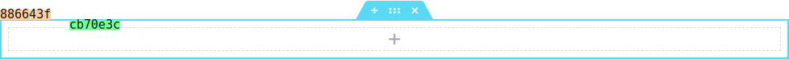
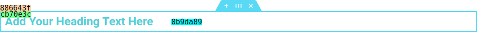
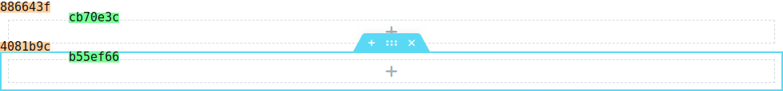
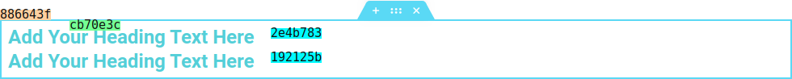
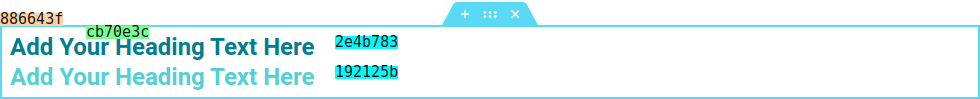
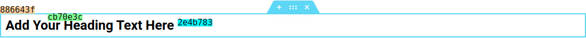

## Component -- `$e.components.get('document/elements')`

*  **Name**: Elements.
*  **Description**: Provides a way to manipulate and perform actions on the currently edited document: create, edit, delete, copy, paste, select, deselect, etc. It's possible using elements [Container](#) instances.

## Component `document/elements/` -- Commands
| Command                                                                | Access                                             | Description         
|------------------------------------------------------------------------|----------------------------------------------------|-----------------------------------------
| [Copy](#copy-command----erundocumentelementscopy)                      | `$e.run('document/elements/copy')`                 | Copy element.
| [Copy-All](#copyall-command----erundocumentelementscopy-all)           | `$e.run('document/elements/copy-all')`             | Copy all elements in the document.
| [Create](#create-command----erundocumentelementscreate)                | `$e.run('document/elements/create')`               | Create element.
| [Delete](#delete-command----erundocumentelementsdelete)                | `$e.run('document/elements/delete')`               | Delete element.
| [Duplicate](#duplicate-command----erundocumentelementsduplicate)       | `$e.run('document/elements/duplicate')`            | Duplicate element.
| [Empty](#empty-command----erundocumentelementsempty)                   | `$e.run('document/elements/empty')`                | Empty document element.
| [Import](#import-command----erundocumentelementsimport)                | `$e.run('document/elements/import')`               | Import elements.
| [Paste](#paste-command----erundocumentelementspaste)                   | `$e.run('document/elements/paste')`                | Paste new element(s) into an existing element/document.
| [Paste-Style](#paste-style-command----erundocumentelementspaste-style) | `$e.run('document/elements/paste-style')`          | Paste style to element.
| [Reset-Style](#reset-style-command----erundocumentelementsreset-style) | `$e.run('document/elements/reset-style')`          | Reset style to element.
| [Settings](#settings-command----erundocumentelementssettings)          | `$e.run('document/elements/settings')`             | Change settings of an element.

## Copy _Command_ -- `$e.run('document/elements/copy')`
* **Name**: Copy.
* **Description**: Copy element.
* **Returns**: `{void}`
* **Arguments**: 

   | Property     | Type             | Description |
   |---           |---               |---|
   | _container_  | `{Container}`    | Target.
   | _containers_ | `{Container[]}`  | Targets.
   | _storageKey_ | `{String}`       | default: `{'clipboard'}`.

## CopyAll _Command_ -- `$e.run('document/elements/copy-all')`
*  **Name**: Copy-All.
*  **Description**: Copy all elements in the document.
*  **Returns**: `{void}`
*  **Arguments**: None.

## Create _Command_ -- `$e.run('document/elements/create')`
* **Name**: Create.
* **Description**: Create element from model.
* **Returns**: `{Container | Container[]}` *Created container(s)*.
* **Arguments**: 

    | Property     | Type             | Description |
    |---           |---               |---|
    | _container_  | `{Container}`    | Target.
    | _containers_ | `{Container[]}`  | Targets.
    | _model_      | `{Object}`       | Model to create.
    | _options_    | `{Object}`       | Options.

    **_options:_**
   
    | Property    | Type                              | Default   | Description                            |
    |-------------|-----------------------------------|-----------|----------------------------------------|
    | at          | `{Number}`                        | `{null}`  | Index position (`null` means last). 
    | clone       | `{Boolean}`                       | `{false}` | Generate unique id for the model.
    | edit        | `{Boolean}`                       | `{false}` | Whether to open the panel for editing after creating the element.
    | onBeforeAdd | `{function()}`                    |           | Run callback before add.
    | onAfterAdd  | `{function( newModel, newView )}` |           | Run callback after add.
    | trigger     | `{Boolean}`                       | `{false}` | *Deprecated*.

* **Examples**:
    Create Heading widget 
    ```javascript
    // Create section.
    const eSection = $e.run( 'document/elements/create', {
      container: elementor.getPreviewContainer(),
      columns: 1,
      model: { elType: 'section' },
    } );  
    ```
    Result: 
    
    
    
    Now, in order to create the widget, we need a column. There are two ways to access the automatically created column, depends on the context. When the section's container instance is available, we can simply access its children:
    ```javascript
    const eColumn = eSection.children[ 0 ];
    ```
    In other cases, where a the column's container-id is provided, we can retrieve the corresponding container instance:
    ```javascript
    const eColumn = elementor.getContainer('cb70e3c');
    ```
    Finally, the heading widget can be created at the selected column:
    ```javascript
    $e.run( 'document/elements/create', {
        container: eColumn,
        model: { 
          elType: 'widget',
          widgetType: 'heading',
        },
    } );
    ```
    Result: 
    
    

## Delete _Command_ -- `$e.run('document/elements/delete')`
*  **Name**: Delete.
*  **Description**: Delete element.
*  **Returns**: `{Container | Container[]}` *Deleted container(s)*.
*  **Arguments**: 

   | Property     | Type             | Description |
   |---           |---               |---|
   | _container_  | `{Container}`    | Target.
   | _containers_ | `{Container[]}`  | Targets.
    
* **Examples**:
    Delete a section, Assuming we have this section, and want to delete it.
    
    ```javascript
    // Get section container.
    const eSection = elementor.getContainer( '886643f' );
    
    $e.run( 'document/elements/delete', { 
        container: eSection,
    } );
    ```
    Result: The section and all of its child elements are deleted.

## Duplicate _Command_ -- `$e.run('document/elements/duplicate')`
* **Name**: Duplicate.
* **Description**: Duplicate element.
* **Returns**: `{Container | Container[]}` *Created container(s)*.
* **Arguments**: 

   | Property     | Type             | Description |
   |---           |---               |---|
   | _container_  | `{Container}`    | Target.
   | _containers_ | `{Container[]}`  | Targets.
    
* **Examples**:
    Duplicating a section.
    
    ```javascript
    // Get section container.
    const eSection = elementor.getContainer( '886643f' );
    
    $e.run( 'document/elements/duplicate', { 
        container: eSection,
    } );
    ```
    Result: 
    
    

## Empty _Command_ -- `$e.run('document/elements/empty')`
*  **Name**: Empty.
*  **Description**: Delete all elements from the document.
*  **Returns**: `{void}`

    | Property | Type        | Requirement       | Description |
    |---       |---          |---                |---|
    | _force_  | `{Boolean}` | **optional**      | default: `{false}`, if true will delete all elements without confirmation.


## Import _Command_ -- `$e.run('document/elements/import')`
*  **Name**: Import.
*  **Description**: Import elements.
*  **Returns**: `{Container | Container[]}` *Imported container(s)*.
*  **Arguments**:

    | Property  | Type               | Requirement       | Description |
    |---        |---                 |---                |---|
    | _model_   | `{Backbone.Model}` | **required**      | Template model.
    | _data_    | `{Object}`         | **required**      | Data.
    | _options_ | `{Object}`         | **optional**      | 

    **_data:_**
   
    | Property      | Type       | Default   | Description                            |
    |---------------|------------|-----------|----------------------------------------|
    | content       | `{Object}` |           | Template content. 
    | page_settings | `{Object}` |           | Template page settings.
    
    **_options:_**
   
    | Property         | Type                              | Default   | Description                            |
    |------------------|-----------------------------------|-----------|----------------------------------------|
    | withPageSettings | `{Boolean}`                       | `{false}` | Should set page settings of `args.page_settings`.
    | at               | `{Number}`                        | `{null}`  | Position (Automatically increased).
    | clone            | `{Boolean}`                       | `{false}` | Generate unique id for the model.
    | edit             | `{Boolean}`                       | `{false}` | Is turn edit panel for the new element.
    | onBeforeAdd      | `{function()}`                    |           | Run callback before add.
    | onAfterAdd       | `{function( newModel, newView )}` |           | Run callback after add.
    | trigger          | `{Boolean}`                       | `{false}` | *Deprecated*.

## Paste _Command_ -- `$e.run('document/elements/paste')`
* **Name**: Paste.
* **Description**: Paste new element(s) into an existing element or document.
* **Returns**: `{Container | Container[]}` *Pasted container(s)*.
* **Arguments**: 

   | Property     | Type             | Description |
   |---           |---               |---|
   | _container_  | `{Container}`    | Target.
   | _containers_ | `{Container[]}`  | Targets.
   | _storageKey_ | `{String}`       | default: `{'clipboard'}`.

* **Examples**:
    Copy widget and paste it into column.

    ```javascript
    const eColumn = elementor.getContainer( 'cb70e3c' ),
        eWidget = elementor.getContainer( '2e4b783' );
    
    $e.run( 'document/elements/copy', { 
        container: eWidget
    } );
    
    const pastedContainers = $e.run( 'document/elements/paste', { 
        container: eColumn
    } );
    
    console.log( pastedContainers );
    ```
    Result:

   

## Paste-Style _Command_ -- `$e.run('document/elements/paste-style')`
* **Name**: Paste-Style.
* **Description**: Paste style to element.
* **Returns**: `{void}`.
* **Arguments**: 

   | Property     | Type             | Description |
   |---           |---               |---|
   | _container_  | `{Container}`    | Target.
   | _containers_ | `{Container[]}`  | Targets.
   | _storageKey_ | `{String}`       | default: `{'clipboard'}`.

* **Examples**:
    Copy style from one widget and paste it into another.
    Assuming we have a two widgets one with special style, another one with defaults, we will copy the style of the one with the default and paste to into the special one, to restore him to default.
    

    ```javascript
    const eSpecialWidget = elementor.getContainer('2e4b783'),
        eDefaultWidget = elementor.getContainer('192125b');
    
    $e.run('document/elements/copy', { 
        container: eDefaultWidget
    } );
    
    $e.run('document/elements/paste-style', { 
        container: eSpecialWidget
    } );
    ```
    Result:

   

## Reset-Style _Command_ -- `$e.run('document/elements/reset-style')`
*  **Name**: Reset-Style.
*  **Description**: Rest style of an element.
*  **Returns**: `{void}`.
*  **Arguments**: 

   | Property     | Type             | Description |
   |---           |---               |---|
   | _container_  | `{Container}`    | Target.
   | _containers_ | `{Container[]}`  | Targets.
   | _storageKey_ | `{String}`       | default: `{'clipboard'}`.

* **Examples**:
    Reset style of widget.
    Assuming we have a widget with special style.
    

    ```javascript
    const eWidget = elementor.getContainer('2e4b783');
    
    $e.run('document/elements/reset-style', { 
      container: eWidget
    } );
    ```
    Result:
    
    

## Settings _Command_ -- `$e.run('document/elements/settings')`
*  **Name**: Settings.
*  **Description**: Change element settings.
*  **Returns**: `{void}`
*  **Arguments**: 

   | Property     | Type             | Description |
   |---           |---               |---|
   | _container_  | `{Container}`    | Target.
   | _containers_ | `{Container[]}`  | Targets.
   | _settings_        | `{Object}`  | Settings.
   | _isMultiSettings_ | `{Boolean}` | default: `{false}`, settings for multi containers (each container).
   | _options_         | `{Object}`  | 

    **_options:_**
   
    | Property         | Type        | Default   | Description                            |
    |------------------|------------ |-----------|----------------------------------------|
    | external         | `{Boolean}` | `{false}` | Re-render panel with new settings.
    | debounce         | `{Boolean}` | `{true}`  | Enable/Disable debounce.

* **Examples**:
   * Change settings of widget, assuming we have widget heading, let change title color.
        
    
        ```javascript
        const eWidget = elementor.getContainer('2e4b783');
        
        $e.run('document/elements/settings', { 
          container: eWidget,
          settings: {
              title_color: 'black', 
          }
        } );
        ```
        Result:
        

### [Back](../component.md) 
