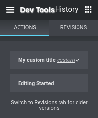
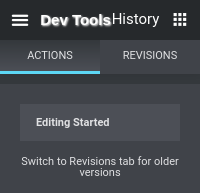

## Component -- `$e.components.get('document/history')`

*  **Name**: History.
*  **Description**: Provide a way to manage history...
*  **Built in history types**:
```javascript
historyTypes = {
	"add": "Added",
	"change": "Edited",
	"disable": "Disabled",
	"duplicate": "Duplicate",
	"enable": "Enabled",
	"move": "Moved",
	"paste": "Pasted",
	"paste_style": "Style Pasted",
	"remove": "Removed",
	"reset_style": "Style Reset",
	"reset_settings": "Settings Reset"
}
```

## Component `document/history/` -- Commands
| Command                                                                | Access                                             | Description         
|------------------------------------------------------------------------|----------------------------------------------------|-----------------------------------------
| [Add-Transaction](#)                                                   | `$e.run('document/history/add-transaction')`       | 
| [Clear-Transaction](#)                                                 | `$e.run('document/history/clear-transaction')`     | 
| [Delete-Log](#)                                                        | `$e.run('document/history/delete-log')`            | 
| [End-Log](#)                                                           | `$e.run('document/history/end-log')`               | 
| [End-Transaction](#)                                                   | `$e.run('document/history/end-transaction')`       | 
| [Log-Sub-Item](#)                                                      | `$e.run('document/history/log-sub-item')`          | 
| [Start-Log](#)                                                         | `$e.run('document/history/start-log')`             | 
| [Undo](#)                                                              | `$e.run('document/history/undo')`                  | 
| [Undo-All](#)                                                          | `$e.run('document/history/undo-all')`              | 
| [Redo](#)                                                              | `$e.run('document/history/redo')`                  | 

## _Command_ -- `$e.run('document/histroy/add-transaction')`
*  **Name**: Add-Transaction.
*  **Description**: Add item to transactions.
*  **Returns**: `{void}`
*  **Arguments**: 

    | Property     | Type                  | Requirement   | Description |
    |---           |---                    |---            |---|
    | _container_  | `{Container}`         | **require**   | Container log.
    | _containers_ | `{Array.<Container>}` | **require**   | Containers log.
    | _type_       | `{String}`            | **require**   | Type
    | _title_      | `{String}`            | **optional**  | Title.
    | _subTitle_   | `{String}`            | **optional**  | Sub title.
    | _restore_    | `{function()}`         | **optional** | Restore function.

## _Command_ -- `$e.run('document/histroy/clear-transaction')`
*  **Name**: Delete-Transaction.
*  **Description**: Clear transactions list.
*  **Returns**: `{void}`
*  **Arguments**: None.

## _Command_ -- `$e.run('document/histroy/delete-log')`
*  **Name**: Delete-Log.
*  **Description**: Delete logged history.
*  **Returns**: `{void}`
*  **Arguments**: 

    | Property     | Type                  | Requirement   | Description |
    |---           |---                    |---            |---|
    | _id_         | `{Number}`            | **required**  | Id of logged history to delete.
    
## _Command_ -- `$e.run('document/histroy/end-transaction')`
*  **Name**: End-Transaction.
*  **Description**: End transaction, will log the first and the last transaction, as new logged history.
title, subTitle will be taken from the first transaction item.
*  **Returns**: `{void}`
*  **Arguments**: None.

## _Command_ -- `$e.run('document/histroy/log-sub-item')`
*  **Name**: Log-Sub-Item.
*  **Description**: Log sub item, Each history item can have sub items ( non visual at history panel ).
*  **Returns**: `{void}`
*  **Arguments**: 

    | Property     | Type                  | Requirement    | Description |
    |---           |---                    |---             |---|
    | _id_         | `{Number}`            | **optional**   | Id of history item, to be sub item of. default: `{elementor.documents.currentDocument.history.getCurrentId()}`.
    | _container_  | `{Container}`         | **optional**   | Container log.
    | _containers_ | `{Array.<Container>}` | **optional**   | Containers log.
    | _type_       | `{String}`            | **optional**   | Type
    | _title_      | `{String}`            | **optional**   | Title.
    | _subTitle_   | `{String}`            | **optional**   | Sub title.
    | _restore_    | `{function()}`        | **optional**   | Restore function.

## _Command_ -- `$e.run('document/histroy/start-log')`
*  **Name**: Start-Log.
*  **Description**: Start log item.
*  **Returns**: `{Number}` *log id*.
*  **Arguments**: 

    | Property     | Type                  | Requirement   | Description |
    |---           |---                    |---            |---|
    | _container_  | `{Container}`         | **require**   | Container log.
    | _containers_ | `{Array.<Container>}` | **require**   | Containers log.
    | _type_       | `{String}`            | **require**   | Type
    | _title_      | `{String}`            | **require**   | Title.
    | _subTitle_   | `{String}`            | **optional**  | Sub title.
    | _restore_    | `{function()}`        | **optional**  | Restore function.
*  **Examples**:
    ```javascript
    id = $e.run( 'document/history/start-log', { 
      type: 'custom',
      title: 'My custom title'
    } );
    ```
    Result:
    
    
    ```javascript
    $e.run( 'document/history/delete-log', { id } ); 
    ```
    Result:
    
    

## _Command_ -- `$e.run('document/histroy/undo')`
*  **Name**: Undo.
*  **Description**: Undo history step.
*  **Returns**: `{void}`
*  **Arguments**: None.

## _Command_ -- `$e.run('document/histroy/undo-all')`
*  **Name**: Undo-All.
*  **Description**: Undo all history step.
*  **Returns**: `{void}`
*  **Arguments**: None.

## _Command_ -- `$e.run('document/histroy/redo')`
*  **Name**: Redo.
*  **Description**: Redo history step.
*  **Returns**: `{void}`
*  **Arguments**: None.

### [Back](../readme.md) 
