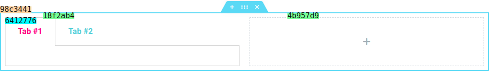

# Legend
* Example:
  
-   `Section ID` - `98c3441`
-  `Column ID` &nbsp;&nbsp;- `18f2ab4`, `4b957d9`
-   `Widget ID` &nbsp;&nbsp;- `5412776`

## Component -- `$e.components.get('document')`

*  **Name**: Document.
*  **Description**: Document manipulation.

## All **Document** components
| Component Name                 | Access Component                         | Description
|--------------------------------|------------------------------------------|-----------------------
| [Dynamic](dynamic/readme.md)   | `$e.components.get('document/dynamic')`  | Dynamic enable, disable and change.
| [Elements](elements/readme.md) | `$e.components.get('document/elements')` | Elements manipulation (create, edit, remove, etc.).
| [History](history/readme.md)   | `$e.components.get('document/history')`  | Provides a way to record/manipulate the commands history.
| [Repeater](repeater/readme.md) | `$e.components.get('document/repeater')` | Provides a way to communicate with repeaters.
| [Save](save/readme.md)         | `$e.components.get('document/save')`     | Responsible for saving the document (either publish/draft).
| [UI](ui/readme.md)             | `$e.components.get('document/ui')`       | Irregular component for handling UI shortcuts.

## Component `document/` -- Utils
| Util Name                                     | Access Util                                               | Description
|-----------------------------------------------|-----------------------------------------------------------|-----------------------
| [findViewRecursive](#)                        | `$e.components.get('document').utils.findViewRecursive()` |
| [findViewById](#)                             | `$e.components.get('document').utils.findViewById()`      |
| [findContainerById](#)                        | `$e.components.get('document').utils.findContainerById()` |

## _Util_ -- `$e.components.get('document').utils.findViewRecursive()`
*  **Name**: findViewRecursive.
*  **Description**: Find view recursively.
*  **Returns**: `{Array}`

   | Property     | Type                  | Requirement   | Description |
       |---           |---                    |---            |---|
   | _parent_     |
   | _key_        |
   | _value_      |
   | _multiple_   | `{Boolean}`           | **optional**  | default: `{false}`.

## _Util_ -- `$e.components.get('document').utils.findViewById()`
*  **Name**: findViewById.
*  **Description**: Find view by id.
*  **Returns**: `{ View | Array.<View> }`

   | Property     | Type                  | Requirement   | Description |
       |---           |---                    |---            |---|
   | _id_         | {String}              | **required**  | Id of the element.

## _Util_ -- `$e.components.get('document').utils.findContainerById()`
*  **Name**: findContainerById.
*  **Description**: Find container by id.
*  **Returns**: `{ Container | Array.<Container> }`

   | Property     | Type                  | Requirement   | Description |
       |---           |---                    |---            |---|
   | _id_         | {String}              | **required**  | Id of the element.

### [Back](../../../../../core/common/assets/js/api/core/commands-methods/getall.md) 
