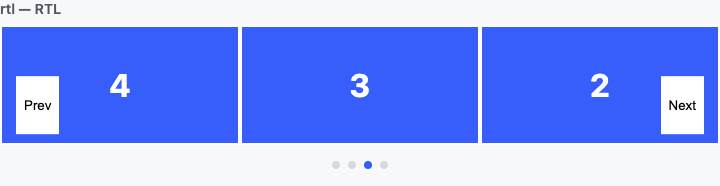
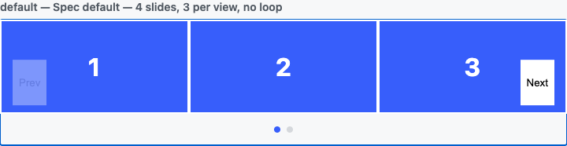

# ED-25237 — Carousel spec review and library evaluation

Research output for [ED-25237](https://elementor.atlassian.net/browse/ED-25237), against
[Carousel — Spec](https://elementor.atlassian.net/wiki/spaces/RDDEP/pages/2750644229) and
[Embla Carousel — Library Evaluation](https://elementor.atlassian.net/wiki/spaces/RDDEP/pages/2823684106).

Date of data collection: **14 Aug 2026**. Every version number, bundle size and behavioural claim
below was measured locally (npm registry, esbuild, Playwright against Chromium) rather than quoted
from the docs.

Two pieces of code back this document. The `e-carousel` element itself is in this repository, under
`modules/atomic-widgets/elements/atomic-carousel/`, behind the hidden `e_carousel` experiment (§10).
The standalone measurement harness is deliberately *outside* the repository, in `carousel-poc/` at
the WordPress root, because it installs two conflicting Embla versions side by side to compare them —
see [Running the POC](#running-the-poc).

---

## 1. Decision summary

| Question | Answer |
|---|---|
| Is Embla the right engine? | **Yes.** It is the only candidate that is genuinely headless *and* loops without cloning or reordering slide nodes. |
| Which version? | **v8.6.0, pinned.** Not the v9 RC — see §4. |
| Alternative if Embla is rejected? | keen-slider (smaller, but no fade and no autoplay, both would be ours to write and maintain). |
| Can we skip the library entirely? | **Not yet.** `::scroll-button()` / `::scroll-marker` are still Chromium-only (~70% of pageviews) and give no loop and no fade. |
| Blocking issues found? | **No blockers.** Three real defects in the spec (§3.1, §3.2, §3.7) and one product decision that must be made before the first PR (§5, R1). |

The standalone POC scores **58 / 60** behavioural checks on v8 and **57 / 60** on the v9 RC. The
failures are genuine findings, not harness noise, and are described in §3.

Beyond the harness, the branch contains a working `e-carousel` element in the plugin behind a hidden
experiment — seven element types, Twig templates, conditional children and the frontend handler —
verified end to end at 30 PHP-side and 22 browser-side checks. See §10.

---

## 2. Corrections to the evaluation page

Five claims on the Confluence evaluation page do not match reality. None of them change the
conclusion, but the page should be updated before it is used to justify the decision.

| Claim on the page | Measured / verified reality |
|---|---|
| Core is "~3–5 KB gzipped" | **7.45 KB gzipped** (17.89 KB minified). The main spec's "~7 KB" figure is the correct one. |
| "~8.7M downloads/week (core)" | **~37.1M/week**, but this is mostly `embla-carousel-react` traffic. `embla-carousel-autoplay` at ~2.7M/week is the better proxy for direct vanilla-JS use. |
| "v9.0.0-rc02 (release candidate, April 2026)" | Correct date (10 Apr 2026), but the page does not say that **v9 is still RC 4 months later, with no stable release and no published timeline**, and that the last *stable* release of anything was **8.6.0 on 4 Apr 2025 — 16 months ago**. |
| `@bluecadet/embla-carousel-a11y` / `embla-carousel-accessibility` listed as a v8 option to "evaluate" | `embla-carousel-accessibility` **has never been published for v8**. Its `latest` tag is `9.0.0-rc01` and it peer-depends on the v9 core. Using it means shipping the RC. |
| "Zero dependencies" | True for core and all first-party plugins. **Not** true for `embla-carousel-wheel-gestures`, which is third-party (maintainer `xiel`) and depends on `wheel-gestures`. Not in our V1 scope, but the blanket claim should be qualified. |

### Measured bundle sizes

esbuild, `--minify --format=iife --target=es2019`, gzip level 9 — the same shape the Elementor Vite
frontend build emits.

| Packages | minified | gzip | brotli |
|---|---|---|---|
| `embla-carousel` (v8.6.0) | 17.89 KB | **7.45 KB** | 6.72 KB |
| \+ `autoplay` + `fade` — **our V1 set** | 22.88 KB | **9.17 KB** | 8.30 KB |
| \+ `class-names` | 24.43 KB | 9.68 KB | 8.76 KB |
| `embla-carousel` (v9.0.0-rc02) | 19.15 KB | 7.99 KB | 7.24 KB |
| v9 + `autoplay` + `fade` + `accessibility` | 27.93 KB | 10.87 KB | 9.89 KB |
| Whole POC bundle (engine + plugins + our handler + test harness) | 30.29 KB | 11.71 KB | — |

For comparison, V3 ships Swiper 8.4.5 (~20 KB gzipped for a *minimal* v14 build; the vendored v8
file is larger). The "~7 KB vs ~47 KB" framing in the spec is directionally right: the honest
number is **~9.2 KB gzipped for the full V1 feature set**, still a solid win.

---

## 3. POC findings

The POC reproduces the spec's exact DOM (all seven `data-e-type` nodes, arrows as siblings of the
viewport, JS-populated pagination) and the spec's base-styles CSS verbatim, then drives 15 scenarios
in a real browser. Full output: `node verify.mjs` / `node verify.mjs v9`.

### 3.1 Defect — RTL arrows do not swap (spec is wrong)

The spec's RTL section states: *"Arrow positions swap automatically (CSS `left`/`right` follow
document direction). No extra CSS needed."*

This is incorrect. `left` and `right` are **physical** properties and are unaffected by `direction`.
Measured in RTL with the spec's base styles, the Prev arrow stays on the left while the carousel
scrolls right-to-left, so the arrow that visually points backwards moves the slides forwards:

```
Spec CSS (left/right):           prev.x=40   next.x=685    <- prev on the LEFT, wrong for RTL
Logical props (inset-inline-*):  prev.x=685  next.x=40     <- prev on the RIGHT, correct
```



**Fix:** use logical properties in the base styles.

```css
[data-e-type="e-carousel-arrow-prev"] { inset-inline-start: 16px; }
[data-e-type="e-carousel-arrow-next"] { inset-inline-end: 16px; }
```

Verified working (`node rtl-fix.mjs`). Pagination needs no change — the dots are a flex row and
already reverse with `direction`, with dot 0 landing rightmost.

Embla's own RTL handling is correct as long as the `direction: 'rtl'` option is paired with a real
`dir`/`direction` on the DOM. Nearly every RTL bug report in the tracker is someone setting the JS
option alone; all 18 RTL issues are closed and there are no open ones.

### 3.2 Defect — disabling an arrow at the edge breaks keyboard navigation

The spec requires two things that conflict:

- *Arrow buttons — `disabled` when can't scroll (non-loop)*
- *Keyboard — Arrow keys navigate slides*

When the user tabs to Next and presses ArrowRight until the last slide, the handler sets
`nextBtn.disabled = true`. A focused element that becomes `disabled` **loses focus to `<body>`**, so
a keydown listener scoped to the carousel stops receiving keys and the user's keyboard journey
dead-ends mid-carousel. Reproduced on both v8 and v9:

```
FAIL  a11y: focus survives the Next arrow becoming disabled at the last snap
      document.activeElement is <body> after the arrow was disabled
FAIL  a11y: ArrowLeft navigates back
      snap is 1, focus on <body>
```

The same test passes as soon as focus is put back inside the carousel, confirming the cause is focus
loss and not the key handling.

**Fix options**, in order of preference:

1. Use `aria-disabled="true"` plus a no-op click handler instead of the `disabled` attribute. The
   button stays focusable, which is the
   [APG-recommended](https://www.w3.org/WAI/ARIA/apg/patterns/carousel/) treatment for exactly this
   reason.
2. Keep `disabled`, but move focus to the opposite arrow (or the carousel root) when the focused
   button is about to be disabled.

This needs a decision from product/a11y, because option 1 changes the spec's stated contract
(`disabled` attribute, visually dimmed).

### 3.3 `transition_speed` as a 1–100 slider is a footgun

Embla's `duration` is a spring-physics constant, not milliseconds, and the docs recommend **20–60**.
The spec exposes it directly as a 1–100 slider with the raw value passed through. Measured
end-to-end transition time, averaged over 3 runs per value (`node speed-curve.mjs`):

| `transition_speed` | Measured transition |
|---|---|
| 1 (panel minimum) | 649 ms |
| 5 | 814 ms |
| 10 | 907 ms |
| 20 (bottom of Embla's documented range) | 739 ms |
| **25 (spec default)** | **1,708 ms** |
| 40 | 3,289 ms |
| 60 (top of Embla's documented range) | 5,274 ms |
| 80 | 7,231 ms |
| 100 (panel maximum) | **9,182 ms** |

Three problems. The **top of the slider gives a nine-second slide transition**, which reads as a
broken carousel. The **bottom third of the slider does nothing useful** — everything from 1 to 20
lands in the same ~650–900 ms band, so a quarter of the control's travel is dead (the floor is the
spring settling plus event latency, not the animation). And the **default of 25 is already 1.7 s**,
which is slower than most users will expect from a carousel.

On top of the UX, the raw Embla constant would be **persisted in `_elementor_data`**, making the
engine's internal unit part of our saved data contract — any future engine change then needs a prop
migration.

**Recommendation:** store a milliseconds value in the prop and map it to `duration` inside the
handler. That fixes the dead zone, gives product a meaningful default, and keeps the saved prop
engine-independent. Clamping the panel to 20–60 is the cheaper alternative but leaves the data
contract coupled to Embla.

### 3.4 Good news — the loop worry did not reproduce

The evaluation page and the Embla docs both warn that `loop` silently falls back to `false` when
there isn't enough slide content. The spec's default tree is 4 slides at 3 per view, which looked
like a likely trigger. It is not:

| Scenario | Effective `loop` |
|---|---|
| 4 slides, 3 per view (spec default) | **true** |
| 8 slides, 3 per view | true |
| 2 slides, 1 per view | true |

Wrap-around from the last snap to the first works, arrows correctly stay enabled in loop mode, and
the slide count in the DOM is unchanged — **no cloning**, confirmed by counting `e-carousel-slide`
nodes after looping. The editor still needs to handle the fallback case eventually, but it is not on
the default path and does not need to block V1.

### 3.5 Good news — CSS `gap` works, and the spec's `flex-basis` formula is correct

With `gap: 20px` on the container, the measured inter-slide distance is exactly 20 px and slide 2
lands flush at the viewport start after navigating (`slide.x=23.7`, `viewport.x=24.0`). Embla
measures rendered geometry, so no JS-side gap calculation is needed — exactly as the spec assumes.
The `flex-basis` formula in the spec's "Gap between slides" section validates as written.

### 3.6 Style ownership — Embla writes inline styles our Style tab cannot beat

Confirmed in the POC:

- container gets an inline `transform: translate3d(...)` always;
- individual slides get inline `transform` in loop mode (3 of 8 slides at the moment of sampling);
- slides get inline `opacity` in fade mode (`["1","0","0","0"]`).

V4 emits user styles as **generated CSS classes in a stylesheet**
(`modules/atomic-widgets/styles/styles-renderer.php`), and the style schema
(`modules/atomic-widgets/styles/style-schema.php`) does expose `transform`, `opacity` and
`transition` to users. Inline styles always beat class rules, so a user who sets `transform` or
`opacity` on `e-carousel-slide` or `e-carousel-container` gets **silently ignored styling** — a
support-ticket generator, and the gotcha the evaluation page already flags ("never apply custom
transform or transition to the container or slides").

**Recommendation:** restrict the style schema on the two Embla-controlled node types
(`e-carousel-container`, `e-carousel-slide`) rather than relying on documentation, or introduce an
inner wrapper inside each slide that carries user transforms.

### 3.7 Defect — "one dot per slide" is the wrong model

The spec describes pagination as one dot per slide. Embla's dot count comes from
`scrollSnapList()`, which is the list of *reachable* positions, and with `containScroll: 'trimSnaps'`
the trailing positions that would scroll past the last slide are dropped. Six slides at three per
view with a 16 px gap produce **five** dots, not six, because the slides do not tile the viewport
exactly.

This is the correct behaviour — a sixth dot would be a dot that cannot be selected — but the spec's
wording will produce the wrong implementation and the wrong QA expectation. Measured in the
integration harness (`node verify-integration.mjs`): 6 slides → 5 dots, 7 slides → 6 dots, 2
slides → 1 dot, at which point the arrows and the dot strip hide themselves.

*Spec fix: "one dot per scroll position".*

### 3.8 Everything else in the spec verified as achievable

| Requirement | Result |
|---|---|
| Arrow disabled states, first/last/middle, loop on/off | pass |
| Dot count from `scrollSnapList()`, active dot, click-to-navigate | pass |
| Arrows and pagination hidden when `slides_per_view >= slide count` | pass |
| Fade + loop together, `slides_per_view` forced to 1 | pass |
| `slides_to_scroll = 3` over 9 slides → 3 snaps | pass |
| `slides_to_scroll (5) > slides_per_view (3)` — spec edge case | initialises cleanly, 2 snaps |
| Autoplay advances; pause/play button toggles and updates `aria-label` (WCAG 2.2.2) | pass |
| `pause_on_hover` | pass **on v8**; fails on v9 (see §4) |
| Editor mode: loop off, autoplay off, drag off — dragging the viewport does nothing | pass |
| Dynamic add/remove of slides auto-reinits and rebuilds dots and `aria-label="X of Y"` | pass |
| `prefers-reduced-motion`: no autoplay, instant transitions | pass |
| Multiple carousels on one page, independent | pass |
| No-JS: slides render in a static clipped flex row | pass |

The dynamic-slides result matters most for the editor: Embla's `watchSlides` runs a MutationObserver
on the container and re-inits itself when the repeater adds or removes a slide. We get the editor's
hardest requirement for free.



---

## 4. Version decision: v8.6.0, not v9 RC

The evaluation page leaves this open ("if stable enough for our timeline, start on v9 to avoid
migration later"). Based on the POC, **v9 is the wrong choice today**, and the reason is not
stability in the abstract — it is that v9's two headline benefits do not survive contact with our
spec.

**The accessibility plugin conflicts with our ARIA contract.** This is the main reason to want v9.
Dumping the attributes it writes (`node a11y-diff.mjs`) shows it targets the Embla root node, which
in our structure is `e-carousel-viewport`:

```
Attributes the v9 accessibility plugin adds:
  viewport.role                 = "region"
  viewport.aria-label           = "Carousel"
  viewport.aria-roledescription = "carousel"
```

Our spec puts exactly those three attributes on `e-carousel`, the viewport's parent. Taking the
plugin gives us **two nested carousel regions**, which screen readers announce twice. We would have
to strip its output — at which point we are writing the ARIA ourselves anyway, which is what the
spec already decided ("We define ARIA ourselves (manual)... No 3rd-party plugin"). The plugin adds
~1.6 KB gzipped and nothing we can use.

**v9 removes the exact autoplay options our panel maps onto.** `stopOnMouseEnter`,
`stopOnInteraction`, `stopOnFocusIn` and `playOnInit` are all gone, replaced by a
`defaultInteraction` flag and an `autoplay:interaction` event. The POC demonstrates the cost
empirically: the identical handler passes `pause_on_hover` on v8 and **fails it on v9**, because
there is no longer an option for it. Our `pause_on_hover` and `pause_on_interaction` props would
become hand-rolled event plumbing.

**The v9 surface is still moving between RCs.** The `scrolloptimize` event was introduced in rc01 and
removed in rc02 after it broke stacking contexts. rc02 is 4 months old with no rc03 and no announced
date.

**The counter-argument is real but cheap to manage.** v8 is a dead branch for fixes — genuine
autoplay bugs (#1300, #1139) were fixed only in rc02 and never backported. And the v8→v9 migration
is broad: every navigation method is renamed (`scrollNext` → `goToNext`, `scrollSnapList` →
`snapList`, …), all events lowercase, `watchDrag` → `draggable`.

The POC already solves this. Both versions run through **one ~20-line adapter** in
`src/e-carousel.js`; the same handler file drives v8 and v9 with an `apiVersion` flag. If we keep
that boundary, the eventual v9 migration is a one-file change, and the "start on v9 to avoid
migration later" argument loses most of its force.

**Recommendation:** pin `embla-carousel@8.6.0` exactly (plugin peer deps pin the core version to the
patch, so all four packages must move together), keep the adapter, and re-evaluate when v9 goes
stable.

---

## 5. Backward- and forward-compatibility risks

The spec's Backward Compatibility section only says "V3 stays as-is, `e-carousel` is new, no
migration needed". That is true and also not the interesting part. The real risks are
**forward**-compatibility ones created by how V4 persists nested elements.

| # | Risk | Severity | Notes |
|---|---|---|---|
| **R1** | **The saved child tree is canonical.** `define_default_children()` only runs when the element is created (`atomic-element-base-model.js`); the full tree is written into `_elementor_data` on save (`Document::save_elements`). Adding an 8th sub-element later does **not** backfill existing documents, and there is **no child-tree migration infrastructure** — `Migrations_Orchestrator` walks `settings` props, not `elements[]`. | **High** | Directly affects the spec's open decision on `show_autoplay_button` ("8th element vs JS-generated button is a dev decision"). **Decide before the first PR.** |
| **R2** | **`children_dependencies` stash is sessionStorage-only.** Toggling `show_arrows` off detaches the arrow elements and stashes them in session storage (`stash.ts`); saving writes a document without them. After the session ends the stash is gone, so re-enabling arrows restores the **factory default**, not the user's customised arrow content. | **High** | The spec explicitly asks for `Child_Dependency` here. Same pattern already shipped in `e-background-video`, so this may be an accepted product behaviour — but it must be a conscious decision, not a surprise. |
| **R3** | **Embla's inline styles beat the Style tab** on `e-carousel-container` and `e-carousel-slide`. | **High** | See §3.6. Restrict the style schema on those node types. |
| **R4** | **`transition_speed` persists an Embla physics constant** into `_elementor_data`. | Medium | See §3.3. Store ms and map, or the engine becomes part of our data contract. |
| **R5** | **Prop renames/removals need a migration.** `Props_Parser` throws on save for invalid settings; render is lenient and ignores unknown props. Migrations exist for prop *types* and key renames via `migrations/manifest.json`. | Medium | Cheap if planned; expensive if discovered post-release. |
| **R6** | **Swiper 8.4.5 and Embla both load** on a page containing a V3 `image-carousel` and a V4 `e-carousel`. No dedup mechanism exists. | Medium | ~20 KB + ~9 KB gzipped. Probably acceptable during the V3/V4 overlap period, but worth stating explicitly rather than discovering in a performance review. |
| **R7** | **`eicon-nested-carousel` is already used by Elementor Pro's `nested-carousel` widget**, which is also labelled "Carousel" in the panel. | Low | The spec says "exists in the eicons set, no design task needed" without noting the collision. Users with Pro will see two identically-iconed, identically-named widgets. |
| **R9** | **Per-breakpoint `slides_per_view` cannot come from a settings prop.** Only *style* props are breakpoint-aware in V4; settings props hold one value. The element writes `--e-carousel-slides-per-view` as an inline attribute, so it is one value for all breakpoints. | Medium | Making it responsive means either sourcing the variable from a style prop or emitting per-breakpoint CSS for the element's own class. Discovered while implementing, not while reading the spec. |
| **R8** | **Component instances**: dependency-inserted children get deterministic derived IDs (`reconcile-component-instance-elements.ts`), and detached conditional children fall back to `default_model` with no stash server-side. | Medium | The spec requires all 12 props to be exposable as component properties, including `show_arrows` / `show_pagination`, which are precisely the ones that detach children. Needs explicit QA. |

**R1 is the one that cannot be deferred.** Everything else can be fixed later at moderate cost;
adding a persisted sub-element after release requires writing migration infrastructure that does not
exist yet. My recommendation is to make the autoplay pause/play button **JS-generated, not a
persisted child** — the POC does it this way and it works, it keeps the tree at 7 nodes, and it
sidesteps R1 entirely for the one element the spec left undecided.

---

## 6. Alternatives considered

Verified against the npm registry and each library's shipped source (not just docs) on 14 Aug 2026.

| Library | Version (date) | gzip | Loop mechanism | Headless | Fade | Verdict |
|---|---|---|---|---|---|---|
| **Embla** | 8.6.0 (Apr 2025) | **9.2 KB** w/ plugins | Transform on real nodes | **Yes** — ships zero CSS, zero DOM, zero ARIA | Plugin | **Recommended** |
| Swiper | 14.1.0 (Aug 2026) | 22.5 KB minimal | **Physically prepends/appends real slide nodes** | No — own CSS, DOM, ARIA | Module | **No.** Reordering our slide nodes on every loop wrap would fight the editor's element tree; arguably worse for us than cloning. |
| keen-slider | 6.8.6 (Jul 2023) | 6.0 KB | Transform | Mostly | **No — DIY** | Viable fallback. Smallest option, but no fade and no autoplay, and no feature release in 3 years. |
| Glide.js | 3.7.1 (Nov 2024) | 7.8 KB | **Clones** | No | No | Disqualified on cloning. |
| Splide | 4.1.4 (**Nov 2022**) | 13.4 KB | **Clones** | No | Yes | Disqualified — unmaintained for ~4 years, 143 open issues. |
| Flicking | 4.16.4 (Jul 2026) | 33.2 KB | Transform | No | Plugin | Best-maintained (Naver, 12 maintainers) but 3.4× the size. |
| `@zag-js/carousel` | 1.43.0 (Aug 2026) | 9.7 KB | Jump-back only | Yes, but owns ARIA | No | Excellent maintenance; wrong loop semantics and no fade. Revisit if we ever move to native scroll-snap. |
| tiny-slider / blaze-slider / Nuka | 2021–2025 | — | clones / n-a | — | — | Dead, or React-only (Nuka). |

### Native CSS carousel primitives

The spec already rejected this path; the data still supports that call. From `@mdn/browser-compat-data@8.0.11`
and `caniuse-db@1.0.30001809`:

| Feature | Chrome | Safari | Firefox | Reach |
|---|---|---|---|---|
| `::scroll-button()`, `::scroll-marker`, `::scroll-marker-group` | 135 | **not shipped** | **not shipped** | ~69.8% |
| `scroll-snap-type` | 69 | 11 | 99 | 96.1% |
| Scroll-driven animations | 115 | 26 | Nightly only | ~84.4% |

Seventeen months after Chrome 135, neither Safari nor Firefox has shipped the pseudo-elements, and
you cannot polyfill a pseudo-element. Building on them means ~30% of pageviews — essentially all
Safari and Firefox users — see a carousel with no arrows and no dots. Native scroll-snap also gives
no loop and no fade, so the two hardest features would still be ours.

Worth doing anyway: build the viewport as `overflow: auto` + `scroll-snap-type` **underneath**
Embla. Embla coexists with it, it improves the no-JS fallback beyond the current static row, and it
leaves the door open to dropping the JS layer for simple carousels once Safari and Firefox catch up.

---

## 7. Maintenance risk on Embla — stated plainly

- **Bus factor is 1.** David Jerleke has 837 of ~900 commits; the next highest human contributor has
  10. One npm publisher and one release author for every release in the project's history.
- **Funding is minimal** — GitHub Sponsors only, with Syntax FM the one substantial sponsor. The
  maintainer states publicly that lack of sponsorship delayed v9 by 6–10 months.
- **But the tracker is genuinely clean**: 6 open issues, 14 open PRs (9 of them dependabot), and the
  repo was pushed 3 days before this report.
- **And v8 shipped the same way**: v8 spent 10 months and 23 release candidates in RC before going
  stable. v9 at 7 months and 2 RCs is tracking normally for this project, not dying.

Two open issues are on our path and worth watching:

- [#1243](https://github.com/davidjerleke/embla-carousel/issues/1243) — selected slide resets on
  window resize when using `breakpoints`. Open 11 months. We plan responsive `slides_per_view`,
  though we intend to drive it with our own CSS variable rather than Embla's `breakpoints`, which
  likely avoids it.
- [#1321](https://github.com/davidjerleke/embla-carousel/issues/1321) — `reInit()` called
  synchronously inside the ResizeObserver callback. Relevant to the editor canvas, which resizes
  constantly. Community fix PRs #1327/#1328 have been open and unmerged since April.

Mitigation: pin the version, keep the API adapter, and accept that a fork is cheap if it ever comes
to that — the whole engine is 18 KB of dependency-free MIT TypeScript.

---

## 8. Spec gaps and questions for product

1. **RTL arrows** (§3.1) — the RTL section is factually wrong. Base styles must use logical
   properties. *Spec fix, no product decision needed.*
2. **`disabled` arrows vs keyboard navigation** (§3.2) — these two requirements conflict. Proposal:
   `aria-disabled` instead of the `disabled` attribute. **Needs product/a11y sign-off** since it
   changes a stated contract.
3. **`transition_speed` range** (§3.3) — the 1–100 slider produces a 9-second transition at the top,
   a dead zone across its bottom fifth, and a 1.7-second default. Proposal: store milliseconds and
   map internally. **Needs product decision.**
4. **`show_autoplay_button` implementation** (§5 R1) — the spec defers this to dev, but it is the one
   decision with a lasting data cost. Proposal: **JS-generated, not a persisted sub-element.**
   Recommend recording it in the spec rather than leaving it open.
5. **`show_arrows` OFF loses customised arrow content across sessions** (§5 R2) — is that acceptable?
   It is the existing `e-background-video` behaviour, so there may be precedent, but the carousel
   spec makes arrows a headline customisation feature, which raises the stakes.
6. **Style tab on slides/container** (§3.6) — user `transform` / `opacity` will be silently ignored.
   Should we hide those controls on those two node types?
7. **`eicon-nested-carousel` + "Carousel" label collide with Elementor Pro's nested carousel** (§5 R7).
8. **Loop fallback UX** (§3.4) — did not reproduce on the default tree, but if a user reaches a
   configuration where Embla disables loop, should the editor warn?
9. **"One dot per slide"** (§3.7) — should read "one dot per scroll position". *Spec fix, no product
   decision needed, but the QA checklist depends on it.*
10. **Is `slides_per_view` meant to be per breakpoint?** (§5 R9) — the spec implies responsive, but
    V4 settings props hold a single value. If responsive is required it needs a design decision
    about where the value lives; if not, the spec should say so.

---

## 9. Proposed implementation tasks under ED-25236

Sequenced so that each one is independently reviewable. Sizes are rough. Tasks 1–3 and 5 exist on
this branch as the POC described in §10; they are listed as tasks because the POC is a sketch, not a
reviewable PR — it has no tests of its own and skips the panel control.

| # | Task | Size | Depends on |
|---|---|---|---|
| 1 | Register the `e_carousel` hidden dev experiment and bundle Embla: add `embla-carousel` + `autoplay` + `fade` to `package.json` (pinned), add the `carousel-handler` entry to `scripts/vite/shared/entries.mjs`, register the script in `Frontend_Assets_Loader` | S | — |
| 2 | PHP element classes for the 7 types under `modules/atomic-widgets/elements/atomic-carousel/`, with `define_props_schema`, `define_atomic_controls`, `define_base_styles` (**logical properties for arrows**), `define_default_children`, `define_allowed_child_types`, and Twig templates | L | 1 |
| 3 | Frontend handler on `@elementor/frontend-handlers`, with the v8/v9 API adapter kept at the boundary | M | 1, 2 |
| 4 | Slides repeater panel control, modelled on the existing `tabs-control` (`packages/.../element-controls/tabs-control/`) | M | 2 |
| 5 | `children_dependencies` for `show_arrows` / `show_pagination`, following `e-background-video` | S | 2 |
| 6 | Editor preview handler: loop/autoplay/drag disabled, navigate-to-slide on canvas and Structure selection | M | 3 |
| 7 | Accessibility pass: ARIA per the spec, the `aria-disabled` decision from §3.2, keyboard, reduced motion | M | 3 |
| 8 | Restrict the style schema on `e-carousel-container` / `e-carousel-slide` (§3.6) | S | 2 |
| 9 | Tests: PHPUnit render snapshots, Jest for the repeater actions, Playwright covering the spec's 20-row QA checklist plus RTL and keyboard | L | 2–7 |
| 10 | Components compatibility: expose all 12 props as overridable, QA the `show_arrows` / `show_pagination` instance behaviour (§5 R8) | M | 2, 5 |
| 11 | Agent Ready: `$widget_description` on all 7 types, `render_markdown()` on the root, `->description()` on every prop | S | 2 |
| 12 | Docs: add the carousel to `docs/atomic-builder/atomic-widgets/elements-catalog.md` | S | 2 |

Task 1 should also carry the decision record from §4 (v8, pinned, adapter at the boundary) so the
rationale is not lost.

---

## 10. The element itself, built on this branch

The standalone harness proves Embla can satisfy the spec. To prove the *architecture* works, the
branch also contains a working `e-carousel` in the plugin, wired the way a real PR would be:

```
modules/atomic-widgets/elements/atomic-carousel/
  atomic-carousel.php                  # root: props, controls, base styles, default children,
  atomic-carousel.html.twig            #       children dependencies, script registration
  atomic-carousel-arrow-base.php       # shared arrow behaviour
  atomic-carousel-viewport/            # + container/, slide/, arrow-prev/, arrow-next/, pagination/
  handlers/carousel-handler.js         # the POC handler, ported onto @elementor/frontend-handlers
```

plus `e_carousel` as a hidden dev experiment in `modules/atomic-widgets/module.php`, the three
pinned Embla packages in `package.json`, and a `carousel-handler` entry in
`scripts/vite/shared/entries.mjs`.

Verified two ways:

**`carousel-poc/render-check.php`** boots the real WordPress install, registers the seven element
types, renders the tree through Elementor's own renderer and asserts the contract the handler
depends on — 30 checks, all passing. It also writes `carousel-poc/integration.html` from that
rendered markup.

**`carousel-poc/verify-integration.mjs`** serves that markup with the *built* bundle
(`assets/js/carousel-handler.js`) loaded exactly as WordPress loads it, and drives it in Chromium —
22 checks, all passing, including one-dot-per-snap, focusable `aria-disabled` arrows, keyboard
navigation, and add/remove of slides from outside the handler.


Three places where the implementation deliberately differs from the spec, each following a
measurement above:

| Spec says | Implementation does | Why |
|---|---|---|
| `transition_speed` is a 1–100 slider stored as Embla's `duration` | stores milliseconds, maps to Embla's 12–60 band in the handler | §3.3 — the raw constant is a physics value, and persisting it makes the engine part of our data contract |
| `show_autoplay_button` is "a dev decision" | the button is created by the handler, not persisted | §5 R1 — a persisted 8th child could never be backfilled into existing documents |
| Arrows sit at `left` / `right`, "RTL swaps automatically" | `inset-inline-start` / `inset-inline-end` | §3.1 — physical properties do not follow `direction` |

Three things a real PR still needs that this POC does not have: the Slides repeater panel control
(slides are managed from the Structure panel here), an editor preview handler, and the v8/v9 API
adapter — the ported handler imports v8 directly, since that is what `package.json` pins. None of
them changes the architecture.

A note for whoever picks this up: Playwright refuses to click a button with
`aria-disabled="true"`, treating it as not actionable. The behaviour is correct in a browser — the
click lands and the handler ignores it — but the spec's QA checklist will need `force: true` on
those steps, or it will read as a bug.

---

## Running the POC

```bash
cd carousel-poc      # at the WordPress root, i.e. three levels above this repository
npm install          # embla v8 in ./node_modules, v9 rc02 in ./v9/node_modules
node build.mjs       # bundles both harnesses, prints the size table
node verify.mjs      # 60 behavioural checks against Embla v8.6.0
node verify.mjs v9   # the same checks against v9.0.0-rc02
node a11y-diff.mjs   # what the v9 accessibility plugin writes onto our markup
node rtl-fix.mjs     # RTL arrow positioning, before and after the logical-property fix
node speed-curve.mjs # real transition time across the 1-100 transition_speed range
```

The element built into the plugin (§10) is verified separately, because it needs the local
WordPress install and the built bundle:

```bash
cd wp-content/plugins/elementor && npm install && node scripts/vite/build-scripts.mjs --dev

# from the site root; the socket path comes from the local WP stack's my.cnf
php -d memory_limit=1024M \
    -d mysqli.default_socket="<local-mysql-socket>" \
    carousel-poc/render-check.php     # 30 PHP-side checks, writes integration.html

cd carousel-poc && node verify-integration.mjs   # 22 browser checks on the built handler
```

`dist/v8.html` and `dist/v9.html` can also be opened directly in a browser to click through all 15
scenarios by hand.

| File | Purpose |
|---|---|
| `src/e-carousel.js` | The handler — spec props in, Embla out. Contains the v8/v9 API adapter. |
| `src/scenarios.js` | The 15 test scenarios and the spec-exact DOM builder. |
| `base.css` | The spec's base-styles table, verbatim. |
| `nojs.html` | Static markup for the graceful-degradation check. |
| `verify.mjs` | Playwright checks. Waits on Embla's `settle` event rather than fixed timeouts, because `duration` is not milliseconds. |
| `render-check.php` | Renders the real element through WordPress and asserts the markup contract. |
| `integration.template.html` | Page shell for the integration harness; restates the PHP base styles so it can be served statically. |
| `verify-integration.mjs` | Browser checks against the real markup and the built bundle. |

The POC needs a local Chromium; it reuses the one already in the Playwright cache
(`POC_CHROMIUM=/path/to/Chromium` to override).
