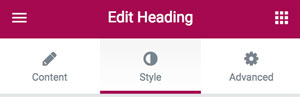
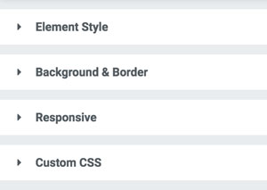
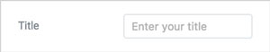
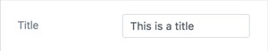
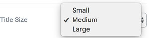
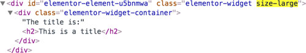
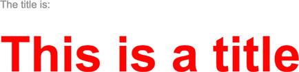

# Controls and the Editor

### Table of Content
* [The Editor](#the-editor)
  - [The editor panel layout](#the-editor-panel-layout)
    * [Tabs](#tabs)
    * [Sections](#sections)
* [Adding a control to an element](#adding-a-control-to-an-element)
  - [Basic example](#basic-example)
  - [Using tabs and sections](#using-tabs-and-sections)
  - [Design attributes for a control](#design-attributes-for-a-control)
    * [`label_block`](#label_block)
    * [`show_label`](#show_label)
    * [`separator`](#separator)
  - [Multiple control](#multiple-control)
* [Proper use of a returned value from a control](#proper-use-of-a-returned-value-from-a-control)
  * [Printing out the value in the element template](#printing-out-the-value-in-the-element-template)
  * [Adding the value to the style definitions of the element](#adding-the-value-to-the-style-definitions-of-the-element)
  * [Adding a class to the element template wrapper](#adding-a-class-to-the-element-template-wrapper)

### The Editor
The Elementor editor panel is where you set all the settings for every element, including  sections, columns and widgets settings. Each element setting is represented in the editor panel by a control ([What's a control?](README.md#what-is-a-control))

#### The editor panel layout

##### Tabs



The controls of the element settings are usually organized under three tabs:
* **Content** - Designated for settings that involve the content of the element. For example: Text fields and images.
* **Style** - Designated for settings that involve the style of the element. For example: Choosing colors and fonts.
* **Advanced** - Designated for settings that involve the style of all elements. For example: Margin, padding, backgrounds, responsive, as well as advanced element settings, if available.

Most elements include these 3 tabs, but some have different tabs, or are missing some of the tabs.

##### Sections



In addition to the controls being separated into the three tabs mentioned before, each set of controls is arranged under a titled section. Pressing on the section's title will show or hide the set of controls under the section.

### Adding a control to an element
All element controls should be added under the designated method `_register_controls`. Adding a control is done through the `add_control` method.

#### Basic example
Let's look at the following example:

```php
class Widget_Fake extends Widget_Base {

  protected function _register_controls() { // Every control has to be registered under this method

     $this->add_control(
        'title', // An unique id for this control. Used for every access to the control value.
        [
           'label' => __( 'Title', 'elementor' ), // The label will be displayed in the panel inside the control
           'type' => Controls_Manager::TEXT, // The type of the control
           'placeholder' => __( 'Enter your title', 'elementor' ), // A placeholder will be displayed inside the control input
        ]
     );

  }
}
```

And here is the result:



Now, we'll add a default value for a control:

```php
$this->add_control(
  'title',
  [
     'label' => __( 'Title', 'elementor' ),
     'type' => Controls_Manager::TEXT,
     'placeholder' => __( 'Enter your title', 'elementor' ),
     'default' => __( 'This is a title', 'elementor' ),
  ]
);
```



As you can see, the control received the default value that we have added, and this value is displayed in the input field, instead of the placeholder.

#### Using tabs and sections
As mentioned earlier, all panel controls should be arranged under tabs and sections. Before adding a control, we must make sure that it has a set section.

Adding a new section is done as following:

```php
$this->start_controls_section(
  'my_section', // A unique id for the section
  [
     'label' => __( 'My Section', 'elementor' ), // The label of the section
     'tab' => Controls_Manager::TAB_CONTENT, // The tab where the section is included in
  ]
);
```

After opening the section, we can now go on to adding more controls that will appear under the same section:

```php
$this->add_control( ... );

$this->add_control( ... );

$this->add_control( ... );
```

After adding all the controls that should appear under the section, we need to close the section:

```php
$this->end_controls_section();
```

Here is an example to further illustrate how it works:

```php
class Widget_Fake extends Widget_Base {

  protected function _register_controls() {
     $this->start_controls_section(
        'my_section',
        [
           'label' => __( 'My Section', 'elementor' ),
           'tab' => Controls_Manager::TAB_CONTENT,
        ]
     );

     $this->add_control(
        'title',
        [
           'label' => __( 'Title', 'elementor' ),
           'type' => Controls_Manager::TEXT,
           'placeholder' => __( 'Enter your title', 'elementor' ),
           'default' => __( 'This is a title', 'elementor' ),
        ]
     );

     $this->add_control(
        'color',
        [
           'label' => __( 'Color', 'elementor' ),
           'type' => Controls_Manager::COLOR,
           'default' => '#f00',
        ]
     );

     $this->end_controls_section();
  }
}
```

#### Design attributes for a control
Each control has several design attributes that determine its style and its integration in the editor panel:

<sub>*Please Note*: The default value for every attribute may change according to the type of control. See [Controls Introduction > Settings hierarchy](README.MD#settings-hierarchy) to learn more.</sub>

##### `label_block`
*Sets whether to display the title in a separate line.*

Options: `true`, `false`

Default: `false`

##### `show_label`
*Sets whether to show the title.*

Options: `true`, `false`

Default: `true`

##### `separator`
*Sets the position of the separator.*

Options: `'default'`, `'before'`, `'after'`, `'none'`

Default: `'default'`

#### Multiple control
[As explained](README.md#multiple-control), the returned value from a multiple control is represented by an array. This is why, when we want to set default values for a multiple control, we have to handle it accordingly. Here's an example:

```php
$this->add_control(
  'image',
  [
     'label' => __( 'Image', 'elementor' ),
     'type' => Controls_Manager::MEDIA,
     'default' => [
        'url' => 'https://elementor.com/wp-content/uploads/2016/05/element-bg.png',
     ],
  ]
);
```

As we can see, we've added a default value to the 'url'. This value is saved as a property in an array that holds the returned value of the control.

### Proper use of a returned value from a control
Elementor offers a number of ways to use the returned value of a control. These include:
* Printing the value in the Element template.
* Adding the value to the element stylesheet file.
* Adding a class to the element template wrapper.

#### Printing out the value in the element template
It is possible to get the value of the control inside the element render method, and print it out, or use it to set the structure of the template.

Let's examine how to do this using the 'title' control we created earlier:

```php
protected function render() {
  $settings = $this->get_settings();

  $title = $settings['title'];

  echo 'The title is: <h2>' . $title . '</h2>';
}
```

And this is the result:


#### Adding the value to the style definitions of the element
Each element in the page includes a set of style settings that are printed as CSS rules under a unique element selector. You can easily define it so the returned control value is included as part of the element design rules. We also need to include these settings when adding the control.

Back to the 'color' control we created earlier, we'll add a 'selectors' property to it:

```php
$this->add_control(
  'color',
  [
     'label' => __( 'Color', 'elementor' ),
     'type' => Controls_Manager::COLOR,
     'default' => '#f00',
     'selectors' => [
        '{{WRAPPER}} h2' => 'color: {{VALUE}}',
     ],
  ]
);
```

And the result:


Explanation:

The 'selectors' property is an array that includes a list of CSS rules that are added to the set of element style settings. Each member of the array contains the key for the selector to which the style rules will be added to, and also contains the style rules themselves, included as a value.

In order to allow for a dynamic insertion of the unique element selector and the value of the control into the style rules, there is an option to include several placeholders inside the array, and have them automatically switch to the right values.

Let's examine the 'selectors' property from before:

`{{WRAPPER}} h2` - The `WRAPPER` placeholder represents the unique element selector. After replacing the placeholder, the full selector that includes the style rules can look something like:
`.elementor-element-u5bnmwa h2`

`color: {{VALUE}}` - The `VALUE` placeholder represent the value returned by the control. In the previous 'color' control example mentioned earlier, the complete value of the style rule will be `color: #f00`

At the end of the process, the element CSS will look something like:

```css
.elementor-element-u5bnmwa h2 {
    color: #f00;
}
```

<sub>*Note: Make sure placeholders are named with capital letters only.*</sub>

#### Adding a class to the element template wrapper

A third way to affect the element structure through the control is by adding a class that comprises of the returned control value. The class will be added to the wrapper html tag of the element.

We will add a 'select' control to our element:

```php
$this->add_control(
  'title_size',
  [
     'label' => __( 'Title Size', 'elementor' ),
     'type' => Controls_Manager::SELECT,
     'options' => [
        'small' => __( 'Small', 'elementor' ),
        'medium' => __( 'Medium', 'elementor' ),
        'large' => __( 'Large', 'elementor' ),
     ],
     'default' => 'medium',
  ]
);
```

In the editing panel, the control should look like:



Now, we'll create the control, including the 'prefix_class' property:

```php
$this->add_control(
  'title_size',
  [
     'label' => __( 'Title Size', 'elementor' ),
     'type' => Controls_Manager::SELECT,
     'options' => [
        'small' => __( 'Small', 'elementor' ),
        'medium' => __( 'Medium', 'elementor' ),
        'large' => __( 'Large', 'elementor' ),
     ],
     'default' => 'medium',
     'prefix_class' => 'size-',
  ]
);
```

From now on, every time the element template is rendered, a class will be added to the wrapper of the template with the 'prefix_class' that we set and the value chosen by the user. For example, if the user chose the 'Large' title, a 'size-large' class will be added to the top of the template.

Here's an example:

Lets say we have a CSS stylesheet with the following style rules:

```css
.size-medium h2 {
   font-size: 40px;
}

.size-large h2 {
   font-size: 72px;
}
```

Now, if the user chooses a 'Large' title size, the main div of the element will look something like:



and the end result in the page will look like:

