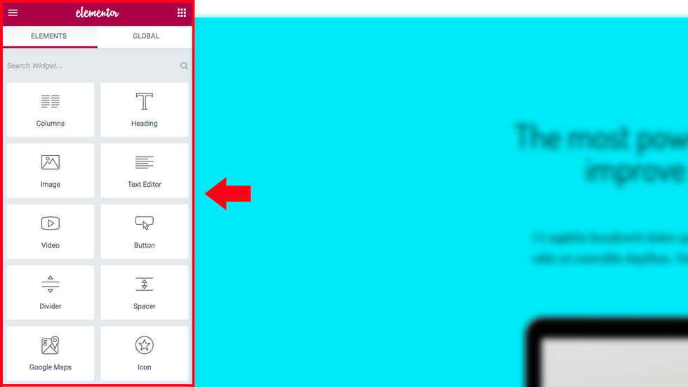
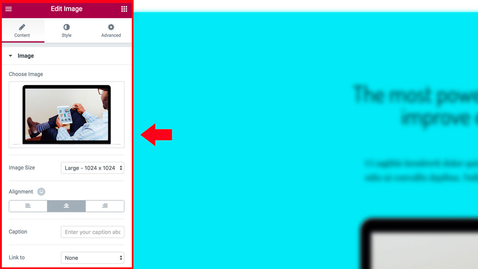
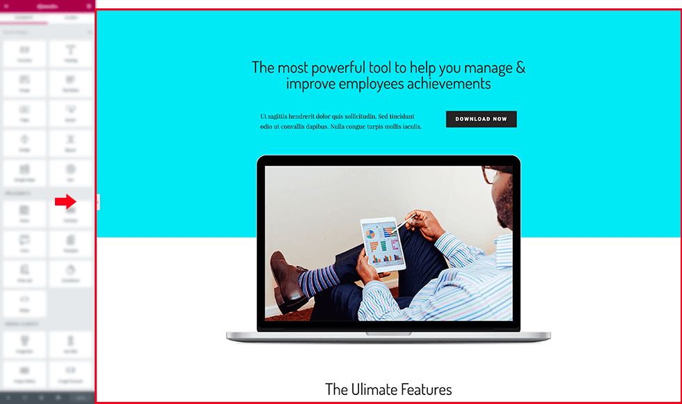

# The Editor

Each element in the editor consists of functions and definitions for four main areas:

## Elements Panel

This area contains elements which the user can drag & drop onto the page.

###### Elements Panel extension options:
                                                                          
* Add new elements
* Add new categories of elements

## Editing Panel
    
This area allows to edit the properties and settings of each element.

###### Editing panel extension options:

* Add / Change / Remove attributes of existing elements

## Preview

This area displays a live preview of the element, rendered by a JavaScript engine, typically without loading from the server side.

###### Preview extension options:

* Add / change / remove HTML while rendering the JavaScript
* Add action controls to every element

## Frontend - Visitor display

The final result displayed to the visitors on the frontend, is comprised of PHP rendered markup and a page-specific CSS file generated on the server side.

###### Frontend extension options:
 
 * Add / Change / Remove HTML while rendering the PHP

