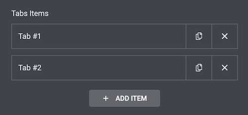

# Elementor Nested-Elements Module

* **Experiment:** `true`
* **Module Description** - is a module that allows you to created nested widgets, widgets inside widgets.
---
## Technical description:
- 📂 __nested\-elements__
    - 📂 __assets__
        - 📂 __js__
            - 📂 __editor__
                - 📄 [component.js](#assetsjseditorcomponentjs) - `Component - nested-elements`.
                - 📄 [index.js](#assetsjseditorindexjs)
                - 📄 [module.js](#assetsjseditormodulejs)
                - 📂 __nested\-repeater__
                    - 📄 [component.js](#assetsjscomponentjs) - `Component - nested-elements/nested-repeater`.
                    - 📂 __controls__
                        - 📄 [repeater.js](#assetsjsnested-repeatercontrolsrepeaterjs) - `Control - To enable customization.`
                    - 📂 __hooks__
                        - 📂 __data__
                            - 📄 [base.js](#assetsjsnested-repeaterhooksbasejs) - `Base hook - For all widgets that support nested elements.`
                            - 📂 __document__
                                - 📂 __elements__
                                    - 📂 __create__
                                        - 📄 [nested\-repeater\-adjust\-container\-titles.js](#nested-repeater-adjust-container-titlesjs) `Data Hook - Adjust Container Titles`.
                                - 📂 __repeater__
                                    - 📂 __insert__
                                        - 📄 [nested\-repeater\-create\-container.js](#nested-repeater-create-containerjs) - `Data Hook - For each repeater item create the corresponding container child`.
                                    - 📂 __remove__
                                        - 📄 [nested\-repeater\-remove\-container.js](#nested-repeater-remove-containerjs) - `Data Hook - For each repeater item remove the corresponding container child`.
                        - 📂 __ui__
                            - 📂 __panel__
                                - 📂 __editor__
                                    - 📂 __open__
                                        - 📄 [nested\-repeater\-focus\-current\-edited\-container.js](#nested-repeater-focus-current-edited-containerjs) - `UI Hook - Add option to reach the current edited tab via navigator`.
                    - 📂 __models__
                        - 📄 [nested\-model\-base.js](#assetsjseditornested-repeatermodelsnested-model-basejs) - `Base model for nested repeater - Enable to set children elements, create the default children elements`.
                    - 📂 __views__
                        - 📄 [nested\-view\-base.js](#assetsjseditornested-repeaterviewsnested-view-basejs) - `Base view for the nested repeater - Change the default placeholder of the children elements`.
    - 📂 __base__
        - 📄 [widget\-nested\-base.php](#basewidget-nested-basephp) `Base class for nested elements - Enable to change the default behavior of the nested elements`.
    - 📂 __controls__
        - 📄 [control\-nested\-repeater.php](#controlscontrol-nested-repeaterphp) - `Nested repeater control, for management of nested repeater, to able run $e.run( 'document/repeater/select )  - for each selected tab in panel`
    - 📄 [module.php](module.php)
- --------------------------------------------------------------------------------------------------------------------------------
    
## Product knowledge base
* [Elementor Widgets](https://developers.elementor.com/docs/widgets/)

- --------------------------------------------------------------------------------------------------------------------------------

## How to consume the module?
>  [__NestedTabs__](../nested-tabs/index.md) documentation is explaining about how to use NestedElements.

#  What inside?
> [__Nested Elements__](#) is a base module for all nested elements, it includes the infrastructure for creating nested elements.

Simple explanation about the files and their purpose:
- --------------------------------------------------------------------------------------------------------------------------------

## `assets/js/editor/component.js.`
### `nested-elements` component.
* **Link to the actual file** - [component.js](../../../modules/nested-elements/assets/js/editor/component.js)
* **Description** - The component does two things:
    - Registers `nested-elements/nested-repeater` component.
    - Have the method `isWidgetSupportNesting` that returns true if the widget supports nesting.

## `assets/js/editor/index.js`
### The first file that loaded for the editor javascript.
* **Link to the actual file** - [index.js](../../../modules/nested-elements/assets/js/editor/index.js)
* **Description** - Loads the editor module, and tells when its loaded, since the dependant modules are that depends on __Nested Elements__ module, need to know when its loaded and avilable.
    - Import the editor(`editor.js`) module.
    - Save the import promise in the global variable(`elementor.modules.nestedElements`).
    - After loading replace the promise with the actual loaded file.


## `assets/js/editor/module.js` 
### The first file that loaded for the editor javascript.
* **Link to the actual file** - [module.js](../../../modules/nested-elements/assets/js/editor/module.js)
* **Description** - Register `nested-elements` component.

## `assets/js/nested-repeater/component.js`
### `nested-elements/nested-repeater` - Component that includes all the functionality that crossing nested repeater logic.
* **Link to the actual file** - [component.js](../../../modules/nested-elements/assets/js/editor/nested-repeater/component.js)
* **Description** - 
  - The component exports the `NestedModelBase` and `NestedViewBase` classes.
  - Register custom control `nested-elements-repeater` for handling the tab selection via dedicated command. (`document/repeater/select`).
  - Register the infrastructure hooks.
  - Have the method `getChildrenTitle()` that returns the default title for the nested repeater.

## `assets/js/nested-repeater/controls/repeater.js`
### Custom repeater control.
* **Link to the actual file** - [control.js](../../../modules/nested-elements/assets/js/editor/nested-repeater/controls/repeater.js)
* **Description** -  The control responsible for two things:
    - Get the default title for children titles(__Custom__ `tab_title`).
    - Change the functionality of selecting repeater items to use the dedicated command (`document/repeater/select`).

## `assets/js/nested-repeater/hooks/base.js`
### Base hooks for the nested repeater.
* **Link to the actual file** - [base.js](../../../modules/nested-elements/assets/js/editor/nested-repeater/hooks/data/base.js)
* **Description** - Is a __base__ hook for all the __data__ hooks in nested repeater component. The hook includes 2 base conditions:
- 
	```javascript
	  getContainerType() {
		  return 'widget';
	  }
	```
-
	```javascript
	getConditions( args ) {
		return $e.components.get( 'nested-elements' ).isWidgetSupportNesting( args.container.model.get( 'widgetType' ) );
	}
	```
  1. The container type should be `widget`
  2. The widget should support nesting.
  

> The next files will be about the __data__ hooks they will use this [__base.js__](../../../modules/nested-elements/assets/js/editor/nested-repeater/hooks/data/base.js).
## `nested-repeater-adjust-container-titles.js` 
### Adjust the nested children titles.
* **Link to the actual file** - [nested-repeater-adjust-container-titles.js](../../../modules/nested-elements/assets/js/editor/nested-repeater/hooks/data/document/elements/create/nested-repeater-adjust-container-titles.js)
* **Description** - Adjust the nested children titles, flow: 
  * For each nested repeater container, set the children container title,
  * According to the nested repeater item title, e.g: the result will be `Tab #1`, `Tab #2` and so on instead of `Container`.
  * `_title` is used by the navigator.

## `nested-repeater-create-container.js` 
### Create container children for each created repeater item. 
* **Link to the actual file** - [nested-repeater-create-container.js](../../../modules/nested-elements/assets/js/editor/nested-repeater/hooks/data/document/repeater/insert/nested-repeater-create-container.js)
* **Description** - The hook called when the repeater item is created, and create container in the widget for that item.

## `nested-repeater-remove-container.js` 
### Remove container children for each created repeater item.
* **Link to the actual file** - [nested-repeater-remove-container.js](../../../modules/nested-elements/assets/js/editor/nested-repeater/hooks/data/document/repeater/remove/nested-repeater-remove-container.js)
* **Description** - The hook called when the repeater item is removed, will delete child container from widget for the corresponding item.
	> The 2 Hooks above exist to enable control over child container creation and deletion, using the next UI.
    
	

## `nested-repeater-focus-current-edited-container.js` 
### Focus the edited container hierarchy.
https://user-images.githubusercontent.com/10234691/166414693-5687c27e-0ef4-48fa-8253-bc09f2db2cf9.mov
* **Link to the actual file** - [nested-repeater-focus-current-edited-container.js](../../../modules/nested-elements/assets/js/editor/nested-repeater/hooks/ui/panel/editor/open/nested-repeater-focus-current-edited-container.js)
* **Description** - The hook called when you click on the container to open it, hook will run over the containers hierarchy from the root to the requested container, and select the container in the path(needed to be visible the selected container).

## `assets/js/editor/nested-repeater/models/nested-model-base.js` 
### Base model for nested elements.
* **Link to the actual file** - [nested-model-base.js](../../../modules/nested-elements/assets/js/editor/nested-repeater/models/nested-model-base.js)
* **Description** - Responsible for the base model of nested elements.
  - Handling the default children elements creation, according to defaults being sent from the backend(`widget-nested-base.php`).
  - Extending `isValidChild` method to allow nested elements to be created inside the widget.

## `assets/js/editor/nested-repeater/views/nested-view-base.js`  
### Base view for nested elements.
* **Link to the actual file** - [nested-view-base.js](../../../modules/nested-elements/assets/js/editor/nested-repeater/views/nested-view-base.js)
* **Description** - Responsible for the base view of nested elements.
    - Allow child to be `container`.
    - Change the default children view container according to selector in backend(`widget-nested-base.php`) defaults.

## `base/widget-nested-base.php`
### Base widget for nested elements.
* **Link to the actual file** - [widget-nested-base.php](../../../modules/nested-elements/base/widget-nested-base.php)
* **Description** - Responsible for the base of widgets that are nested elements.
    - Allow passing the nested behavior config defaults from the backend to the widget in the editor.
    - Have `print_children( index )` method to print the children elements.
    - Allow widgets to be nested in the backend.

## `controls/control-nested-repeater.php`
### Control for nested elements.
* **Link to the actual file** - [control-nested-repeater.php](../../../modules/nested-elements/controls/control-nested-repeater.php)
* **Description** - Responsible for the control of nested elements.
	- Allow to customize the repeater control.

## `- module.php`
### The module it self
* **Link to the actual file** - [module.php](../../../modules/nested-elements/module.php)
* **Description** - Is responsible for:
  - Registering the module in the backend.
  - Make it dependent upon the `container` module.
  - Enqueueing the editor assets.
  - Registering custom repeater control.
