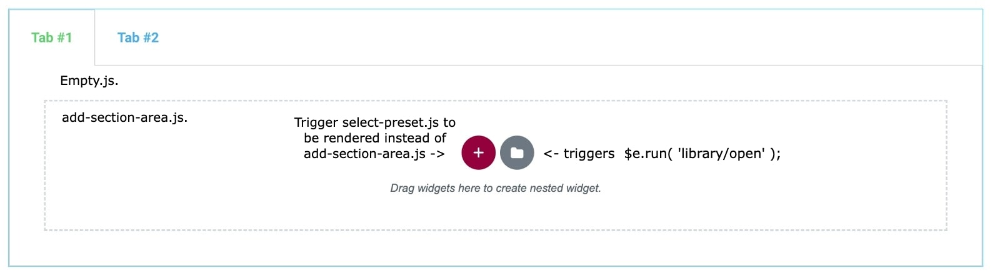
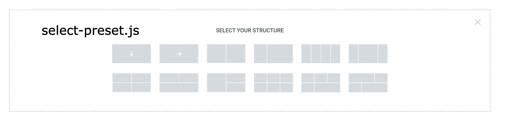

# Elementor NestedTabs Module

* **Experiment:** `true`
* **Module Description** - Module that allows you to create nested tabs widget.
* **Depends** - on `\Elementor\Modules\NestedElements\Module`
---
* ## Technical description:
- 📂 __tabs\-v2__
	- 📂 __assets__
		- 📂 __js__
			- 📂 __editor__
				- 📄 [index.js](#assetsjseditorindexjs---load-the-module) - `The first files to be loaded in the editor, tells the editor to load the module.`
				- 📄 [module.js](#assetsjseditormodulejs---the-module-register-the-widget) - `Load the widget and register it to editor elementsManager., wait for NestedElements module to be loaded first!.`
				- 📄 [tabs\-v2.js](#assetsjseditornested-tabsjs---register-the-widget) - `Register the widget in the editor.`
				- 📂 __views__
					- 📄 [add\-section\-area.js](#assetsjseditorviewsadd-section-areajs---custom-addsectionarea-for-nested-tabs) - `React component that renders the add section area, rendered via empty.js`
					- 📄 [empty.js](#assetsjseditorviewsemptyjs---custom-empty-view-for-the-widget) - `React component, that will be rendered when the widget is empty, prints select-preset or add-section-area.`
					- 📄 [select\-preset.js](#assetsjseditorviewsselect-presetjs---custom-react-component-to-print-the-presets-available-for-children-containers) `React component that Render  the preset for children container.`
					- 📄 [view.js](#assetsjseditorviewsviewjs---custom-view-for-the-widget) - `The widget view, actually used to manipulate clicks on the widget (view), register the model, view. emptyView for the widget.`
			- 📂 __frontend__
				- 📂 __handlers__
					- 📄 [tabs\-v2.js](#assetsjsfrontendhandlersnested-tabsjs---custom-frontend-handler) - `Frontend handler(s), custom handlers for interacting with the widget.`
		- 📂 __scss__
			- 📄 [frontend.scss](assets/scss/frontend.scss) - `All CSS will be used in frontend, how visually the widget will looks`
	- 📄 [module.php](#assetsjseditormodulejs---the-module-register-the-widget) - `The module, enable the experiment to work on/off, register editor scripts`
	- 📂 __widgets__
		- 📄 [tabs\-v2.php](#widgetsnested-tabsphp---how-to-register-a-widget) - `Backend, The widget that will be nested, insert new widget into the system.`

- --------------------------------------------------------------------------------------------------------------------------------
## Product knowledge base
* [Elementor Tabs](https://developers.elementor.com/docs/editor/elementor-tabs/)

## Attention needed / Known issues
* The widget works only with [containers](../../core/container-element.md)
* Abnormal behavior for handling mobile [nested-tabs.js](../../../modules/nested-tabs/assets/js/frontend/handlers/nested-tabs.js)
    - The reason for the issue is that __NestedTabs__ should looks like old tab.
    - Since the content of the widget and its children was hardcoded, it was possible have any structure inside the widget markup,
         now, the Nested Elements mechanism is creating the children as Container for specific selector, so its required to have the same markup.
    ```javascript
    onInit( ...args ) {
        // TODO: Find better solution, Manually adding 'e-collapse' for each container.
        if ( elementorFrontend.isEditMode() ) {
            const $widget = this.$element,
                $removed = this.findElement( '.e-collapse' ).remove();

            let index = 1;

            this.findElement( '.e-container' ).each( function() {
                const $current = jQuery( this ),
                    $desktopTabTitle = $widget.find( `.e-n-tabs-heading > *:nth-child(${ index })` ),
                    mobileTitleHTML = `<div class="e-n-tab-title e-collapse" data-tab="${ index }" role="tab">${ $desktopTabTitle.html() }</div>`;

                    $current.before( mobileTitleHTML );

                ++index;
            } );

            // On refresh since indexes are rearranged, do not call `activateDefaultTab` let editor control handle it.
            if ( $removed.length ) {
                return elementorModules.ViewModule.prototype.onInit.apply( this, args );
            }
        }

        super.onInit( ...args );
    }
    ```
     > Since NestedTabs should look like old Tabs widget, there is manual handling of the situation for mobile devices.
* Default global values should be set in widget CSS.
    - Since nested-elements should use CSS variables and the editor/backend mechanism does not support it, it should be added manually:
  ```css
	--n-tabs-title-color: var(--e-global-color-primary);
	--n-tabs-title-active-color: var(--e-global-color-accent);

	--n-tabs-title-typography-font-family: var(--e-global-typography-primary-font-family);
	--n-tabs-title-typography-font-size: initial;
	--n-tabs-title-typography-font-weight: var(--e-global-typography-primary-font-weight);
   ```
- --------------------------------------------------------------------------------------------------------------------------------

# How NestedElements, NestedTabs (Nested tabs) works?
* The module [__NestedTabs__](../../../modules/nested-tabs/) will be used as a live example of the guide.
* What are the difference between __NestedTabs__ and __Nested Elements__ modules?
  > [__Nested Elements__](../../modules/nested-elements/index.md) is a base module for all nested elements, it includes the infrastructure for creating nested elements.

  > __NestedTabs__ is a module that allows you to create nested tabs.

	* __NestedTabs__ module includes:
		* Editor scripts:
			* Widget: __NestedTabs__
			* Custom Views:
				* __View__ `modules/nested-tabs/assets/js/editor/views/view.js` - The actual view of the widget.
			* Custom Empty widget views:
				* __Empty View__ `modules/nested-tabs/assets/js/editor/views/empty.js` - The view that will be rendered when the widget is empty.
				* __Select Preset View__ `modules/nested-tabs/assets/js/editor/views/select-preset.js` - will be rendered when select preset selected.
				* __Add Section Area View__ `modules/nested-tabs/assets/js/editor/views/add-section-area.js` - The default that will be rendered on the __Empty View__.
		* Frontend scripts:
			* __NestedTabs__ Handler `modules/nested-tabs/assets/js/frontend/handlers/nested-tabs.js`
		* Frontend styles:
			* __NestedTabs__ Styles `modules/nested-tabs/assets/scss/frontend.scss`
		* Backend Widget:
			* __NestedTabs__ Widget registration `modules/nested-tabs/widgets/nested-tabs.php`

	  > The views are extra, and they are not required.

The flow:
3 main flows, editor, frontend and backend.

* Backend:
    -  `modules/nested-tabs/module.php` -> Register the widget in the backend -> `widgets/nested-tabs.php`
    -  `modules/nested-tabs/widgets/nested-tabs.php` -> Register the widget in the backend according to the file code.
    -  `modules/nested-tabs/module.php` -> Tells the editor to enqueue the scripts and styles.
* Editor
    -  `assets/js/editor/index.js` -> Load editor module -> `assets/js/editor/module.js`.
    -  `assets/js/editor/module.js` -> Load widget and register it into `elementor.elementsManager.registerElementType`.
    -  `assets/js/editor/module.js` -> Register the widget `assets/js/editor/widgets/nested-tabs.js`
    -  `assets/js/editor/widgets/nested-tabs.js` -> Register the widget with custom views: `assets/js/editor/views/view.js`, `assets/js/editor/views/empty.js`, `assets/js/editor/views/select-preset.js`, `assets/js/editor/views/add-section-area.js`
* Frontend:
  - Load the handler `assets/js/frontend/handlers/nested-tabs.js`
  - Load the styles `assets/scss/frontend.scss`

The following guide will help you to understand how the module works, step by step.

Start by registering the module:

## `- Module.php` - How to register a module.
* **Link to the actual file** - [module.php](../../../modules/nested-tabs/module.php)
* **Description** - Registers the experiment on/off, register editor scripts
* **Extends** - `\Elementor\Core\Base\Module`

How to register a module?
* Since __NestedTabs__ (nested tabs) depends on `NestedElements` module,
	- use `get_experimental_data` method used to notify the module dependency upon `NestedElementsModule`. Please see `'dependencies'` key.
    ```php
    use Elementor\Modules\NestedElements\Module as NestedElementsModule;
  
    public static function get_experimental_data() {
        return [
            'name' => 'nested-tabs',
            'title' => esc_html__( 'Nested Tab', 'elementor' ),
            'description' => esc_html__( 'Nested Tabs', 'elementor' ),
            'release_status' => Experiments_Manager::RELEASE_STATUS_ALPHA,
            'default' => Experiments_Manager::STATE_INACTIVE,
            'dependencies' => [ NestedElementsModule::class ],
        ];
    }
    ```
* Loading the editor scripts.
  ```php
  public function __construct() {
        add_action( 'elementor/editor/before_enqueue_scripts', function () {
            // The script you load for the editor goes here.
            wp_enqueue_script( 'nested-tabs', $this->get_js_assets_url( 'nested-tabs' ), [
                'elementor-common',
            ], ELEMENTOR_VERSION, true );
        } );
  }
    ```
	* Does it is a requirement for creating nested widgets?
		* Yes, it is, since nested elements required different `Model` to allow child to be another widget.

* To register the widget, extend the `get_widgets` method in the `Module` and return the widget name, eg:
  ```php
  protected function get_widgets() {
      return [ 'NestedTabs' ]; // Located at widgets/nested-tabs.php (the file will be loaded automatically).
  }
  ```
* The complete module
  ```php
  <?php
  namespace Elementor\Modules\NestedTabs;
	
  use Elementor\Core\Experiments\Manager as Experiments_Manager;
  use Elementor\Modules\NestedElements\Module as NestedElementsModule;
	
  class Module extends \Elementor\Core\Base\Module {
	
      public static function get_experimental_data() {
          return [
              'name' => 'nested-tabs',
              'title' => esc_html__( 'Nested Tab', 'elementor' ),
              'description' => esc_html__( 'Nested Tabs', 'elementor' ),
              'release_status' => Experiments_Manager::RELEASE_STATUS_ALPHA,
              'default' => Experiments_Manager::STATE_INACTIVE,
              'dependencies' => [ NestedElementsModule::class ],
          ];
      }
	
      public function get_name() {
          return 'nested-tabs';
      }
	
      protected function get_widgets() {
          return [ 'NestedTabs' ];
      }
	
      public function __construct() {
          parent::__construct();
	
          add_action( 'elementor/editor/before_enqueue_scripts', function () {
              wp_enqueue_script( $this->get_name(), $this->get_js_assets_url( $this->get_name() ), [
                  'nested-elements',
              ], ELEMENTOR_VERSION, true );
          } );
      }
  }
  ```
## `assets/js/frontend/handlers/nested-tabs.js` - Custom frontend handler.
* **Link to the actual file** - [nested-tabs.js](../../../modules/nested-tabs/assets/js/frontend/handlers/nested-tabs.js)
* Since NestedElements, and TabV2, are modules, it will be required to create such custom handler.
```javascript
export default class YourCustomHandler extends elementorModules.frontend.handlers.BaseNestedTabs {
	// Create your custom handler.
}
```

## `widgets/nested-tabs.php` - How to register a widget.
* **Link to the actual file** - [nested-tabs.php](../../../modules/nested-tabs/widgets/nested-tabs.php)
* **Description** - The `widgets/nested-tabs.php` is the main backend configuration file for widget with nested capabilities.
* **Extends** - [`\Elementor\Modules\NestedElements\Base\Widget_Nested_Base`](#)

* Requirements:
	* Before creating a __Widget__ you have to be familiar with the [simple widget creation process](https://developers.elementor.com/docs/widgets/).
* Is it requirement?
	* Yes, in other words it's simply the widget registration, including few abstract methods that will be explained in the next section.
* The class should extend `Widget_Nested_Base` class, there are few important methods to note:
	* `get_default_children_elements` - The inner children/elements that will be created when the widget created.
	* `get_default_repeater_title_setting_key` - The setting key that will be used by `$e.run( 'document/elements/settings' )` in the frontend for the children title.
	* `get_default_children_title` - The tab title including `%d` for the index.
	* `get_default_children_placeholder_selector` - Custom selector to place the children, in __NestedTabs__ is used inside the tabs content. Return `null` if the element should be added in the end of the element.

  ```php
  <?php
  namespace Elementor\Modules\NestedTabs\Widgets;
	
  use Elementor\Modules\NestedElements\Base\Widget_Nested_Base;
  use Elementor\Plugin;
	
  class NestedTabs extends Widget_Nested_Base {
      protected function get_default_children_elements() {
              return [
              [
                  'elType' => 'container',
                  'settings' => [
                      '_title' => __( 'Tab #1', 'elementor' ),
                  ],
              ],
              [
                  'elType' => 'container',
                  'settings' => [
                      '_title' => __( 'Tab #2', 'elementor' ),
                  ],
              ],
          ];
      }
	
      protected function get_default_repeater_title_setting_key() {
          return 'tab_title';
      }
	
      protected function get_defaults_children_title() {
          return esc_html__( 'Tab #%d', 'elementor' );
      }
	
      protected function get_default_children_placeholder_selector() {
          return '.e-n-tabs-content';
      }
	
      protected function get_html_wrapper_class() {
          return 'elementor-widget-n-tabs';
      }
  }
  ```
  
## `assets/js/editor/index.js` - Load the module.
* **Link to the actual file** - [index.js](../../../modules/nested-tabs/assets/js/editor/index.js)

* This is first loaded file in the editor.
  * What it does? Await for `Nested Elements` module to be loaded (requirement since the NestedTabs depends on the Nested Elements module).
  * Load the __NestedTabs__ module.
      ```javascript
      // On editor init components.
      elementorCommon.elements.$window.on( 'elementor/init-components', async () => {
          // The module should be loaded only when `nestedElements` is available.
          await elementor.modules.nestedElements;
	
          // Create the NestedTabs module.
          new ( await import( '../editor/module' ) ).default();
      } );
      ```
## `assets/js/editor/module.js` - The module register the widget.
* **Link to the actual file** - [module.js](../../../modules/nested-tabs/assets/js/editor/module.js)

* What the modules do? Register the widget only.
* What are the advantages of registering the element in the `elmeentor.elementsManager`?
  * Enable the option to customize the `View, EmptyView, or Model`
	
  ```javascript
    import NestedTabs from './nested-tabs'; // Import the widget.
	
    export default class Module {
        constructor() {
            // Register new NestedTabs widget.
            elementor.elementsManager.registerElementType( new NestedTabs() );
        }
    }
    ```
    * The registration required for creating widgets with custom view, models, or custom empty-view.
## `assets/js/editor/nested-tabs.js` - Register the widget.
* **Link to the actual file** - [nested-tabs.js](../../../modules/nested-tabs/assets/js/editor/nested-tabs.js)
* The minimum requirement for nested capabilities is having a model support nested elements(elements inside elements), and can be done by registering this class:
  ```javascript
  export class YourWidgetName extends elementor.modules.elements.Widget {
      getModel() {
          // Includes the nested model with support of nested elements.
          return $e.components.get( 'nested-elements/nested-repeater' ).exports.NestedModelBase;
      }
  }
  ```
  > ### At this point, the widget is ready to be used and those are the minimum requirements, the next examples are extras.
* More advance example of register the widget and manipulate the views.
    ```javascript
    import View from './views/view';            // Custom view for handling the clicks.
    import EmptyView from './views/empty';      // Customn empty view for handling empty in the widget.
	
    export class NestedTabs extends elementor.modules.elements.types.Base {
        getType() {
              return 'nested-tabs'; // Widget type from the backend registeration.
        }
	
        getView() {
             // Custom-View for the element should extend `$e.components.get( 'nested-elements/nested-repeater' ).exports.NestedViewBase`.
            return View;
        }
	
        getEmptyView() {
             // Custom empty-view for the widget should be `React` component.
            return EmptyView;
        }
	
        getModel() {
            // Should extend `$e.components.get( 'nested-elements/nested-repeater' ).exports.NestedRepeaterModel`.
            // In this senario, custom model is not required so default is returned.
            return $e.components.get( 'nested-elements/nested-repeater' ).exports.NestedModelBase;
        }
    }
	
    export default NestedTabs;
	
    ```
## `assets/js/editor/views/view.js` - Custom view for the widget.
* **Link to the actual file** - [view.js](../../../modules/nested-tabs/assets/js/editor/views/view.js)
* The view should extend `$e.components.get( 'nested-elements/nested-repeater' ).exports.NestedViewBase`, let use __NestedTabs__ view as exmaple:
	```javascript
	/**
	 * @extends {NestedViewBase}
	 */
	export class View extends $e.components.get( 'nested-elements/nested-repeater' ).exports.NestedViewBase {
		events() {
			const events = super.events();
	
			events.click = ( e ) => {
				const closest = e.target.closest( '.elementor-element' );
	
				let model = this.options.model,
					view = this;
	
				// For clicks on container.
				if ( 'container' === closest?.dataset.element_type ) { // eslint-disable-line camelcase
					// In case the container empty, click should be handled by the EmptyView.
					const container = elementor.getContainer( closest.dataset.id );
	
					if ( container.view.isEmpty() ) {
						return true;
					}
	
					// If not empty, open it.
					model = container.model;
					view = container.view;
				}
	
				e.stopPropagation();
	
				$e.run( 'panel/editor/open', {
					model,
					view,
				} );
			};
	
			return events;
		}
	}
	
	export default View;
	```
- The view logic is handles the clicks on the widget, that's what it used in this scenario, if there is no custom logic, the default nested view can be used:       - `$e.components.get( 'nested-elements/nested-repeater' ).exports.NestedViewBase`.

## `assets/js/editor/views/add-section-area.js` - Custom `AddSectionArea` for nested tabs.
* **Link to the actual file** - [add-section-area.js](../../../modules/nested-tabs/assets/js/editor/views/add-section-area.js)
```javascript
import { useEffect, useRef } from 'react';

export default function AddSectionArea( props ) {
	const addAreaElementRef = useRef(),
		containerHelper = elementor.helpers.container,
		args = {
			importOptions: {
				target: props.container,
			},
		};

	// Make droppable area.
	useEffect( () => {
		if ( props.container.view.isDisconnected() ) {
			return;
		}

		const $addAreaElementRef = jQuery( addAreaElementRef.current ),
			defaultDroppableOptions = props.container.view.getDroppableOptions();

		// Make some adjustments to behave like 'AddSectionArea', use default droppable options from container element.
		defaultDroppableOptions.placeholder = false;
		defaultDroppableOptions.items = '> .elementor-add-section-inner';
		defaultDroppableOptions.hasDraggingOnChildClass = 'elementor-dragging-on-child';

		// Make element drop-able.
		$addAreaElementRef.html5Droppable( defaultDroppableOptions );

		// Cleanup.
		return () => {
			$addAreaElementRef.html5Droppable( 'destroy' );
		};
	}, [] );

	return (
		<div className="elementor-add-section" onClick={() => containerHelper.openEditMode( props.container )}
				ref={addAreaElementRef}>
			<div className="elementor-add-section-inner">
				<div className="e-view elementor-add-new-section">
					<div className="elementor-add-section-area-button elementor-add-section-button"
						onClick={() => props.setIsRenderPresets( true )}
						title={__( 'Add new container', 'elementor' )}>
						<i className="eicon-plus"/>
					</div>
					<div className="elementor-add-section-drag-title">
						{__( 'Drag widgets here.', 'elementor' )}
					</div>
				</div>
			</div>
		</div>
	);
}

AddSectionArea.propTypes = {
	container: PropTypes.object.isRequired,
	setIsRenderPresets: PropTypes.func.isRequired,
};
```
## `assets/js/editor/views/empty.js` - Custom empty-view for the widget.
* **Link to the actual file** - [empty.js](../../../modules/nested-tabs/assets/js/editor/views/empty.js)


* The view should be `React` component, it will be the empty view for the widget children, in this case, the tabs.
    ```javascript
    import { useState } from 'react';
	
    import AddSectionArea from './add-section-area';
    import SelectPreset from './select-preset';
	
    export default function Empty( props ) {
        const [ isRenderPresets, setIsRenderPresets ] = useState( false );
	
        props = {
            ...props,
            setIsRenderPresets,
        };
	
        return isRenderPresets ? <SelectPreset {...props} /> : <AddSectionArea {...props} />;
    }
	
    Empty.propTypes = {
        container: PropTypes.object.isRequired,
    };
	
    ```
    - This component determines which component to print `SelectPreset` or `AddSectionArea`.
## `assets/js/editor/views/select-preset.js` - Custom react component to print the presets available for children containers.
* **Link to the actual file** - [select-preset.js](../../../modules/nested-tabs/assets/js/editor/views/select-preset.js)


```javascript
export default function SelectPreset( props ) {
	const containerHelper = elementor.helpers.container,
		onPresetSelected = ( preset, container ) => {
			const options = {
				createWrapper: false,
			};

			// Create new one by selected preset.
			containerHelper.createContainerFromPreset( preset, container, options );
		};

	return (
		<>
			<div className="elementor-add-section-close">
				<i onClick={() => props.setIsRenderPresets( false )} className="eicon-close" aria-hidden="true"/>
				<span className="elementor-screen-only">{__( 'Close', 'elementor' )}</span>
			</div>
			<div className="e-view e-con-select-preset">
				<div className="e-con-select-preset__title">{__( 'Select your Structure', 'elementor' )}</div>
				<div className="e-con-select-preset__list">
					{
						elementor.presetsFactory.getContainerPresets().map( ( preset ) => (
							<div onClick={() => onPresetSelected( preset, props.container )}
								key={preset} className="e-con-preset" data-preset={preset}
								dangerouslySetInnerHTML={{ __html: elementor.presetsFactory.generateContainerPreset( preset ) }}/>
						) )
					}
				</div>
			</div>
		</>
	);
}

SelectPreset.propTypes = {
	container: PropTypes.object.isRequired,
	setIsRenderPresets: PropTypes.func.isRequired,
};
```

## Another useful feature that used in nested tabs is partial data render
* Since the default render mechanism render all the children each render,
	* There is issue with the nested-tabs, when you modify the `tab-title` for example, and the whole nested-tabs children hierarchy affected, it gets re-render which create huge performance impact
	* The new nested infrastructure is allowing to avoid it, if you know the markup in advance using new feature called __partial render__:
		* The feature will avoid the full re-render and select this exact node/markup and modify only it.
		* You will be able to achieve that using the following markup in the element:
			- For repeater items, example:
      ```html
        <element 
            'data-binding-type': 'repeater-item',  // Type of binding (to know how to behave).
            'data-binding-repeater-name': 'tabs',  // Repeater setting key that effect the binding.
            'data-binding-setting': 'tab_title',   // The key in the repeater that effect the binding.
            'data-binding-index': tabCount,        // Index is required for repeater items.
        >
        </element>
      ```
        - For simple settings items, example:
	  ```html
		 <element
		 	'data-binding-type': 'content', 		 // Type of binding (to know how to behave).
		 	'data-binding-setting': 'testimonial_content',   // Setting change to capture, the value will replace the data-binding.
		 </element>
	  ```
      > Use it in the `_content_template()` method.
