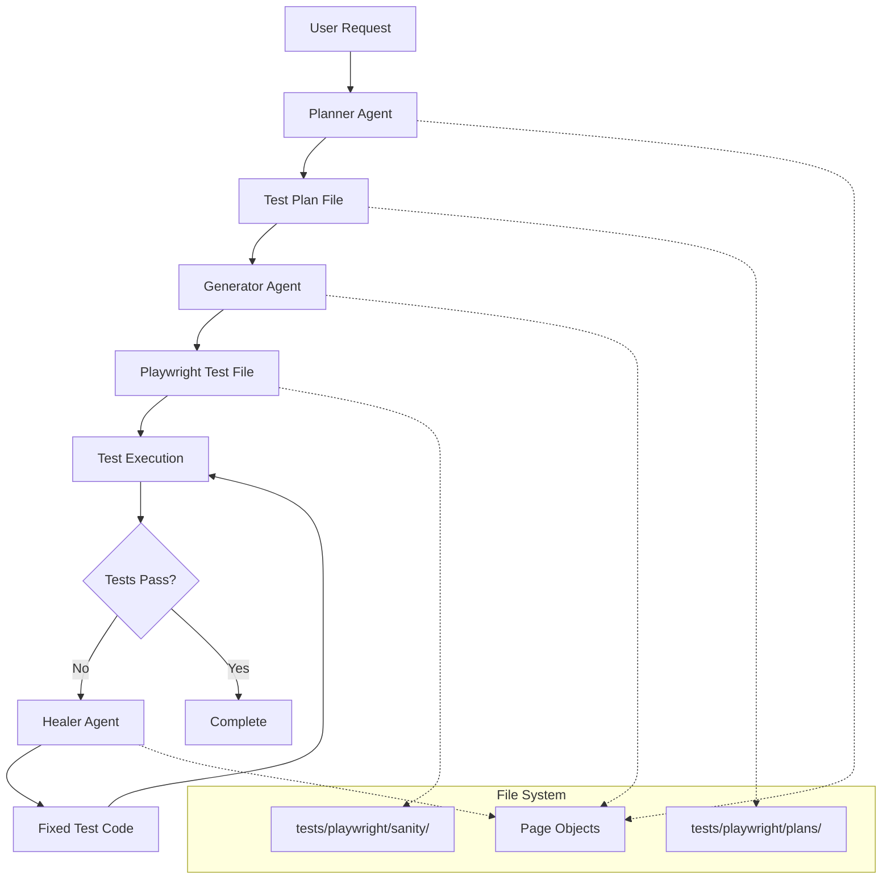

# Playwright Test Agents for Elementor

This document describes the **Cursor-based** Playwright test agent ecosystem for Elementor, including the planner, generator, and healer agents that work together to create and maintain automated tests.

> **⚠️ Important**: These are **Cursor IDE agents**, not GitHub Copilot. They are independent AI agents that run within Cursor using the Model Context Protocol (MCP) with Playwright integration.

## Overview

The Playwright test agent system consists of three specialized agents:

1. **Planner Agent**: Explores the Elementor interface and creates comprehensive test plans
2. **Generator Agent**: Converts test plans into executable Playwright test code
3. **Healer Agent**: Debugs and fixes failing tests automatically

## Architecture



## Agent Configurations

### Planner Agent (`playwright-test-planner`)

**Purpose**: Explores Elementor interfaces and creates detailed test plans

**Key Features**:
- Navigates and explores Elementor editor interface
- Identifies interactive elements, widgets, and functionality
- Creates structured test scenarios with step-by-step instructions
- Saves test plans as markdown files in `tests/playwright/plans/`

**Usage**:
```
@playwright-test-planner Please create a test plan for adding and configuring a button widget in the Elementor editor
```

### Generator Agent (`playwright-test-generator`)

**Purpose**: Converts test plans into executable Playwright test code

**Key Features**:
- Reads test plan markdown files
- Generates TypeScript test files using Elementor page objects
- Follows existing test patterns and structure
- Places tests in appropriate directories under `tests/playwright/sanity/`

**Usage**:
```
@playwright-test-generator Please generate tests from the test plan at tests/playwright/plans/button-widget-test-plan.md
```

### Healer Agent (`playwright-test-healer`)

**Purpose**: Debugs and fixes failing Playwright tests

**Key Features**:
- Runs failing tests and analyzes error output
- Uses browser tools to investigate current application state
- Fixes common issues like selector changes, timing problems, and assertions
- Validates fixes by re-running tests

**Usage**:
```
@playwright-test-healer Please fix the failing test in tests/playwright/sanity/widgets/button.test.ts
```

## Workflow Examples

### Complete Test Creation Workflow

1. **Planning Phase**:
   ```
   @playwright-test-planner Create a comprehensive test plan for testing the image widget functionality in Elementor, including upload, settings configuration, and responsive behavior
   ```

2. **Generation Phase**:
   ```
   @playwright-test-generator Generate Playwright tests from the image widget test plan you created
   ```

3. **Validation Phase**:
   ```bash
   npm run test:playwright -- image-widget.test.ts
   ```

4. **Healing Phase** (if tests fail):
   ```
   @playwright-test-healer Fix the failing image widget tests
   ```

### Test Maintenance Workflow

1. **Identify Failing Tests**:
   ```bash
   npm run test:playwright
   ```

2. **Auto-Fix with Healer**:
   ```
   @playwright-test-healer Please analyze and fix all failing tests in the latest test run
   ```

3. **Validate Fixes**:
   ```bash
   npm run test:playwright
   ```

## File Structure

```
tests/playwright/
├── plans/                          # Test plans created by planner agent
│   ├── button-widget-plan.md
│   ├── image-widget-plan.md
│   └── responsive-design-plan.md
├── sanity/                         # Generated test files
│   ├── seed.spec.ts               # Seed test for agent workflows
│   ├── widgets/
│   │   ├── button.test.ts         # Generated by generator agent
│   │   ├── image.test.ts
│   │   └── text.test.ts
│   └── modules/
├── pages/                          # Page objects used by agents
│   ├── wp-admin-page.ts
│   ├── editor-page.ts
│   └── content.ts
└── parallelTest.ts                 # Custom test fixture
```

## Best Practices

### For Planner Agent

1. **Be Specific**: Provide clear, detailed requirements for the functionality to test
2. **Include Context**: Mention specific Elementor features, widgets, or workflows
3. **Consider Edge Cases**: Ask for comprehensive coverage including error scenarios

Example:
```
Create a test plan for the heading widget that covers:
- Adding the widget to canvas
- Configuring text content and HTML tag
- Styling options (typography, colors, spacing)
- Responsive behavior across devices
- Accessibility features
```

### For Generator Agent

1. **Reference Test Plans**: Always specify the test plan file to use
2. **Verify Structure**: Ensure generated tests follow existing patterns
3. **Check Imports**: Verify page objects and fixtures are properly imported

Example:
```
Generate tests from tests/playwright/plans/heading-widget-plan.md
Ensure the tests use EditorPage methods and follow the existing test structure
```

### For Healer Agent

1. **Provide Context**: Include error messages or failing test names
2. **Run Tests First**: Execute tests to get current failure state
3. **Iterative Fixing**: Fix one issue at a time and re-test

Example:
```
The test tests/playwright/sanity/widgets/heading.test.ts is failing with selector timeout errors.
Please analyze and fix the issues.
```

## Common Issues and Solutions

### Selector Changes
**Problem**: Elementor updates change DOM structure and selectors fail
**Solution**: Healer agent updates selectors using browser inspection tools

### Timing Issues
**Problem**: Tests fail due to loading states or animations
**Solution**: Add proper waits for Elementor editor loading phases

### Dynamic Content
**Problem**: Dynamic IDs and classes cause test instability
**Solution**: Use more resilient locators based on stable attributes

### Environment Issues
**Problem**: Tests fail due to WordPress or Elementor configuration
**Solution**: Verify seed test setup and environment consistency

## MCP Server Integration

The agents use the Playwright MCP server for browser automation:

```bash
# Start MCP server for agent use
npm run test:playwright:mcp-server
```

**Available Tools**:
- `browser_navigate`: Navigate to URLs
- `browser_click`: Click elements
- `browser_type`: Type text into inputs
- `browser_snapshot`: Capture page structure
- `browser_wait_for`: Wait for conditions
- And more browser automation tools

## Testing the Agent Workflow

### 1. Test Seed File
```bash
npm run test:playwright:seed
```

### 2. Test MCP Server
```bash
npm run test:playwright:mcp-server
```

### 3. Validate Agent Configurations
Check that all three agent files are properly configured:
- `.github/agents/playwright-test-planner.agent.md`
- `.github/agents/playwright-test-generator.agent.md`
- `.github/agents/playwright-test-healer.agent.md`

## Troubleshooting

### Agent Not Responding
1. Check MCP server is running
2. Verify agent configuration files are valid
3. Ensure required tools are available

### Generated Tests Failing
1. Run healer agent to auto-fix issues
2. Check page object methods are up to date
3. Verify Elementor version compatibility

### Test Plans Too Generic
1. Provide more specific requirements to planner
2. Include Elementor-specific context and features
3. Reference existing successful test patterns

## Contributing

When adding new agent capabilities:

1. Update agent configuration files with new tools or instructions
2. Add corresponding documentation to this file
3. Create example workflows demonstrating new features
4. Test the complete workflow end-to-end

## Related Documentation

- [Playwright Configuration](../tests/playwright/playwright.config.ts)
- [Page Objects](../tests/playwright/pages/)
- [Existing Tests](../tests/playwright/sanity/)
- [Cursor Rules](../.cursor/rules/playwright-healer.mdc)