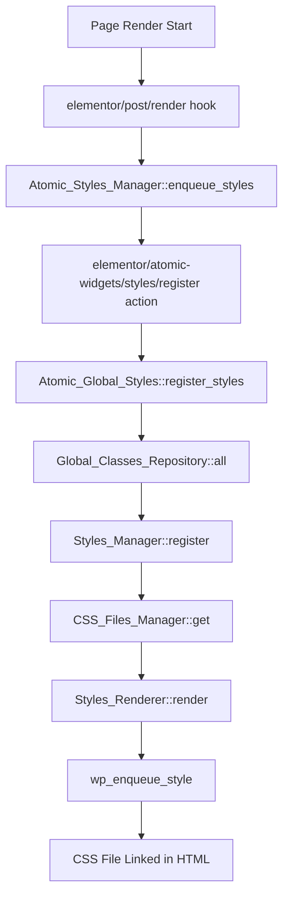

# 🔥 Global Classes Architecture Analysis

**MAX DEBUG MODE**: Complete analysis of Elementor's Global Classes system and CSS injection mechanism.

## 📋 Executive Summary

This document analyzes how Elementor's Global Classes module works, how CSS is injected during page rendering, and identifies the architectural gap in our CSS Converter implementation.

### 🎯 Key Findings

| Component | Status | Integration Point |
|-----------|--------|------------------|
| **Global Classes Module** | ✅ Active | Experiment flag `e_classes` |
| **Atomic Widgets Integration** | ✅ Working | `Atomic_Global_Styles` class |
| **CSS Injection System** | ✅ Sophisticated | `Atomic_Styles_Manager` + file caching |
| **CSS Converter Integration** | ❌ **MISSING** | No atomic system integration |

## 🏗️ Architecture Overview

### 1. **Global Classes Module Structure**

```
plugins/elementor/modules/global-classes/
├── module.php                          # Main module with experiment flags
├── atomic-global-styles.php            # 🔑 KEY: Atomic widgets integration
├── global-classes-repository.php       # Storage and retrieval
├── global-classes.php                  # Data structure
├── global-classes-parser.php           # Validation and parsing
├── global-classes-rest-api.php         # CRUD operations
└── usage/                              # Usage tracking
    ├── global-classes-usage.php
    ├── document-usage.php
    └── css-class-usage.php
```

### 2. **CSS Injection Pipeline**



## 🔍 Detailed Component Analysis

### 1. **Module Initialization** (`module.php`)

```php
class Module extends BaseModule {
    const NAME = 'e_classes';
    
    public function __construct() {
        $is_feature_active = Plugin::$instance->experiments->is_feature_active( self::NAME );
        $is_atomic_widgets_active = Plugin::$instance->experiments->is_feature_active( Atomic_Widgets_Module::EXPERIMENT_NAME );
        
        if ( $is_feature_active && $is_atomic_widgets_active ) {
            ( new Atomic_Global_Styles() )->register_hooks();  // 🔑 KEY INTEGRATION
        }
    }
}
```

**Key Points:**
- ✅ Requires both `e_classes` AND `e_atomic_elements` experiments
- ✅ `Atomic_Global_Styles` is the bridge to atomic widgets system
- ⚠️ Hidden experiment flag (alpha release status)

### 2. **Atomic Integration** (`atomic-global-styles.php`)

```php
class Atomic_Global_Styles {
    const STYLES_KEY = 'global';
    
    public function register_hooks() {
        // 🔑 KEY: Register with atomic widgets styles system
        add_action(
            'elementor/atomic-widgets/styles/register',
            fn( Atomic_Styles_Manager $styles_manager, array $post_ids ) => $this->register_styles( $styles_manager ),
            20,  // Priority 20 (after base styles at 10, before local styles at 30)
            2
        );
        
        // Transform class names for atomic widgets
        add_filter('elementor/atomic-widgets/settings/transformers/classes',
            fn( $value ) => $this->transform_classes_names( $value )
        );
    }
    
    private function register_styles( Atomic_Styles_Manager $styles_manager ) {
        $context = is_preview() ? Global_Classes_Repository::CONTEXT_PREVIEW : Global_Classes_Repository::CONTEXT_FRONTEND;
        
        $get_styles = function () use ( $context ) {
            return Global_Classes_Repository::make()->context( $context )->all()->get_items()->map( function( $item ) {
                $item['id'] = $item['label'];  // 🔑 KEY: ID becomes CSS class name
                return $item;
            })->all();
        };
        
        $styles_manager->register(
            self::STYLES_KEY . '-' . $context,
            $get_styles,
            [ self::STYLES_KEY, $context ]
        );
    }
}
```

**Key Points:**
- ✅ Uses official `elementor/atomic-widgets/styles/register` hook
- ✅ Priority 20 (between base and local styles)
- ✅ Context-aware (frontend vs preview)
- ✅ Transforms class names for atomic widgets

### 3. **Storage System** (`global-classes-repository.php`)

```php
class Global_Classes_Repository {
    const META_KEY_FRONTEND = '_elementor_global_classes';
    const META_KEY_PREVIEW = '_elementor_global_classes_preview';
    
    public function all() {
        $meta_key = $this->get_meta_key();
        $all = $this->get_kit()->get_json_meta( $meta_key );  // 🔑 KEY: Stored in kit meta
        
        return Global_Classes::make( $all['items'] ?? [], $all['order'] ?? [] );
    }
    
    public function put( array $items, array $order ) {
        $updated_value = [
            'items' => $items,
            'order' => $order,
        ];
        
        $meta_key = $this->get_meta_key();
        $value = $this->get_kit()->update_json_meta( $meta_key, $updated_value );
        
        do_action( 'elementor/global_classes/update', $this->context, $updated_value, $current_value );
    }
}
```

**Key Points:**
- ✅ Persistent storage in Elementor Kit meta
- ✅ Separate frontend/preview contexts
- ✅ Triggers update hooks for cache invalidation

### 4. **CSS Generation System** (`atomic-styles-manager.php`)

```php
class Atomic_Styles_Manager {
    public function register_hooks() {
        add_action( 'elementor/frontend/after_enqueue_post_styles', fn() => $this->enqueue_styles() );
        add_action( 'elementor/post/render', function( $post_id ) {
            $this->post_ids[] = $post_id;
        } );
    }
    
    private function enqueue_styles() {
        // 🔑 KEY: Trigger registration of all style providers
        do_action( 'elementor/atomic-widgets/styles/register', $this, $this->post_ids );
        
        // Process all registered styles
        foreach ( $styles_by_key as $style_key => $style_params ) {
            foreach ( $breakpoints as $breakpoint_key ) {
                $style_file = $this->css_files_manager->get(
                    $style_key . '-' . $breakpoint_key,
                    $breakpoint_media,
                    $render_css,
                    $this->cache_validity->is_valid( $breakpoint_cache_keys )
                );
                
                if ( $style_file ) {
                    wp_enqueue_style(  // 🔑 KEY: WordPress native enqueue
                        $style_file->get_handle(),
                        $style_file->get_url(),
                        [],
                        $style_file->get_media()
                    );
                }
            }
        }
    }
}
```

**Key Points:**
- ✅ Hooks into `elementor/frontend/after_enqueue_post_styles`
- ✅ Uses WordPress native `wp_enqueue_style()`
- ✅ File-based caching with breakpoint support
- ✅ Cache invalidation system

### 5. **CSS File Management** (`css-files-manager.php`)

```php
class CSS_Files_Manager {
    const DEFAULT_CSS_DIR = 'elementor/css/';
    
    public function get( string $handle, string $media, callable $get_css, bool $is_valid_cache ): ?Style_File {
        if ( $is_valid_cache && $filesystem->exists( $path ) ) {
            return Style_File::create( $handle, $filesystem_path, $url, $media );
        }
        
        $css = $get_css();  // 🔑 KEY: Generate CSS on demand
        
        if ( empty( $css ) ) {
            return null;
        }
        
        $is_created = $filesystem->put_contents( $filesystem_path, $css, self::PERMISSIONS );
        
        return Style_File::create( $handle, $filesystem_path, $url, $media );
    }
}
```

**Key Points:**
- ✅ File-based caching in `wp-content/uploads/elementor/css/`
- ✅ On-demand CSS generation
- ✅ WordPress filesystem API integration

## 🚨 CSS Converter Integration Gap

### **Current CSS Converter Approach** ❌

```php
// WRONG: Custom CSS injection
private function inject_css_classes_into_page( array $global_classes ): void {
    add_action( 'wp_head', function() use ( $css_content ) {
        echo "<style id='css-converter-global-classes'>\n{$css_content}\n</style>\n";
    }, 100 );
}
```

**Problems:**
- ❌ Bypasses atomic widgets system
- ❌ No caching mechanism
- ❌ No breakpoint support
- ❌ Timing issues with `wp_head`
- ❌ Not integrated with Elementor's CSS pipeline

### **Correct Atomic Approach** ✅

```php
// CORRECT: Atomic widgets integration
class CSS_Converter_Global_Styles {
    public function register_hooks() {
        add_action(
            'elementor/atomic-widgets/styles/register',
            fn( Atomic_Styles_Manager $styles_manager, array $post_ids ) => $this->register_styles( $styles_manager ),
            25,  // After global classes (20), before local styles (30)
            2
        );
    }
    
    private function register_styles( Atomic_Styles_Manager $styles_manager ) {
        $get_styles = function() {
            return $this->get_css_converter_global_classes();
        };
        
        $styles_manager->register(
            'css-converter-global-classes',
            $get_styles,
            [ 'css-converter', 'global-classes' ]
        );
    }
}
```

## 🔧 Implementation Strategy

### **Phase 1: Create CSS Converter Global Styles Service**

```php
namespace Elementor\Modules\CssConverter\Services\Styles;

class CSS_Converter_Global_Styles {
    const STYLES_KEY = 'css-converter-global';
    
    private static array $pending_global_classes = [];
    
    public static function add_global_classes( array $global_classes ): void {
        self::$pending_global_classes = array_merge( self::$pending_global_classes, $global_classes );
    }
    
    public function register_hooks(): void {
        add_action(
            'elementor/atomic-widgets/styles/register',
            fn( Atomic_Styles_Manager $styles_manager, array $post_ids ) => $this->register_styles( $styles_manager ),
            25,
            2
        );
    }
    
    private function register_styles( Atomic_Styles_Manager $styles_manager ): void {
        if ( empty( self::$pending_global_classes ) ) {
            return;
        }
        
        $get_styles = fn() => $this->convert_to_atomic_format( self::$pending_global_classes );
        
        $styles_manager->register(
            self::STYLES_KEY,
            $get_styles,
            [ 'css-converter', 'global-classes' ]
        );
    }
    
    private function convert_to_atomic_format( array $global_classes ): array {
        $atomic_styles = [];
        
        foreach ( $global_classes as $class_name => $class_data ) {
            $atomic_styles[] = [
                'id' => $class_name,
                'label' => $class_name,
                'type' => 'class',
                'variants' => [
                    [
                        'meta' => [
                            'breakpoint' => 'desktop',
                            'state' => null,
                        ],
                        'props' => $this->convert_css_to_atomic_props( $class_data['properties'] ),
                        'custom_css' => null,
                    ],
                ],
            ];
        }
        
        return $atomic_styles;
    }
}
```

### **Phase 2: Update Widget Conversion Service**

```php
// Replace custom CSS injection
private function inject_css_classes_into_page( array $global_classes ): void {
    CSS_Converter_Global_Styles::add_global_classes( $global_classes );
}
```

### **Phase 3: Initialize in Module**

```php
class Module {
    public function __construct() {
        // Initialize CSS Converter global styles integration
        ( new CSS_Converter_Global_Styles() )->register_hooks();
    }
}
```

## 🧪 Testing Strategy

### **1. Verify Atomic Integration**

```javascript
// Playwright test
test('CSS Converter global classes use atomic system', async ({ page }) => {
    await page.goto('/test-page');
    
    // Check for CSS file links (not inline styles)
    const cssLinks = await page.locator('link[rel="stylesheet"][href*="elementor/css/"]').count();
    expect(cssLinks).toBeGreaterThan(0);
    
    // Verify no inline CSS converter styles
    const inlineStyles = await page.locator('style#css-converter-global-classes').count();
    expect(inlineStyles).toBe(0);
    
    // Check CSS is applied
    const element = page.locator('.inline-element-1');
    await expect(element).toHaveCSS('padding', '20px');
});
```

### **2. Debug CSS Generation**

```php
// Add debug logging
error_log( "🔥 MAX DEBUG: CSS Converter registered " . count($atomic_styles) . " styles with atomic system" );
error_log( "🔥 MAX DEBUG: Atomic styles manager will generate CSS files for: " . implode(', ', array_keys($atomic_styles)) );
```

### **3. Chrome DevTools Inspection**

```javascript
// Check for generated CSS files
console.log('CSS files:', Array.from(document.querySelectorAll('link[rel="stylesheet"]')).map(l => l.href));

// Check for CSS rules
console.log('CSS rules for .inline-element-1:', getComputedStyle(document.querySelector('.inline-element-1')));
```

## 📊 Priority Matrix

| Priority | Task | Impact | Effort |
|----------|------|--------|--------|
| **P0** | Create `CSS_Converter_Global_Styles` service | High | Medium |
| **P0** | Replace custom CSS injection | High | Low |
| **P0** | Test atomic integration | High | Medium |
| **P1** | Add breakpoint support | Medium | High |
| **P1** | Implement cache invalidation | Medium | Medium |
| **P2** | Add usage tracking | Low | Low |

## 🎯 Success Criteria

### **Functional Requirements**
- ✅ CSS classes applied to HTML elements
- ✅ CSS rules injected via atomic widgets system
- ✅ No custom `wp_head` injection
- ✅ File-based caching working
- ✅ Playwright tests passing

### **Performance Requirements**
- ✅ CSS files cached and reused
- ✅ No duplicate CSS generation
- ✅ Proper cache invalidation

### **Integration Requirements**
- ✅ Compatible with Elementor's atomic widgets
- ✅ Follows Elementor's CSS pipeline
- ✅ Respects breakpoint system

## 🚀 Next Steps

1. **Immediate**: Create `CSS_Converter_Global_Styles` service
2. **Short-term**: Replace custom CSS injection in `Widget_Conversion_Service`
3. **Medium-term**: Add comprehensive testing
4. **Long-term**: Optimize for performance and caching

---

**Status**: 🔥 **CRITICAL ARCHITECTURAL GAP IDENTIFIED**  
**Action Required**: Implement atomic widgets integration for CSS injection  
**Timeline**: Immediate (blocking Playwright tests)

