# Heading Widget Test Cases - Visual Mind Map

```mermaid
mindmap
  root((Heading Widget))
    Core Functionality
      Content Management
        Text Input & Editing
          Default text
          Inline editing
          Panel editing
          Text validation
        Heading Levels
          H1-H6 selection
          Default H2
          Semantic HTML
        Link Functionality
          Enable/disable toggle
          URL input
          Target settings
          Link validation
      Element Identification
        Custom ID
        ID validation
        Accessibility
    Styling & Design
      Typography
        Font Family
          System fonts
          Google Fonts
          Custom fonts
        Font Properties
          Size (px, em, rem)
          Weight (100-900)
          Style (normal, italic)
          Line height
          Letter spacing
        Text Effects
          Transform
          Decoration
          Stroke
          Shadow
      Layout & Alignment
        Text Alignment
          Left, center, right
          Justify
          RTL support
        Position & Display
          Static, relative, absolute
          Z-index
          Overflow
      Colors & Background
        Text Color
          Color picker
          Global colors
          Accessibility
        Background
          Color
          Image
          Position
          Size
      Spacing & Sizing
        Margins & Padding
          Individual sides
          Responsive
          Negative margins
        Dimensions
          Width/height
          Min/max
          Box sizing
      Border & Effects
        Border
          Width, style, color
          Radius
          Individual sides
        Effects
          Box shadow
          Opacity
          Blend modes
          Transform
    Responsive Design
      Breakpoint Behavior
        Desktop
          Default styling
          Large screen
        Tablet
          Medium screen
          Touch interactions
        Mobile
          Small screen
          Touch friendly
      Responsive Controls
        Hide/Show
          Per breakpoint
          Conditional logic
        Typography
          Font scaling
          Line height
          Spacing
    Advanced Features
      Animation & Transitions
        Entrance Animations
          Fade, slide, zoom
          Duration, delay
          Easing
        Hover Effects
          Color transitions
          Scale effects
          Shadow changes
      Custom CSS
        Custom Classes
          Assignment
          Multiple classes
          Validation
        Inline CSS
          Syntax validation
          Specificity
      Dynamic Content
        Dynamic Tags
          Post title
          Custom fields
          Site settings
          User data
    Testing Scenarios
      Functional Testing
        Widget Addition
          Drag & drop
          Panel integration
          Container placement
        Content Editing
          Real-time preview
          Save/load
          Version control
      User Experience
        Accessibility
          Screen readers
          Keyboard navigation
          Focus management
        Performance
          Loading speed
          Memory usage
          Rendering
      Security Testing
        Input Validation
          XSS prevention
          SQL injection
          Code filtering
      Cross-Browser
        Browser Compatibility
          Chrome, Firefox
          Safari, Edge
          Mobile browsers
    Data & Integration
      Data Persistence
        Save/Load
          Database storage
          JSON export/import
          Template saving
          Revision history
      Third-Party
        Font Services
          Google Fonts
          Adobe Fonts
          Custom services
        Analytics
          Click tracking
          Scroll tracking
          Performance
    Edge Cases & Errors
      Error Scenarios
        Network Issues
          Font loading
          Image loading
          API connections
        Data Corruption
          Invalid JSON
          Missing dependencies
          Corrupted settings
      Recovery
        Auto-recovery
          Unsaved changes
          Crash recovery
          Data restoration
    Priority Matrix
      High Priority 🔴
        Widget addition
        Basic editing
        Heading levels
        Link functionality
        Basic styling
      Medium Priority 🟡
        Advanced typography
        Responsive behavior
        Animation effects
        Custom CSS
        Accessibility
      Low Priority 🟢
        Advanced effects
        Performance
        Cross-browser
        Third-party
```

## 🎯 Key Testing Focus Areas

### 🔴 Critical Path Testing
1. **Widget Addition & Basic Editing**
   - Add widget to container
   - Edit text content
   - Change heading levels
   - Basic link functionality

2. **Core Styling**
   - Font family and size
   - Text color and alignment
   - Basic spacing and margins

### 🟡 Important Features
1. **Advanced Typography**
   - Font weight and style
   - Line height and spacing
   - Text effects and transforms

2. **Responsive Behavior**
   - Breakpoint-specific styling
   - Mobile/tablet adaptations
   - Hide/show functionality

### 🟢 Advanced Features
1. **Effects & Animations**
   - Entrance animations
   - Hover effects
   - Custom CSS

2. **Integration & Performance**
   - Third-party font services
   - Performance optimization
   - Cross-browser compatibility

## 📊 Test Coverage Strategy

### Phase 1: Foundation (Week 1-2)
- Core widget functionality
- Basic content editing
- Essential styling controls

### Phase 2: Enhancement (Week 3-4)
- Advanced typography
- Responsive design
- Animation effects

### Phase 3: Polish (Week 5-6)
- Accessibility compliance
- Performance optimization
- Edge case handling

### Phase 4: Integration (Week 7-8)
- Third-party integrations
- Cross-browser testing
- Security validation
