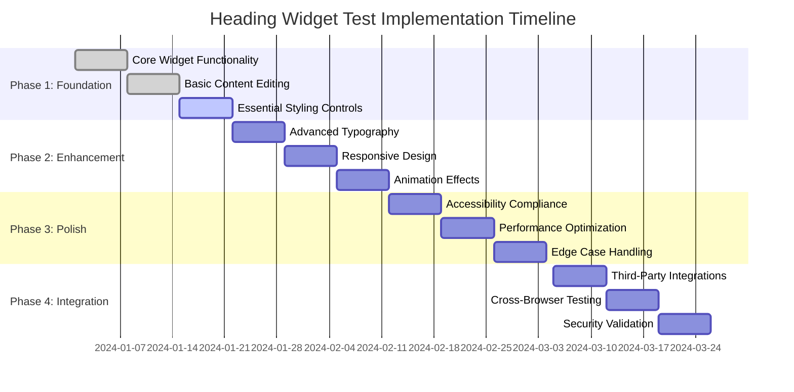
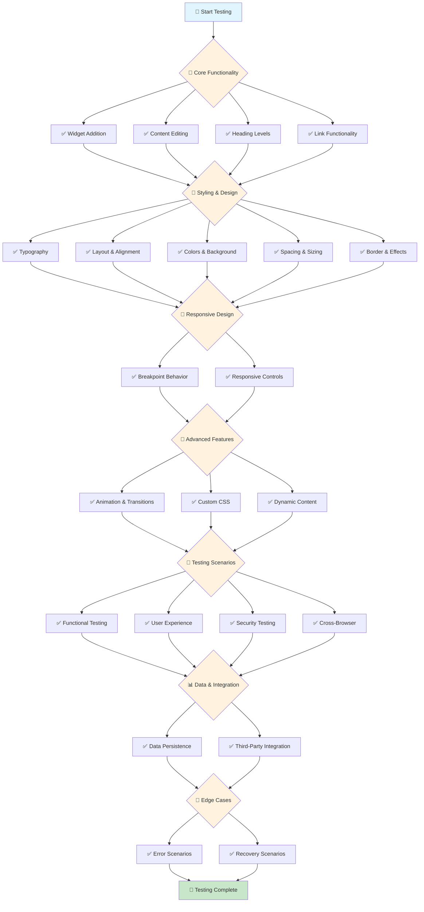
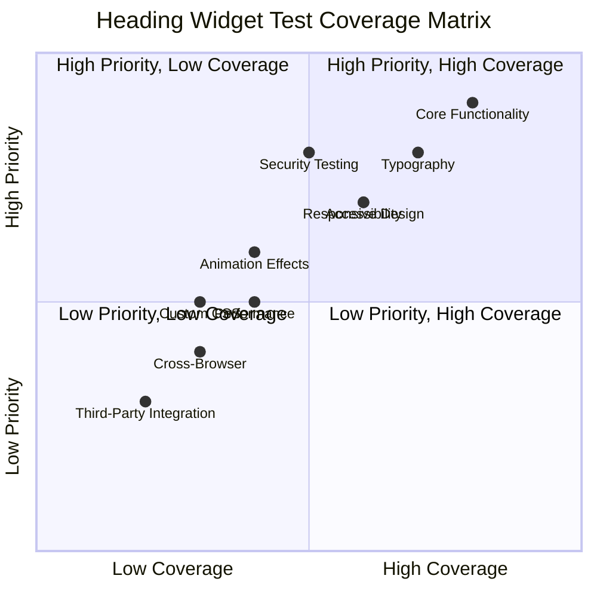

# Heading Widget Test Cases - Visual Mind Map

## 🎯 Complete Test Coverage Mind Map

```mermaid
mindmap
  root((🎯 Heading Widget))
    📝 Core Functionality
      🔤 Content Management
        ✏️ Text Input & Editing
          📄 Default text: "Add Your Heading Text Here"
          🖱️ Inline text editing
          ⚙️ Panel-based text editing
          ✅ Text validation (empty, special chars, length)
          📋 Copy/paste functionality
          ↩️ Undo/redo text changes
        🔢 Heading Levels
          🏷️ H1, H2, H3, H4, H5, H6 selection
          🎯 Default level (H2)
          🌐 Semantic HTML validation
          ♿ Accessibility compliance
        🔗 Link Functionality
          🔘 Enable/disable link toggle
          🌐 URL input field
          🎯 Link target (same window, new window)
          🔒 Link rel attributes (nofollow, sponsored)
          ✅ Link validation (valid URLs, relative vs absolute)
          🗑️ Link removal
      🆔 Element Identification
        🏷️ Custom ID assignment
        ✅ ID uniqueness validation
        📝 ID format validation (alphanumeric, hyphens, underscores)
        ♿ ID accessibility (for anchor links)
    🎨 Styling & Design
      📏 Typography
        🔤 Font Family
          💻 System fonts selection
          🌐 Google Fonts integration
          🎨 Custom font loading
          🔄 Font fallback handling
        📐 Font Properties
          📏 Font size (px, em, rem, vw)
          ⚖️ Font weight (100-900)
          🆎 Font style (normal, italic)
          📏 Line height
          🔤 Letter spacing
          📝 Word spacing
        ✨ Text Effects
          🔤 Text transform (uppercase, lowercase, capitalize)
          🎨 Text decoration (underline, line-through, overline)
          🖊️ Text stroke
          🌟 Text shadow
      🎯 Text Alignment & Layout
        📐 Alignment
          ⬅️ Left, center, right, justify
          📱 Responsive alignment (mobile, tablet, desktop)
          🌐 RTL (right-to-left) support
        📐 Layout
          📦 Display properties
          📍 Position (static, relative, absolute, fixed)
          🔢 Z-index management
          📦 Overflow handling
      🌈 Colors & Background
        🎨 Text Color
          🎨 Color picker functionality
          🌐 Hex, RGB, HSL color formats
          🌍 Global colors integration
          ♿ Color accessibility (contrast ratios)
        🖼️ Background
          🎨 Background color
          🖼️ Background image
          📍 Background position
          📏 Background size
          🔄 Background repeat
          📌 Background attachment
      📐 Spacing & Sizing
        📏 Margins & Padding
          📐 Individual side control (top, right, bottom, left)
          📱 Responsive spacing
          ➖ Negative margins
        📏 Dimensions
          📏 Width and height
          📏 Min/max dimensions
          📦 Box sizing (content-box, border-box)
      🖼️ Border & Effects
        🖼️ Border
          📏 Border width
          🎨 Border style (solid, dashed, dotted)
          🎨 Border color
          🔄 Border radius
          📐 Individual border sides
        ✨ Effects
          🌟 Box shadow
          🌟 Text shadow
          👁️ Opacity
          🎨 Blend modes
          🔄 Transform (scale, rotate, translate)
    📱 Responsive Design
      🖥️ Breakpoint Behavior
        💻 Desktop
          🎨 Default styling
          🖥️ Large screen optimization
        📱 Tablet
          📱 Medium screen adaptations
          👆 Touch-friendly interactions
        📱 Mobile
          📱 Small screen optimization
          👆 Touch interactions
          📖 Readability adjustments
      🔄 Responsive Controls
        👁️ Hide/Show
          📱 Element visibility per breakpoint
          🔀 Conditional display logic
        📏 Responsive Typography
          📏 Font size scaling
          📏 Line height adjustments
          📏 Spacing modifications
    🔧 Advanced Features
      🎭 Animation & Transitions
        🎬 Entrance Animations
          🌟 Fade in, slide in, zoom in
          ⏱️ Animation duration
          ⏰ Animation delay
          🎯 Animation easing
        🖱️ Hover Effects
          🎨 Color transitions
          📏 Scale effects
          🌟 Shadow changes
          🔄 Transform animations
      🎨 Custom CSS
        🏷️ Custom Classes
          🏷️ CSS class assignment
          🏷️ Multiple class support
          ✅ Class validation
        💻 Custom CSS
          💻 Inline CSS editing
          ✅ CSS syntax validation
          🎯 CSS specificity handling
      🔗 Dynamic Content
        🏷️ Dynamic Tags
          📄 Post title integration
          📝 Custom field integration
          ⚙️ Site settings integration
          👤 User data integration
    🧪 Testing Scenarios
      ✅ Functional Testing
        ➕ Widget Addition
          🖱️ Drag and drop functionality
          ⚙️ Widget panel integration
          📦 Container placement
          📋 Widget duplication
        ✏️ Content Editing
          👁️ Real-time preview updates
          💾 Save/load functionality
          📝 Version control
          💾 Auto-save behavior
      🎯 User Experience Testing
        ♿ Accessibility
          🔊 Screen reader compatibility
          ⌨️ Keyboard navigation
          🎯 Focus management
          ♿ ARIA attributes
        ⚡ Performance
          ⚡ Loading speed
          💾 Memory usage
          🎨 Rendering performance
          📏 Large content handling
      🔒 Security Testing
        ✅ Input Validation
          🛡️ XSS prevention
          🛡️ SQL injection prevention
          🛡️ Malicious code filtering
          📁 File upload security
      🌐 Cross-Browser Testing
        🌐 Browser Compatibility
          🌐 Chrome, Firefox, Safari, Edge
          📱 Mobile browsers
          🖥️ Legacy browser support
    📊 Data & Integration
      💾 Data Persistence
        💾 Save/Load
          🗄️ Database storage
          📄 JSON export/import
          📋 Template saving
          📝 Revision history
      🔌 Third-Party Integration
        🔤 Font Services
          🌐 Google Fonts
          🎨 Adobe Fonts
          🎨 Custom font services
        📊 Analytics
          👆 Click tracking
          📜 Scroll tracking
          ⚡ Performance monitoring
    🚨 Edge Cases & Error Handling
      ⚠️ Error Scenarios
        🌐 Network Issues
          🔤 Font loading failures
          🖼️ Image loading failures
          🔌 API connection issues
        💾 Data Corruption
          ❌ Invalid JSON
          ❌ Missing dependencies
          💾 Corrupted settings
      🔄 Recovery Scenarios
        🔄 Auto-recovery
          💾 Unsaved changes recovery
          💥 Crash recovery
          💾 Data restoration
    📋 Priority Matrix
      🔴 High Priority (Critical)
        ➕ Widget addition and basic editing
        🔢 Heading level selection
        📝 Text content management
        🔗 Link functionality
        🎨 Basic styling (color, size, alignment)
      🟡 Medium Priority (Important)
        📏 Advanced typography
        📱 Responsive behavior
        🎭 Animation effects
        🎨 Custom CSS
        ♿ Accessibility features
      🟢 Low Priority (Nice to Have)
        ✨ Advanced effects
        ⚡ Performance optimizations
        🌐 Cross-browser edge cases
        🔌 Third-party integrations
```

## 🎯 Test Implementation Phases



## 🔄 Test Flow Diagram



## 📊 Test Coverage Matrix



## 🎯 Key Testing Metrics

### 📈 Coverage Targets
- **Core Functionality**: 90% coverage
- **Styling & Design**: 80% coverage  
- **Responsive Design**: 70% coverage
- **Advanced Features**: 60% coverage
- **Testing Scenarios**: 75% coverage
- **Data & Integration**: 50% coverage
- **Edge Cases**: 40% coverage

### ⏱️ Timeline Estimates
- **Phase 1**: 2 weeks (Foundation)
- **Phase 2**: 2 weeks (Enhancement)
- **Phase 3**: 2 weeks (Polish)
- **Phase 4**: 2 weeks (Integration)

### 🎯 Success Criteria
- ✅ All critical functionality tested
- ✅ 80%+ code coverage achieved
- ✅ Accessibility standards met
- ✅ Performance benchmarks passed
- ✅ Cross-browser compatibility verified
- ✅ Security vulnerabilities addressed

This visual mind map provides a comprehensive overview of all test cases and implementation strategy for the Heading widget! 🚀
